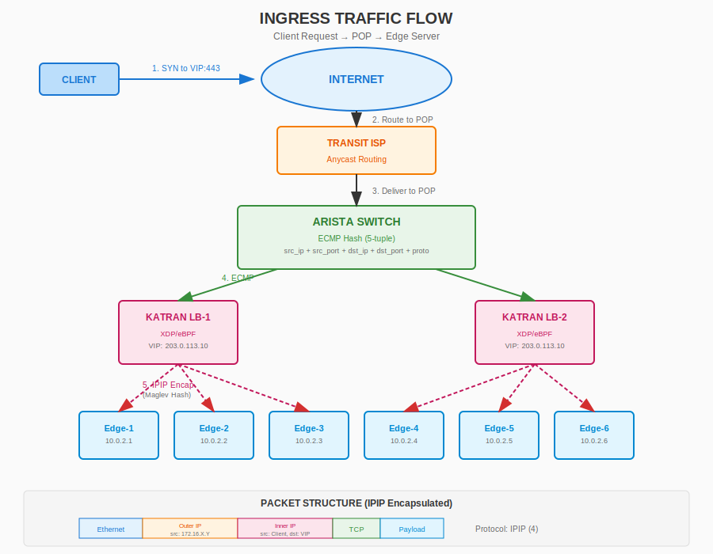
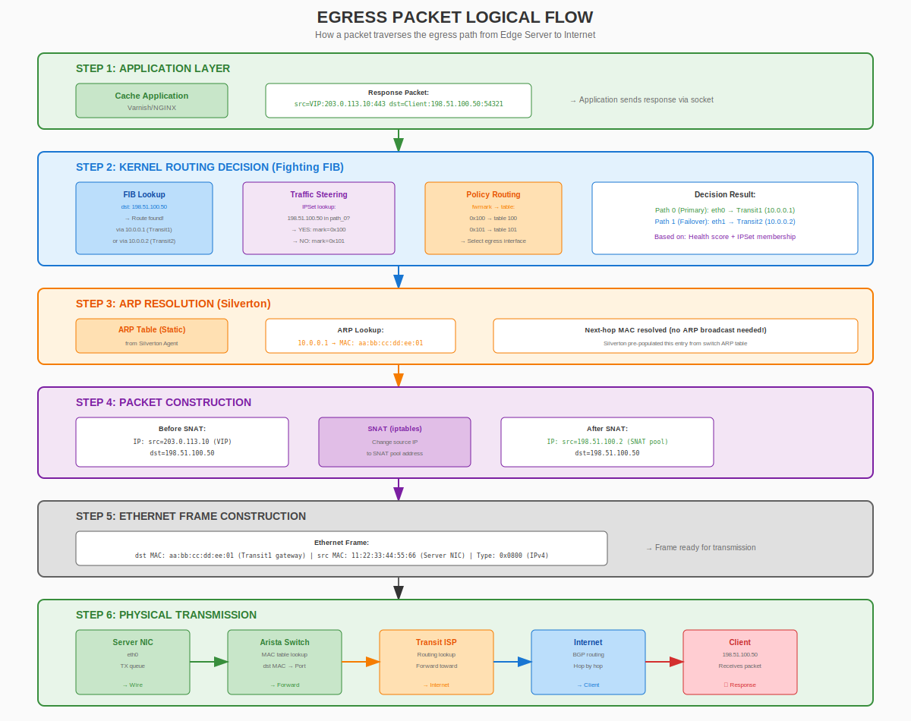
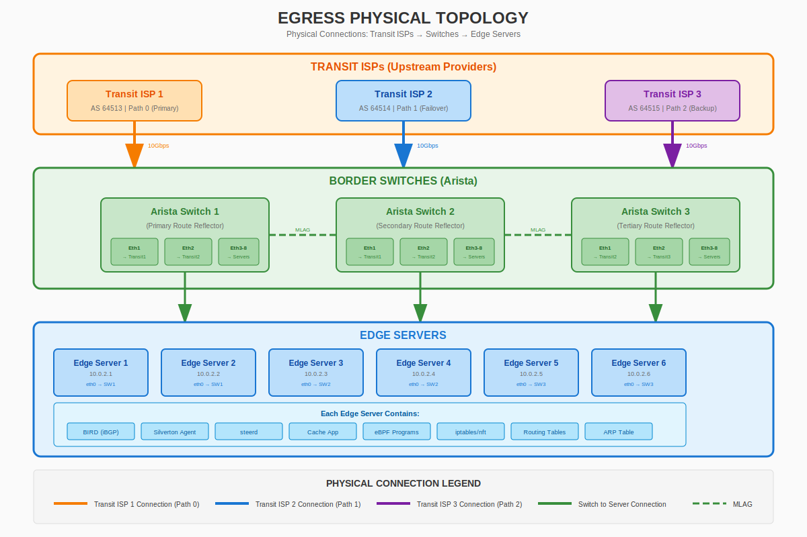

# POP Architecture Analysis: Katran (Ingress) + Fastly Fighting FIB (Egress)

## Executive Summary

This document presents a comprehensive architecture for your Point of Presence (POP) that combines:

- **Ingress Traffic**: Meta's **Katran** - Layer 4 load balancer using XDP/eBPF for high-performance packet processing
- **Egress Traffic**: Fastly's **Fighting FIB** approach - Distributed routing using commodity switches with route reflection

This hybrid architecture leverages the strengths of both solutions while ensuring they operate seamlessly together without conflicts.

---

## Table of Contents

1. [Architecture Overview](#1-architecture-overview)
2. [Step 1: Ingress with Katran](#2-step-1-ingress-with-katran)
3. [Step 2: Egress with Fastly Fighting FIB](#3-step-2-egress-with-fastly-fighting-fib)
4. [Integration: How Both Solutions Work Together](#4-integration-how-both-solutions-work-together)
5. [Implementation Checklist](#5-implementation-checklist)
6. [Network Diagrams](#6-network-diagrams)
7. [Traffic Steering Configuration](#7-traffic-steering-configuration)

---

## 1. Architecture Overview

### Design Principles

| Principle | Implementation |
|-----------|----------------|
| **Efficiency** | XDP processing before kernel for ingress; direct routing for egress |
| **Security** | DSR mode prevents LB bottleneck; distributed routing eliminates single points of failure |
| **Scalability** | Linear scaling with NIC queues (ingress); linear scaling with servers (egress) |
| **Cost-Effective** | Uses commodity switches (Arista) and standard Linux servers |

### High-Level Architecture

```
┌─────────────────────────────────────────────────────────────────────────────┐
│                              INTERNET                                        │
│                    (Clients / Origin Servers)                                │
└─────────────────────────────┬───────────────────────────────────────────────┘
                              │
              ┌───────────────┴───────────────┐
              ▼                               ▼
    ┌─────────────────┐             ┌─────────────────┐
    │  Transit ISP 1  │             │  Transit ISP 2  │
    │    (eBGP)       │             │    (eBGP)       │
    └────────┬────────┘             └────────┬────────┘
             │                               │
             ▼                               ▼
┌─────────────────────────────────────────────────────────────────────────────┐
│                         POP INFRASTRUCTURE                                   │
│  ┌───────────────────────────────────────────────────────────────────────┐  │
│  │                     BORDER SWITCHES (Arista)                           │  │
│  │  ┌─────────────┐    iBGP/ECMP    ┌─────────────┐                       │  │
│  │  │  Arista SW1 │◀──────────────▶│  Arista SW2 │                       │  │
│  │  │  (Primary)  │                 │ (Secondary)│                       │  │
│  │  └──────┬──────┘                 └──────┬──────┘                       │  │
│  └─────────┼───────────────────────────────┼──────────────────────────────┘  │
│            │                               │                                  │
│            │     ECMP (5-tuple hash)       │                                  │
│            └───────────────┬───────────────┘                                  │
│                            │                                                  │
│  ┌─────────────────────────▼─────────────────────────────────────────────┐   │
│  │                    KATRAN LOAD BALANCERS                               │   │
│  │  ┌──────────────────┐              ┌──────────────────┐                │   │
│  │  │   Katran LB-1    │              │   Katran LB-2    │                │   │
│  │  │   XDP/eBPF       │              │   XDP/eBPF       │                │   │
│  │  │   VIP Anycast    │              │   VIP Anycast    │                │   │
│  │  │   10.0.1.1       │              │   10.0.1.2       │                │   │
│  │  └────────┬─────────┘              └────────┬─────────┘                │   │
│  └───────────┼─────────────────────────────────┼──────────────────────────┘   │
│              │         IPIP Encap              │                              │
│              └────────────────┬────────────────┘                              │
│                               │                                               │
│  ┌────────────────────────────▼──────────────────────────────────────────┐   │
│  │                      EDGE SERVERS (6x)                                 │   │
│  │  ┌────────┐ ┌────────┐ ┌────────┐ ┌────────┐ ┌────────┐ ┌────────┐    │   │
│  │  │Edge-1  │ │Edge-2  │ │Edge-3  │ │Edge-4  │ │Edge-5  │ │Edge-6  │    │   │
│  │  │Cache   │ │Cache   │ │Cache   │ │Cache   │ │Cache   │ │Cache   │    │   │
│  │  │10.0.2.1│ │10.0.2.2│ │10.0.2.3│ │10.0.2.4│ │10.0.2.5│ │10.0.2.6│    │   │
│  │  └────────┘ └────────┘ └────────┘ └────────┘ └────────┘ └────────┘    │   │
│  │                                                                        │   │
│  │  Each server has:                                                      │   │
│  │  - VIP configured on loopback (for DSR)                               │   │
│  │  - IPIP interface for decapsulation                                    │   │
│  │  - BIRD instance for route reflection                                  │   │
│  └────────────────────────────────────────────────────────────────────────┘   │
│                                                                               │
│  ┌────────────────────────────────────────────────────────────────────────┐   │
│  │                    MANAGEMENT / CONTROL PLANE                          │   │
│  │  ┌──────────────────┐  ┌──────────────────┐  ┌──────────────────┐      │   │
│  │  │   Silverton      │  │   Healthcheck    │  │   Monitoring     │      │   │
│  │  │   Controller     │  │   Service        │  │   (Prometheus)   │      │   │
│  │  └──────────────────┘  └──────────────────┘  └──────────────────┘      │   │
│  └────────────────────────────────────────────────────────────────────────┘   │
└───────────────────────────────────────────────────────────────────────────────┘
```

---

## 2. Step 1: Ingress with Katran

### 2.1 Overview

Katran handles all **inbound traffic** from the internet to your POP. It operates at Layer 4, distributing TCP/UDP connections across your edge servers.

### 2.2 Katran Components

```
┌─────────────────────────────────────────────────────────────────┐
│                    KATRAN LOAD BALANCER                         │
├─────────────────────────────────────────────────────────────────┤
│                                                                 │
│  ┌─────────────────────────────────────────────────────────┐   │
│  │                   XDP/eBPF Layer                         │   │
│  │  ┌─────────────┐  ┌─────────────┐  ┌─────────────┐       │   │
│  │  │  balancer   │  │  healthcheck│  │   root      │       │   │
│  │  │  .bpf.o     │  │  _ipip.o    │  │   xdp.o     │       │   │
│  │  └─────────────┘  └─────────────┘  └─────────────┘       │   │
│  └─────────────────────────────────────────────────────────┘   │
│                           │                                     │
│                           ▼                                     │
│  ┌─────────────────────────────────────────────────────────┐   │
│  │                   BPF Maps                               │   │
│  │  ┌──────────┐ ┌──────────┐ ┌──────────┐ ┌──────────┐     │   │
│  │  │ VIP Map  │ │ Real Map │ │ LRU Cache│ │ Stats Map│     │   │
│  │  │          │ │          │ │          │ │          │     │   │
│  │  └──────────┘ └──────────┘ └──────────┘ └──────────┘     │   │
│  └─────────────────────────────────────────────────────────┘   │
│                           │                                     │
│                           ▼                                     │
│  ┌─────────────────────────────────────────────────────────┐   │
│  │                   Control Plane                          │   │
│  │  ┌─────────────┐  ┌─────────────┐  ┌─────────────┐       │   │
│  │  │ KatranLb    │  │  ExaBGP     │  │  gRPC/Thrift│       │   │
│  │  │  Library    │  │  (VIP adv)  │  │  API        │       │   │
│  │  └─────────────┘  └─────────────┘  └─────────────┘       │   │
│  └─────────────────────────────────────────────────────────┘   │
│                                                                 │
└─────────────────────────────────────────────────────────────────┘
```

### 2.3 Ingress Packet Flow

```
┌──────────────────────────────────────────────────────────────────────────┐
│                        INGRESS PACKET FLOW                               │
├──────────────────────────────────────────────────────────────────────────┤
│                                                                          │
│  1. CLIENT REQUEST                                                       │
│     ┌───────┐                                                            │
│     │Client │ ────── SYN ─────▶ VIP:203.0.113.10:443                     │
│     └───────┘                   (Anycast IP advertised via BGP)          │
│                                                                          │
│  2. SWITCH PROCESSING (ECMP)                                             │
│     ┌─────────┐                                                          │
│     │ Arista  │  Hash(5-tuple) → Select Katran LB                        │
│     │ Switch  │  src_ip + src_port + dst_ip + dst_port + proto           │
│     └────┬────┘                                                          │
│          │                                                               │
│          ▼                                                               │
│  3. KATRAN XDP PROCESSING (Before Kernel!)                               │
│     ┌─────────────────────────────────────────────────────────────┐     │
│     │  a) Check if dst_ip is configured VIP         ─────────┐     │     │
│     │  b) Check LRU cache for existing connection           │     │     │
│     │     - If found: use cached real server                │     │     │
│     │     - If not found: compute Maglev hash               │     │     │
│     │  c) Select real server based on hash ring             │     │     │
│     │  d) Update LRU cache (connection → real)               │     │     │
│     │  e) IPIP encapsulate packet                           ▼     │     │
│     └─────────────────────────────────────────────────────────────┐     │
│                              │                                        │     │
│                              ▼                                        │     │
│  4. IPIP ENCAPSULATION                                                  │
│     ┌─────────────────────────────────────────────────────────────┐     │
│     │  Original Packet:                                            │     │
│     │    src: Client_IP, dst: VIP                                  │     │
│     │                                                               │     │
│     │  Encapsulated Packet:                                         │     │
│     │    Outer: src: 172.16.X.Y (RSS-friendly), dst: Real_IP       │     │
│     │    Inner: src: Client_IP, dst: VIP (unchanged)              │     │
│     └─────────────────────────────────────────────────────────────┘     │
│                              │                                          │
│                              ▼                                          │
│  5. FORWARD TO EDGE SERVER                                              │
│     ┌─────────┐                                                         │
│     │ Edge    │ ◀── IPIP packet (decapsulate)                          │
│     │ Server  │     - Remove outer header                              │
│     │         │     - Process inner packet (VIP on loopback)           │
│     └─────────┘                                                         │
│                                                                          │
└──────────────────────────────────────────────────────────────────────────┘
```

### 2.4 Katran Configuration

#### KatranConfig Structure

```cpp
struct KatranConfig {
  std::string mainInterface;      // "eth0" - main interface for XDP
  std::string v4TunInterface;     // "ipip0" - IPv4 tunnel interface
  std::string v6TunInterface;     // "ipip60" - IPv6 tunnel interface
  std::string balancerProgPath;   // path to balancer.bpf.o
  std::string healthcheckingProgPath; // path to healthchecking_ipip.o
  std::vector<uint8_t> defaultMac;    // MAC of default gateway (switch)
  uint32_t priority = 10;             // TC filter priority
  std::string rootMapPath;            // For shared XDP mode
  uint32_t rootMapPos = 2;            // Position in prog array
  bool enableHc = true;               // Enable healthcheck forwarding
  uint32_t maxVips = 64;              // Maximum VIPs
  uint32_t maxReals = 128;            // Maximum real servers
  uint32_t chRingSize = 65537;        // Maglev ring size (prime!)
  uint64_t LruSize = 8000000;         // Connection tracking table size
  std::vector<int32_t> forwardingCores; // CPU cores for forwarding
  std::vector<int32_t> numaNodes;       // NUMA node hints
};
```

#### VIP and Real Configuration

```bash
# Add VIP (TCP port 443)
./katran_goclient -A -t 203.0.113.10:443

# Add real servers with weights
./katran_goclient -a -t 203.0.113.10:443 -r 10.0.2.1 -w 10
./katran_goclient -a -t 203.0.113.10:443 -r 10.0.2.2 -w 10
./katran_goclient -a -t 203.0.113.10:443 -r 10.0.2.3 -w 10
./katran_goclient -a -t 203.0.113.10:443 -r 10.0.2.4 -w 10
./katran_goclient -a -t 203.0.113.10:443 -r 10.0.2.5 -w 10
./katran_goclient -a -t 203.0.113.10:443 -r 10.0.2.6 -w 10

# List configuration
./katran_goclient -l
```

### 2.5 Edge Server Configuration (for Katran)

```bash
# Create IPIP interfaces for decapsulation
ip link add name ipip0 type ipip external
ip link add name ipip60 type ip6tnl external
ip link set up dev ipip0
ip link set up dev ipip60

# Configure dummy IP on IPIP interface
ip addr add 127.0.0.42/32 dev ipip0

# Configure VIP on loopback (for DSR)
ip addr add 203.0.113.10/32 dev lo

# Disable rp_filter (required for DSR)
for sc in $(sysctl -a | awk '/\.rp_filter/ {print $1}'); do
  sysctl ${sc}=0
done

# Increase MTU to accommodate IPIP overhead
ip link set dev eth0 mtu 9000
```

---

## 3. Step 2: Egress with Fastly Fighting FIB

### 3.1 Overview

For **outbound traffic** (responses from edge servers to clients, and traffic to origin servers), we implement Fastly's **Fighting FIB** approach. This eliminates the need for expensive routers by pushing routing intelligence to the switches and hosts.

### 3.2 Fighting FIB Architecture

```
┌──────────────────────────────────────────────────────────────────────────┐
│                    FIGHTING FIB ARCHITECTURE                              │
├──────────────────────────────────────────────────────────────────────────┤
│                                                                          │
│  PROBLEM: Switch FIB is limited (tens of thousands of routes)            │
│  SOLUTION: Push routes to hosts, use ARP manipulation                    │
│                                                                          │
│  ┌────────────────────────────────────────────────────────────────────┐ │
│  │                    TRADITIONAL ROUTER APPROACH                      │ │
│  │                                                                     │ │
│  │  Internet ──▶ Router (600K+ routes in FIB) ──▶ Switch ──▶ Hosts    │ │
│  │                     (EXPENSIVE!)                                    │ │
│  └────────────────────────────────────────────────────────────────────┘ │
│                                                                          │
│  ┌────────────────────────────────────────────────────────────────────┐ │
│  │                    FASTLY FIGHTING FIB APPROACH                     │ │
│  │                                                                     │ │
│  │  Internet ──▶ Switch (BGP daemon) ──iBGP──▶ Hosts (routes in kernel)│ │
│  │              (Commodity Arista)        │                            │ │
│  │                                       ▼                            │ │
│  │                              Host kernel FIB                        │ │
│  │                              (Full routing table)                   │ │
│  └────────────────────────────────────────────────────────────────────┘ │
│                                                                          │
└──────────────────────────────────────────────────────────────────────────┘
```

### 3.3 Silverton - Route Reflection Controller

Silverton is a distributed routing agent developed by Fastly that solves a critical problem in the Fighting FIB architecture: **how to propagate network reachability information from switches to servers without requiring expensive routers**.

#### 3.3.1 The Problem Silverton Solves

In traditional architectures, routers maintain full FIB (Forwarding Information Base) tables with hundreds of thousands of routes. This requires expensive hardware with large TCAM (Ternary Content-Addressable Memory) capacity. Commodity switches (like Arista) have limited FIB capacity - typically tens of thousands of entries versus the 800K+ IPv4 routes in the full Internet routing table.

**Silverton's Solution**: Instead of storing all routes in the switch FIB, push the full routing table to the host kernels where memory is abundant and cheap. The switch only needs to forward packets based on MAC addresses, not IP routing.

#### 3.3.2 How Silverton Actually Works

Silverton operates as a **two-component system**:

```
┌──────────────────────────────────────────────────────────────────────────┐
│                    SILVERTON COMPONENT ARCHITECTURE                       │
├──────────────────────────────────────────────────────────────────────────┤
│                                                                          │
│  ┌───────────────────────────────────────────────────────────────────┐  │
│  │                    SWITCH SIDE (Silverton Controller)              │  │
│  │                                                                    │  │
│  │  Role: OBSERVE and PUBLISH                                        │  │
│  │                                                                    │  │
│  │  ┌─────────────────────────────────────────────────────────────┐  │  │
│  │  │  1. BGP Route Reflector (BIRD daemon)                        │  │  │
│  │  │     - Receives full Internet routes via eBGP from transits  │  │  │
│  │  │     - Reflects routes to all hosts via iBGP                 │  │  │
│  │  │     - NO need to install routes in switch FIB               │  │  │
│  │  └─────────────────────────────────────────────────────────────┘  │  │
│  │                                                                    │  │
│  │  ┌─────────────────────────────────────────────────────────────┐  │  │
│  │  │  2. ARP Table Watcher (EOS SDK daemon)                       │  │  │
│  │  │     - Monitors switch ARP table in real-time                │  │  │
│  │  │     - Detects when switch learns new neighbor MAC           │  │  │
│  │  │     - Publishes ARP updates via gRPC to all agents          │  │  │
│  │  └─────────────────────────────────────────────────────────────┘  │  │
│  └───────────────────────────────────────────────────────────────────┘  │
│                              │                                           │
│                              │ gRPC Stream (bidirectional)               │
│                              ▼                                           │
│  ┌───────────────────────────────────────────────────────────────────┐  │
│  │                    SERVER SIDE (Silverton Agent)                   │  │
│  │                                                                    │  │
│  │  Role: RECEIVE and APPLY                                          │  │
│  │                                                                    │  │
│  │  ┌─────────────────────────────────────────────────────────────┐  │  │
│  │  │  1. BGP Route Receiver (BIRD daemon)                         │  │  │
│  │  │     - Receives full Internet routes via iBGP from switch    │  │  │
│  │  │     - Installs routes into kernel FIB (main routing table)  │  │  │
│  │  │     - Host now has full routing table (~800K routes)        │  │  │
│  │  └─────────────────────────────────────────────────────────────┘  │  │
│  │                                                                    │  │
│  │  ┌─────────────────────────────────────────────────────────────┐  │  │
│  │  │  2. ARP Applier (Silverton agent daemon)                     │  │  │
│  │  │     - Receives ARP updates from switch controller            │  │  │
│  │  │     - Creates static ARP entries via netlink                 │  │  │
│  │  │     - Entries are NUD_PERMANENT (never expire)              │  │  │
│  │  └─────────────────────────────────────────────────────────────┘  │  │
│  └───────────────────────────────────────────────────────────────────┘  │
│                                                                          │
└──────────────────────────────────────────────────────────────────────────┘
```

#### 3.3.3 Silverton on the Switch: What It Actually Does

On the Arista switch, Silverton runs as an EOS SDK daemon that performs two distinct functions:

**1. BGP Route Reflection (via BIRD or ExaBGP):**

```bash
# The switch runs a BGP daemon that:
# 1. Establishes eBGP sessions with transit ISPs
# 2. Receives full Internet routing table (~800K IPv4 + ~100K IPv6 routes)
# 3. Reflects these routes to all connected hosts via iBGP
# 4. Does NOT install these routes in switch FIB (only default route needed)

# Example BIRD configuration on switch:
protocol bgp transit1 {
    local as 64512;
    neighbor 10.0.0.1 as 64513;  # Transit ISP 1
    import all;   # Accept all routes
    export none;  # Don't advertise anything
}

protocol bgp host_rr {
    local as 64512;
    neighbor 10.0.2.1 as 64512;  # Edge Server 1
    neighbor 10.0.2.2 as 64512;  # Edge Server 2
    # ... more hosts
    import none;  # Don't accept routes from hosts
    export all;   # Reflect all routes to hosts
    rr client;    # Act as route reflector
}
```

**2. ARP Table Monitoring and Propagation:**

```python
# Silverton Controller on Switch (EOS SDK daemon)
# This runs inside the switch's EOS environment

class SilvertonController:
    def __init__(self):
        # Subscribe to ARP table changes via EOS API
        self.arp_table = eos.ArpTable()
        self.arp_table.handler(self.on_arp_change)
        
        # gRPC server to stream updates to agents
        self.grpc_server = grpc.server()
        self.registered_agents = []
    
    def on_arp_change(self, key, old_entry, new_entry):
        """
        Called by EOS when ARP table changes.
        This is the KEY function - it detects when the switch
        learns a new MAC address and immediately propagates
        this information to all servers.
        """
        if new_entry is not None:
            # New or updated ARP entry
            update = ArpUpdate(
                ip_address=key.ip_address(),      # e.g., 10.0.0.1
                mac_address=new_entry.mac_addr(), # e.g., aa:bb:cc:dd:ee:ff
                interface=new_entry.interface(),  # e.g., Ethernet1
                type=UpdateType.ADD_OR_UPDATE
            )
        else:
            # Deleted ARP entry
            update = ArpUpdate(
                ip_address=key.ip_address(),
                type=UpdateType.DELETE
            )
        
        # Broadcast to all registered Silverton agents on servers
        self.broadcast_arp_update(update)
```

**Why the switch doesn't need full FIB:**
- The switch only needs to know how to reach directly connected neighbors
- Packets from servers already have the correct destination MAC (set by the server)
- Switch does simple MAC lookup and forwarding, not IP routing
- This is why commodity switches work - they only need MAC table, not full FIB

#### 3.3.4 Silverton on the Server: What It Actually Does

On each edge server, Silverton runs as a userspace daemon that applies network configuration:

**1. BGP Route Reception (via BIRD):**

```bash
# The server runs BIRD to receive routes from switch
# /etc/bird/bird.conf on edge server

protocol bgp switch_rr {
    local as 64512;
    neighbor 10.0.1.254 as 64512;  # Switch IP
    import all;   # Accept all reflected routes
    export none;  # Don't advertise anything
    
    # Routes go directly to kernel
}

protocol kernel {
    scan time 60;
    import none;
    export all;  # Export BGP routes to kernel FIB
}

# After BIRD establishes session:
# $ ip route show | wc -l
# 800000+  # Full Internet routing table in kernel!
```

**2. ARP Entry Application (via Silverton Agent):**

```python
# Silverton Agent on Server (Linux daemon)
# /usr/bin/silverton-agent

class SilvertonAgent:
    def __init__(self):
        self.nl_socket = netlink.socket()
        self.controllers = ["10.0.1.254:50051", "10.0.1.253:50051"]
    
    def on_arp_update(self, update):
        """
        Called when switch sends ARP update.
        This applies the ARP entry to the kernel immediately.
        """
        if update.type == UpdateType.DELETE:
            self.delete_arp_entry(update.ip_address, update.interface)
        else:
            self.add_arp_entry(
                update.ip_address,
                update.mac_address,
                update.interface
            )
    
    def add_arp_entry(self, ip, mac, interface):
        """
        Create static ARP entry via netlink.
        This is the CRITICAL function - it allows the server
        to send packets directly to the transit gateway
        without the switch needing to route.
        """
        # Netlink message to add neighbor
        msg = netlink.NeighborMessage()
        msg.family = socket.AF_INET
        msg.ifindex = netlink.if_nametoindex(interface)
        msg.state = netlink.NUD_PERMANENT  # Static - never expires!
        
        msg.attrs = [
            (netlink.NDA_DST, ip),        # Next-hop IP
            (netlink.NDA_LLADDR, mac),    # Next-hop MAC
        ]
        
        # Send to kernel
        netlink.send(msg, NLM_F_REQUEST | NLM_F_CREATE | NLM_F_REPLACE)
        
        # Result: Server now has static ARP for transit gateway
        # $ ip neigh show 10.0.0.1
        # 10.0.0.1 dev eth0 lladdr aa:bb:cc:dd:ee:ff nud permanent
```

#### 3.3.5 The Complete Flow: How It All Works Together

```
┌──────────────────────────────────────────────────────────────────────────┐
│                    SILVERTON OPERATIONAL FLOW                             │
├──────────────────────────────────────────────────────────────────────────┤
│                                                                          │
│  STEP 1: Switch learns transit provider's MAC                            │
│  ────────────────────────────────────────────                            │
│  Transit Router (10.0.0.1) sends packet to switch                        │
│  Switch learns: 10.0.0.1 → MAC aa:bb:cc:dd:ee:ff                         │
│  EOS triggers ARP table change event                                     │
│                                                                          │
│  STEP 2: Silverton Controller detects and broadcasts                     │
│  ─────────────────────────────────────────────────────                   │
│  Silverton (switch) receives ARP change event                            │
│  Creates gRPC message: {ip: 10.0.0.1, mac: aa:bb:cc:dd:ee:ff}           │
│  Streams to all registered Silverton agents                              │
│                                                                          │
│  STEP 3: Silverton Agent applies to kernel                               │
│  ──────────────────────────────────────────                              │
│  Silverton (server) receives gRPC message                                │
│  Calls netlink to add static ARP entry                                   │
│  Kernel now has: 10.0.0.1 → aa:bb:cc:dd:ee:ff (permanent)               │
│                                                                          │
│  STEP 4: Server can now send directly                                    │
│  ──────────────────────────────────────                                  │
│  Server wants to send packet to client 203.0.113.100                    │
│  Kernel FIB lookup: 203.0.113.100 → via 10.0.0.1 (transit)              │
│  Kernel ARP lookup: 10.0.0.1 → aa:bb:cc:dd:ee:ff                        │
│  Server builds frame: dst_mac=aa:bb:cc:dd:ee:ff                         │
│  Sends to switch                                                         │
│                                                                          │
│  STEP 5: Switch forwards based on MAC only                               │
│  ───────────────────────────────────────────                             │
│  Switch receives frame with dst_mac=aa:bb:cc:dd:ee:ff                   │
│  MAC table lookup: aa:bb:cc:dd:ee:ff → Ethernet1 (toward transit)       │
│  Forwards frame - NO IP routing needed!                                  │
│                                                                          │
│  KEY INSIGHT:                                                            │
│  ─────────────                                                           │
│  The server does the IP routing (FIB lookup)                             │
│  The switch does only L2 forwarding (MAC lookup)                         │
│  This is why commodity switches work - they don't need full FIB!         │
│                                                                          │
└──────────────────────────────────────────────────────────────────────────┘
```

#### 3.3.6 Route Reflection Flow

```
┌──────────────────────────────────────────────────────────────────────────┐
│                    ROUTE REFLECTION FLOW                                  │
├──────────────────────────────────────────────────────────────────────────┤
│                                                                          │
│  Transit ISP                                                             │
│      │                                                                   │
│      │ eBGP (full internet routes)                                      │
│      ▼                                                                   │
│  ┌──────────────┐                                                        │
│  │   Arista     │  BIRD/ExaBGP daemon                                   │
│  │   Switch     │  (userspace BGP)                                      │
│  │              │                                                        │
│  │  Routes:     │                                                        │
│  │  - Default   │                                                        │
│  │  - Transit 1 │                                                        │
│  │  - Transit 2 │                                                        │
│  └──────┬───────┘                                                        │
│         │                                                                │
│         │ iBGP (route reflection)                                        │
│         │                                                                │
│         ▼                                                                │
│  ┌──────────────┐  ┌──────────────┐  ┌──────────────┐                   │
│  │   Host 1     │  │   Host 2     │  │   Host N     │                   │
│  │   BIRD       │  │   BIRD       │  │   BIRD       │                   │
│  │   (kernel)   │  │   (kernel)   │  │   (kernel)   │                   │
│  │              │  │              │  │              │                   │
│  │  Full FIB    │  │  Full FIB    │  │  Full FIB    │                   │
│  │  in kernel   │  │  in kernel   │  │  in kernel   │                   │
│  └──────────────┘  └──────────────┘  └──────────────┘                   │
│                                                                          │
└──────────────────────────────────────────────────────────────────────────┘
```

### 3.4 ARP Propagation

```
┌──────────────────────────────────────────────────────────────────────────┐
│                    ARP PROPAGATION MECHANISM                              │
├──────────────────────────────────────────────────────────────────────────┤
│                                                                          │
│  Problem: Hosts know nexthop IPs but not MAC addresses                   │
│  Solution: Silverton propagates ARP entries from switch to hosts         │
│                                                                          │
│  Step 1: Switch learns provider MAC                                      │
│  ┌─────────────────────────────────────────────────────────────────────┐│
│  │  Arista Switch                                                       ││
│  │  Interface: Ethernet1                                                ││
│  │  Provider IP: 10.0.0.1                                               ││
│  │  Provider MAC: aa:bb:cc:dd:ee:ff                                     ││
│  │                                                                      ││
│  │  Silverton daemon subscribes to ARP table changes via EOS API       ││
│  └─────────────────────────────────────────────────────────────────────┘│
│                              │                                           │
│                              │ Silverton propagates                      │
│                              ▼                                           │
│  Step 2: Hosts configured with provider reachability                     │
│  ┌─────────────────────────────────────────────────────────────────────┐│
│  │  Edge Server (Host)                                                  ││
│  │                                                                      ││
│  │  # Make provider IP appear link-local                               ││
│  │  ip addr add 10.0.1.1 peer 10.0.0.1 dev eth0                        ││
│  │                                                                      ││
│  │  # Configure static ARP entry                                       ││
│  │  ip neigh replace 10.0.0.1 lladdr aa:bb:cc:dd:ee:ff nud perman     ││
│  │                                                                      ││
│  │  Now host can send directly to provider!                            ││
│  └─────────────────────────────────────────────────────────────────────┘│
│                                                                          │
│  Step 3: Packet forwarding                                               │
│  ┌─────────────────────────────────────────────────────────────────────┐│
│  │  Host routing table:                                                 ││
│  │  default via 10.0.0.1 dev eth0                                      ││
│  │                                                                      ││
│  │  Host sends packet:                                                  ││
│  │  dst: Client_IP (from route lookup)                                 ││
│  │  nexthop: 10.0.0.1                                                   ││
│  │  MAC: aa:bb:cc:dd:ee:ff (from ARP table)                            ││
│  │                                                                      ││
│  │  Switch receives frame:                                              ││
│  │  - Looks up MAC in MAC address table                                ││
│  │  - Forwards to correct interface (toward provider)                  ││
│  └─────────────────────────────────────────────────────────────────────┘│
│                                                                          │
└──────────────────────────────────────────────────────────────────────────┘
```

### 3.5 Silverton Communication Details

This section describes in detail how Silverton components communicate between the switch and server.

#### 3.5.1 Silverton Architecture Overview

```
┌──────────────────────────────────────────────────────────────────────────┐
│                    SILVERTON COMMUNICATION ARCHITECTURE                   │
├──────────────────────────────────────────────────────────────────────────┤
│                                                                          │
│  ┌───────────────────────────────────────────────────────────────────┐  │
│  │                    ARISTA SWITCH (EOS)                             │  │
│  │  ┌─────────────────────────────────────────────────────────────┐  │  │
│  │  │  Silverton Controller (Switch Side)                         │  │  │
│  │  │                                                              │  │  │
│  │  │  Components:                                                 │  │  │
│  │  │  ┌──────────────┐  ┌──────────────┐  ┌──────────────┐       │  │  │
│  │  │  │ EOS API      │  │ ARP Watcher  │  │ gRPC Server  │       │  │  │
│  │  │  │ Client       │  │              │  │              │       │  │  │
│  │  │  └──────────────┘  └──────────────┘  └──────────────┘       │  │  │
│  │  │        │                  │                  │               │  │  │
│  │  │        ▼                  ▼                  ▼               │  │  │
│  │  │  ┌─────────────────────────────────────────────────────┐   │  │  │
│  │  │  │  ARP Table Monitor (via EOS eAPI)                   │   │  │  │
│  │  │  │  - Subscribes to ARP table changes                  │   │  │  │
│  │  │  │  - Detects new neighbor entries                     │   │  │  │
│  │  │  │  - Tracks MAC address changes                       │   │  │  │
│  │  │  └─────────────────────────────────────────────────────┘   │  │  │
│  │  └─────────────────────────────────────────────────────────────┘  │  │
│  └───────────────────────────────────────────────────────────────────┘  │
│                              │                                           │
│                              │ gRPC / HTTP2 over TCP                     │
│                              │ (Port 50051 or custom)                    │
│                              ▼                                           │
│  ┌───────────────────────────────────────────────────────────────────┐  │
│  │                    EDGE SERVER (Linux)                             │  │
│  │  ┌─────────────────────────────────────────────────────────────┐  │  │
│  │  │  Silverton Agent (Server Side)                              │  │  │
│  │  │                                                              │  │  │
│  │  │  Components:                                                 │  │  │
│  │  │  ┌──────────────┐  ┌──────────────┐  ┌──────────────┐       │  │  │
│  │  │  │ gRPC Client  │  │ ARP Manager  │  │ Netlink      │       │  │  │
│  │  │  │              │  │              │  │ Interface    │       │  │  │
│  │  │  └──────────────┘  └──────────────┘  └──────────────┘       │  │  │
│  │  │        │                  │                  │               │  │  │
│  │  │        ▼                  ▼                  ▼               │  │  │
│  │  │  ┌─────────────────────────────────────────────────────┐   │  │  │
│  │  │  │  Kernel ARP Table Management                        │   │  │  │
│  │  │  │  - Creates static ARP entries                       │   │  │  │
│  │  │  │  - Updates neighbor entries via netlink             │   │  │  │
│  │  │  │  - Sets entries as NUD_PERMANENT                    │   │  │  │
│  │  │  └─────────────────────────────────────────────────────┘   │  │  │
│  │  └─────────────────────────────────────────────────────────────┘  │  │
│  └───────────────────────────────────────────────────────────────────┘  │
│                                                                          │
└──────────────────────────────────────────────────────────────────────────┘
```

#### 3.5.2 Communication Protocol Flow

```
┌──────────────────────────────────────────────────────────────────────────┐
│                    SILVERTON PROTOCOL COMMUNICATION                       │
├──────────────────────────────────────────────────────────────────────────┤
│                                                                          │
│  SEQUENCE: ARP Entry Propagation                                         │
│                                                                          │
│  Time                                                                    │
│   │                                                                      │
│   │  ┌──────────────────────────────────────────────────────────────┐  │
│   │  │ T1: Switch learns MAC via ARP/NDP                            │  │
│   │  │                                                                │  │
│   │  │  Transit Router (10.0.0.1)                                     │  │
│   │  │       │                                                        │  │
│   │  │       │ ARP Request: "Who has 10.0.0.1?"                      │  │
│   │  │       │ ◀──────────────────────────────────── Switch          │  │
│   │  │       │                                                        │  │
│   │  │       │ ARP Reply: "10.0.0.1 is at aa:bb:cc:dd:ee:ff"        │  │
│   │  │       │ ─────────────────────────────────────▶ Switch        │  │
│   │  │       │                                                        │  │
│   │  │  Switch EOS:                                                   │  │
│   │  │    - ARP table updated: 10.0.0.1 → aa:bb:cc:dd:ee:ff         │  │
│   │  │    - Event triggered via EOS eAPI                             │  │
│   └──────────────────────────────────────────────────────────────────┘  │
│   │                                                                      │
│   │  ┌──────────────────────────────────────────────────────────────┐  │
│   │  │ T2: Silverton Controller detects change                      │  │
│   │  │                                                                │  │
│   │  │  Silverton Controller (Switch):                               │  │
│   │  │    - Receives ARP table change event                          │  │
│   │  │    - Extracts: IP=10.0.0.1, MAC=aa:bb:cc:dd:ee:ff            │  │
│   │  │    - Interface=Ethernet1                                      │  │
│   │  │    - Prepares gRPC message                                    │  │
│   └──────────────────────────────────────────────────────────────────┘  │
│   │                                                                      │
│   │  ┌──────────────────────────────────────────────────────────────┐  │
│   │  │ T3: gRPC Message sent to all registered agents                │  │
│   │  │                                                                │  │
│   │  │  gRPC Request (Protobuf):                                     │  │
│   │  │    message ArpUpdate {                                        │  │
│   │  │      string ip_address = 1;     // "10.0.0.1"                │  │
│   │  │      string mac_address = 2;    // "aa:bb:cc:dd:ee:ff"       │  │
│   │  │      string interface = 3;      // "eth0"                    │  │
│   │  │      int32 vrf = 4;             // 0 (default)               │  │
│   │  │      UpdateType type = 5;       // ADDOrUpdate              │  │
│   │  │    }                                                          │  │
│   │  │                                                                │  │
│   │  │  Switch ──────── gRPC Stream ────────▶ Edge Server 1         │  │
│   │  │  Switch ──────── gRPC Stream ────────▶ Edge Server 2         │  │
│   │  │  Switch ──────── gRPC Stream ────────▶ Edge Server N         │  │
│   └──────────────────────────────────────────────────────────────────┘  │
│   │                                                                      │
│   │  ┌──────────────────────────────────────────────────────────────┐  │
│   │  │ T4: Silverton Agent processes update                         │  │
│   │  │                                                                │  │
│   │  │  Silverton Agent (Server):                                    │  │
│   │  │    - Receives gRPC message                                    │  │
│   │  │    - Validates IP and MAC format                              │  │
│   │  │    - Calls Netlink interface                                  │  │
│   │  │                                                                │  │
│   │  │  Netlink Operation:                                           │  │
│   │  │    NLM_F_REQUEST | NLM_F_CREATE | NLM_F_REPLACE              │  │
│   │  │    nda_ifindex = if_nametoindex("eth0")                      │  │
│   │  │    nda_dst = 10.0.0.1                                         │  │
│   │  │    nda_lladdr = aa:bb:cc:dd:ee:ff                            │  │
│   │  │    ndm_state = NUD_PERMANENT                                  │  │
│   └──────────────────────────────────────────────────────────────────┘  │
│   │                                                                      │
│   │  ┌──────────────────────────────────────────────────────────────┐  │
│   │  │ T5: Kernel ARP table updated                                  │  │
│   │  │                                                                │  │
│   │  │  $ ip neigh show                                              │  │
│   │  │  10.0.0.1 dev eth0 lladdr aa:bb:cc:dd:ee:ff nud permanent   │  │
│   │  │                                                                │  │
│   │  │  Result:                                                      │  │
│   │  │    - Static ARP entry created                                 │  │
│   │  │    - No ARP broadcasts needed for this neighbor              │  │
│   │  │    - Entry survives interface flaps                          │  │
│   └──────────────────────────────────────────────────────────────────┘  │
│   │                                                                      │
│   ▼                                                                      │
│                                                                          │
└──────────────────────────────────────────────────────────────────────────┘
```

#### 3.5.3 Switch-Side Silverton Implementation

```bash
# Silverton Controller running on Arista Switch (via EOS API or container)

# Configuration on Arista EOS
!
daemon Silverton
   exec /usr/bin/Silverton-controller
   option grpc_port value 50051
   option enable_arp_watch value true
   option log_level value info
   no shutdown
!
   
# EOS API Subscription (Python example running on switch)
import eos
import grpc
import arp_update_pb2
import arp_update_pb2_grpc

class SilvertonController(eos.EosSdkEntity):
    def __init__(self, tracer):
        self.tracer = tracer
        self.arp_table = eos.ArpTable(tracer)
        self.arp_table.handler(self.on_arp_change)
        
        # gRPC server to stream updates to agents
        self.server = grpc.server(futures.ThreadPoolExecutor(max_workers=10))
        self.update_queue = []
        
    def on_arp_change(self, key, old_entry, new_entry):
        """
        Called when ARP table changes on switch
        """
        if new_entry is None:
            # ARP entry deleted
            update = arp_update_pb2.ArpUpdate(
                ip_address=str(key.ip_address()),
                mac_address="",
                type=arp_update_pb2.DELETE
            )
        else:
            # ARP entry added or updated
            update = arp_update_pb2.ArpUpdate(
                ip_address=str(key.ip_address()),
                mac_address=str(new_entry.mac_address()),
                interface=str(new_entry.intf()),
                type=arp_update_pb2.ADD_OR_UPDATE
            )
        
        # Broadcast to all connected agents
        self.broadcast_update(update)
        
    def broadcast_update(self, update):
        """
        Send update to all registered Silverton agents
        """
        for agent_stub in self.registered_agents:
            try:
                agent_stub.OnArpUpdate(update)
            except grpc.RpcError:
                # Agent disconnected, remove from list
                self.registered_agents.remove(agent_stub)
```

#### 3.5.4 Server-Side Silverton Agent Implementation

```bash
# Silverton Agent running on Edge Server (Linux)

# Installation
sudo apt-get install silverton-agent
# or
sudo yum install silverton-agent

# Configuration: /etc/silverton/agent.conf
[controller]
# Switch IP addresses (for HA, multiple controllers)
controllers = 10.0.1.254:50051,10.0.1.253:50051

[agent]
# Local interface to manage
interface = eth0

# Retry settings
retry_interval = 5
max_retries = 10

# Logging
log_level = info
log_file = /var/log/silverton-agent.log

[grpc]
# gRPC settings
keepalive_time = 30s
keepalive_timeout = 10s
```

```python
# Silverton Agent Implementation (Python example)
import grpc
import netlink
import arp_update_pb2
import arp_update_pb2_grpc

class SilvertonAgent:
    def __init__(self, config):
        self.config = config
        self.nl_socket = netlink.socket()
        self.controllers = config['controllers']
        
    def connect_to_controller(self):
        """
        Establish gRPC connection to switch controller
        """
        for controller in self.controllers:
            try:
                channel = grpc.insecure_channel(controller)
                self.stub = arp_update_pb2_grpc.SilvertonStub(channel)
                
                # Register for ARP updates
                request = arp_update_pb2.RegisterRequest(
                    hostname=os.uname().nodename,
                    interface=self.config['interface']
                )
                self.stub.Register(request)
                return True
            except grpc.RpcError:
                continue
        return False
    
    def on_arp_update(self, update):
        """
        Process ARP update from controller
        """
        if update.type == arp_update_pb2.DELETE:
            self.delete_arp_entry(update.ip_address, update.interface)
        else:
            self.add_arp_entry(
                update.ip_address,
                update.mac_address,
                update.interface
            )
    
    def add_arp_entry(self, ip, mac, interface):
        """
        Add static ARP entry via netlink
        """
        # Create neighbor message
        msg = netlink.NeighborMessage()
        msg.family = socket.AF_INET
        msg.ifindex = netlink.if_nametoindex(interface)
        msg.state = netlink.NUD_PERMANENT  # Static entry
        msg.flags = netlink.NTF_NONE
        
        # Set destination IP
        msg.attrs = [
            (netlink.NDA_DST, ip),
            (netlink.NDA_LLADDR, mac),
        ]
        
        # Send to kernel
        netlink.nl_socket.send(msg, netlink.NLM_F_REQUEST | 
                                    netlink.NLM_F_CREATE | 
                                    netlink.NLM_F_REPLACE)
        
        logging.info(f"Added ARP entry: {ip} -> {mac} on {interface}")
    
    def delete_arp_entry(self, ip, interface):
        """
        Delete ARP entry via netlink
        """
        msg = netlink.NeighborMessage()
        msg.family = socket.AF_INET
        msg.ifindex = netlink.if_nametoindex(interface)
        msg.attrs = [(netlink.NDA_DST, ip)]
        
        netlink.nl_socket.send(msg, netlink.NLM_F_REQUEST | netlink.NLM_F_ACK)
        
        logging.info(f"Deleted ARP entry: {ip} on {interface}")
    
    def run(self):
        """
        Main loop: receive updates from controller
        """
        while True:
            try:
                for update in self.stub.StreamArpUpdates(
                    arp_update_pb2.StreamRequest()
                ):
                    self.on_arp_update(update)
            except grpc.RpcError as e:
                logging.error(f"gRPC error: {e}")
                time.sleep(self.config['retry_interval'])
                self.connect_to_controller()
```

#### 3.5.5 Verification Commands

```bash
# On Arista Switch - Check Silverton Controller Status
show daemon Silverton
show daemon Silverton status
show daemon Silverton logs

# Check ARP table on switch
show arp
show arp detail

# On Edge Server - Check Silverton Agent Status
systemctl status silverton-agent
journalctl -u silverton-agent -f

# Check ARP entries (should show "nud permanent")
ip neigh show
ip neigh show dev eth0

# Example output:
# 10.0.0.1 dev eth0 lladdr aa:bb:cc:dd:ee:ff nud permanent
# 10.0.0.2 dev eth0 lladdr 11:22:33:44:55:66 nud permanent

# Verify static entries
ip neigh show nud permanent

# Check gRPC connection
ss -tn | grep 50051
netstat -tn | grep 50051

# Manual ARP entry test (for debugging)
ip neigh replace 10.0.0.1 lladdr aa:bb:cc:dd:ee:ff dev eth0 nud permanent

# Delete and let Silverton re-add
ip neigh del 10.0.0.1 dev eth0
# Wait a few seconds, then check
ip neigh show 10.0.0.1
```

#### 3.5.6 Silverton Communication Benefits

```
┌──────────────────────────────────────────────────────────────────────────┐
│                    SILVERTON BENEFITS                                     │
├──────────────────────────────────────────────────────────────────────────┤
│                                                                          │
│  1. ELIMINATES ARP BROADCASTS                                            │
│     ────────────────────────────                                         │
│     • No ARP requests flooding the network                               │
│     • No ARP replies consuming bandwidth                                 │
│     • Reduces broadcast domain noise                                     │
│     • Particularly important at scale (100s of servers)                  │
│                                                                          │
│  2. FASTER CONVERGENCE                                                   │
│     ─────────────────────                                                │
│     • ARP entries pre-populated before traffic                           │
│     • No waiting for ARP resolution (typically 1-3ms per lookup)         │
│     • Immediate packet forwarding                                        │
│     • Critical for high-frequency connection scenarios                   │
│                                                                          │
│  3. DETERMINISTIC BEHAVIOR                                               │
│     ───────────────────────                                              │
│     • Static entries don't expire                                        │
│     • No ARP timeout issues (typically 30-60 seconds)                    │
│     • Predictable forwarding path                                        │
│     • No "ARP cache miss" latency spikes                                  │
│                                                                          │
│  4. HIGH AVAILABILITY                                                    │
│     ───────────────────                                                  │
│     • Multiple controllers for redundancy                                │
│     • Automatic failover to backup controller                            │
│     • Graceful handling of network partitions                            │
│     • Persistent entries survive agent restarts                          │
│                                                                          │
│  5. SECURITY BENEFITS                                                    │
│     ───────────────────                                                  │
│     • Static entries can't be poisoned (nud permanent)                   │
│     • gRPC authentication available (mTLS)                               │
│     • Controlled propagation path                                        │
│     • Audit trail of all ARP changes                                     │
│                                                                          │
│  COMPARISON:                                                             │
│  ┌─────────────────────────────────────────────────────────────────────┐│
│  │                    Traditional ARP    │    Silverton ARP            ││
│  │  ─────────────────────────────────────────────────────────────────  ││
│  │  Resolution Time   1-3ms per lookup  │  0ms (pre-populated)        ││
│  │  Broadcast Traffic Yes               │  No                          ││
│  │  Cache Expiry      30-60 seconds     │  Never (permanent)          ││
│  │  Spoofing Risk     Yes               │  Reduced (static)           ││
│  │  Scale Impact      O(n²) broadcasts  │  O(n) updates               ││
│  └─────────────────────────────────────────────────────────────────────┘│
│                                                                          │
└──────────────────────────────────────────────────────────────────────────┘
```

### 3.5 Egress Packet Flow (DSR)

```
┌──────────────────────────────────────────────────────────────────────────┐
│                        EGRESS PACKET FLOW (DSR)                           │
├──────────────────────────────────────────────────────────────────────────┤
│                                                                          │
│  1. EDGE SERVER RESPONSE (Direct Server Return)                          │
│     ┌─────────┐                                                          │
│     │  Edge   │  Response packet:                                        │
│     │ Server  │    src: VIP (203.0.113.10)                               │
│     │         │    dst: Client_IP                                        │
│     │         │                                                          │
│     │         │  Route lookup:                                           │
│     │         │    - Check kernel FIB (full routes from iBGP)            │
│     │         │    - Select best path (transit 1 or 2)                   │
│     └────┬────┘                                                          │
│          │                                                               │
│          ▼                                                               │
│  2. DIRECT TO SWITCH (Bypasses Katran!)                                  │
│     ┌─────────┐                                                         │
│     │ Arista  │  Receives packet:                                       │
│     │ Switch  │    dst MAC: provider MAC (from host's ARP)              │
│     │         │                                                          │
│     │         │  Forwards based on:                                      │
│     │         │    - MAC address table lookup                           │
│     │         │    - Direct to transit provider                         │
│     └────┬────┘                                                          │
│          │                                                               │
│          ▼                                                               │
│  3. TO INTERNET                                                          │
│     ┌─────────┐                                                         │
│     │ Transit │  Packet goes directly to client                         │
│     │ ISP     │  Katran LB is completely bypassed!                      │
│     └─────────┘                                                         │
│                                                                          │
│  KEY INSIGHT:                                                            │
│  ─────────────                                                           │
│  Ingress: Client → Switch → Katran → Edge Server (IPIP encap)           │
│  Egress:  Edge Server → Switch → Transit → Client (Direct!)             │
│                                                                          │
│  This asymmetry is what makes DSR so efficient:                         │
│  - Load balancer only processes inbound traffic                         │
│  - Outbound traffic scales with number of edge servers                  │
│  - No bottleneck on response path                                       │
│                                                                          │
└──────────────────────────────────────────────────────────────────────────┘
```

### 3.6 BIRD Configuration for Route Reflection

#### Switch BIRD Configuration

```bash
# /etc/bird/bird.conf on Arista switch (via EOS API or container)

# eBGP session with transit providers
protocol bgp transit1 {
    local as 64512;
    neighbor 10.0.0.1 as 64513;
    import all;
    export all;
}

protocol bgp transit2 {
    local as 64512;
    neighbor 10.0.0.2 as 64514;
    import all;
    export all;
}

# iBGP route reflection to hosts
protocol bgp host_rr {
    local as 64512;
    neighbor 10.0.2.1 port 179 as 64512;  # Edge-1
    neighbor 10.0.2.2 port 179 as 64512;  # Edge-2
    neighbor 10.0.2.3 port 179 as 64512;  # Edge-3
    neighbor 10.0.2.4 port 179 as 64512;  # Edge-4
    neighbor 10.0.2.5 port 179 as 64512;  # Edge-5
    neighbor 10.0.2.6 port 179 as 64512;  # Edge-6
    
    import none;
    export all;
    rr client;
}
```

#### Host BIRD Configuration

```bash
# /etc/bird/bird.conf on each Edge Server

# iBGP session with switch (receive routes)
protocol bgp switch_rr {
    local as 64512;
    neighbor 10.0.1.254 as 64512;  # Switch IP
    import all;
    export none;
}

# Kernel route injection
protocol kernel {
    scan time 60;
    import none;
    export all;  # Export BGP routes to kernel
}

# Static route for VIP (advertised by Katran via ExaBGP)
protocol static {
    route 203.0.113.10/32 via "lo";
}
```

---

## 4. Integration: How Both Solutions Work Together

### 4.1 Key Integration Points

```
┌──────────────────────────────────────────────────────────────────────────┐
│                    INTEGRATION ARCHITECTURE                               │
├──────────────────────────────────────────────────────────────────────────┤
│                                                                          │
│  ┌─────────────────────────────────────────────────────────────────────┐│
│  │                    TRAFFIC DIRECTION SEPARATION                      ││
│  │                                                                      ││
│  │  INGRESS (Inbound)              EGRESS (Outbound)                   ││
│  │  ──────────────────             ──────────────────                  ││
│  │                                                                      ││
│  │  Technology: Katran            Technology: Fighting FIB             ││
│  │  Layer: L4 Load Balancing      Layer: L3 Routing                    ││
│  │  Mechanism: XDP + IPIP         Mechanism: BGP + ARP                 ││
│  │                                                                      ││
│  │  ┌─────────────────┐           ┌─────────────────┐                  ││
│  │  │                 │           │                 │                  ││
│  │  │   ┌─────────┐   │           │   ┌─────────┐   │                  ││
│  │  │   │ Client  │───┼──────────▶│   │ Switch  │◀──┼─── Edge Server  ││
│  │  │   └─────────┘   │           │   └─────────┘   │                  ││
│  │  │                 │           │        │        │                  ││
│  │  │   ┌─────────┐   │           │        ▼        │                  ││
│  │  │   │ Switch  │   │           │   ┌─────────┐   │                  ││
│  │  │   └─────────┘   │           │   │ Transit │   │                  ││
│  │  │        │        │           │   └─────────┘   │                  ││
│  │  │        ▼        │           │        │        │                  ││
│  │  │   ┌─────────┐   │           │        ▼        │                  ││
│  │  │   │ Katran  │   │           │   ┌─────────┐   │                  ││
│  │  │   └─────────┘   │           │   │ Client  │   │                  ││
│  │  │        │        │           │   └─────────┘   │                  ││
│  │  │        ▼        │           │                 │                  ││
│  │  │   ┌─────────┐   │           │                 │                  ││
│  │  │   │  Edge   │───┼───────────┼─────────────────┘                  ││
│  │  │   └─────────┘   │           │                 │                  ││
│  │  │                 │           │                 │                  ││
│  │  └─────────────────┘           └─────────────────┘                  ││
│  └─────────────────────────────────────────────────────────────────────┘│
│                                                                          │
└──────────────────────────────────────────────────────────────────────────┘
```

### 4.2 Why No Mismatch Occurs

```
┌──────────────────────────────────────────────────────────────────────────┐
│                    NO MISMATCH EXPLANATION                                │
├──────────────────────────────────────────────────────────────────────────┤
│                                                                          │
│  CONCERN: Could ingress and egress paths conflict?                       │
│  ANSWER: No, they operate at different layers and directions             │
│                                                                          │
│  ┌─────────────────────────────────────────────────────────────────────┐│
│  │ 1. DIFFERENT TRAFFIC DIRECTIONS                                      ││
│  │                                                                      ││
│  │    INGRESS: Client → POP (request traffic)                          ││
│  │    EGRESS:  POP → Client (response traffic)                         ││
│  │             POP → Origin (fetch traffic)                            ││
│  │                                                                      ││
│  │    These are completely separate flows!                             ││
│  └─────────────────────────────────────────────────────────────────────┘│
│                                                                          │
│  ┌─────────────────────────────────────────────────────────────────────┐│
│  │ 2. DIFFERENT PROCESSING LAYERS                                       ││
│  │                                                                      ││
│  │    Katran (Ingress):                                                 ││
│  │    - Operates at Layer 4 (TCP/UDP)                                  ││
│  │    - Matches on VIP + Port                                          ││
│  │    - Modifies packet: IPIP encapsulation                            ││
│  │    - Decision: Which edge server to use                             ││
│  │                                                                      ││
│  │    Fighting FIB (Egress):                                            ││
│  │    - Operates at Layer 3 (IP routing)                               ││
│  │    - Matches on destination IP (client or origin)                   ││
│  │    - No packet modification (except MAC for next hop)               ││
│  │    - Decision: Which transit provider to use                        ││
│  │                                                                      ││
│  │    Different decision domains = No conflict!                        ││
│  └─────────────────────────────────────────────────────────────────────┘│
│                                                                          │
│  ┌─────────────────────────────────────────────────────────────────────┐│
│  │ 3. DSR (Direct Server Return) ENSURES SEPARATION                     ││
│  │                                                                      ││
│  │    Ingress path:                                                     ││
│  │    Client → Switch → Katran → IPIP → Edge Server                    ││
│  │                                                                      ││
│  │    Egress path:                                                      ││
│  │    Edge Server → Switch → Transit → Client                          ││
│  │                                                                      ││
│  │    Response traffic NEVER goes through Katran!                      ││
│  │    This is the key architectural decision that prevents conflicts.  ││
│  └─────────────────────────────────────────────────────────────────────┘│
│                                                                          │
│  ┌─────────────────────────────────────────────────────────────────────┐│
│  │ 4. VIP CONFIGURATION IS CONSISTENT                                   ││
│  │                                                                      ││
│  │    Katran:                                                           ││
│  │    - VIP 203.0.113.10 configured as service to balance              ││
│  │    - Advertised via BGP to internet (anycast)                       ││
│  │                                                                      ││
│  │    Edge Servers:                                                     ││
│  │    - VIP 203.0.113.10 configured on loopback                        ││
│  │    - Used as source IP for responses (DSR)                          ││
│  │                                                                      ││
│  │    Both use the SAME VIP, but for different purposes:               ││
│  │    - Katran: receives requests TO the VIP                           ││
│  │    - Edge: sends responses FROM the VIP                             ││
│  └─────────────────────────────────────────────────────────────────────┘│
│                                                                          │
└──────────────────────────────────────────────────────────────────────────┘
```

### 4.3 Complete Bidirectional Flow

```
┌──────────────────────────────────────────────────────────────────────────┐
│                    COMPLETE BIDIRECTIONAL FLOW                            │
├──────────────────────────────────────────────────────────────────────────┤
│                                                                          │
│  TIME                                                                    │
│   │                                                                      │
│   │  ┌──────────────────────────────────────────────────────────────┐  │
│   │  │ T1: CLIENT SYN REQUEST                                        │  │
│   │  │                                                                │  │
│   │  │  Client (203.0.113.100:54321)                                 │  │
│   │  │       │                                                        │  │
│   │  │       │ IP: src=203.0.113.100, dst=203.0.113.10 (VIP)         │  │
│   │  │       │ TCP: SYN, dst_port=443                                │  │
│   │  │       ▼                                                        │  │
│   │  │  Internet Routing (Anycast)                                   │  │
│   │  │       │                                                        │  │
│   │  │       ▼                                                        │  │
│   │  │  Transit ISP                                                   │  │
│   │  │       │                                                        │  │
│   │  │       ▼                                                        │  │
│   │  │  Arista Switch (ECMP hash on 5-tuple)                         │  │
│   │  │       │                                                        │  │
│   │  │       │ Hash(203.0.113.100, 54321, 203.0.113.10, 443, TCP)    │  │
│   │  │       │ → Select Katran LB-1                                  │  │
│   │  │       ▼                                                        │  │
│   │  │  Katran LB-1 (XDP processing)                                 │  │
│   │  │       │                                                        │  │
│   │  │       │ 1. VIP match: 203.0.113.10:443 ✓                      │  │
│   │  │       │ 2. LRU miss (new connection)                          │  │
│   │  │       │ 3. Maglev hash → Select Edge-3 (10.0.2.3)             │  │
│   │  │       │ 4. IPIP encapsulate                                   │  │
│   │  │       ▼                                                        │  │
│   │  │  IPIP Packet:                                                  │  │
│   │  │       Outer: src=172.16.0.3, dst=10.0.2.3                     │  │
│   │  │       Inner: src=203.0.113.100, dst=203.0.113.10              │  │
│   │  │       │                                                        │  │
│   │  │       ▼                                                        │  │
│   │  │  Edge Server 3 (10.0.2.3)                                     │  │
│   │  │       │                                                        │  │
│   │  │       │ 1. Decapsulate IPIP                                   │  │
│   │  │       │ 2. VIP on loopback: accept packet                     │  │
│   │  │       │ 3. TCP stack: SYN received, prepare SYN-ACK           │  │
│   │  └──────────────────────────────────────────────────────────────┘  │
│   │                                                                      │
│   │  ┌──────────────────────────────────────────────────────────────┐  │
│   │  │ T2: EDGE SERVER SYN-ACK RESPONSE (DSR - Direct Server Return) │  │
│   │  │                                                                │  │
│   │  │  Edge Server 3                                                 │  │
│   │  │       │                                                        │  │
│   │  │       │ IP: src=203.0.113.10 (VIP), dst=203.0.113.100         │  │
│   │  │       │ TCP: SYN-ACK, src_port=443                            │  │
│   │  │       │                                                        │  │
│   │  │       │ Kernel FIB lookup:                                    │  │
│   │  │       │   dst 203.0.113.100 → via Transit 1 (best path)       │  │
│   │  │       │   nexthop: 10.0.0.1 (Transit 1 gateway)               │  │
│   │  │       │                                                        │  │
│   │  │       │ ARP lookup:                                           │  │
│   │  │       │   10.0.0.1 → MAC aa:bb:cc:dd:ee:ff                   │  │
│   │  │       ▼                                                        │  │
│   │  │  Ethernet Frame:                                               │  │
│   │  │       dst MAC: aa:bb:cc:dd:ee:ff (Transit 1)                  │  │
│   │  │       src MAC: 11:22:33:44:55:66 (Edge-3 NIC)                 │  │
│   │  │       │                                                        │  │
│   │  │       ▼                                                        │  │
│   │  │  Arista Switch                                                  │  │
│   │  │       │                                                        │  │
│   │  │       │ MAC table lookup:                                      │  │
│   │  │       │   aa:bb:cc:dd:ee:ff → Ethernet1 (Transit 1)           │  │
│   │  │       │                                                        │  │
│   │  │       │ Forward directly to Transit 1                         │  │
│   │  │       │ (Katran is COMPLETELY BYPASSED!)                       │  │
│   │  │       ▼                                                        │  │
│   │  │  Transit ISP 1                                                  │  │
│   │  │       │                                                        │  │
│   │  │       ▼                                                        │  │
│   │  │  Internet Routing                                               │  │
│   │  │       │                                                        │  │
│   │  │       ▼                                                        │  │
│   │  │  Client (203.0.113.100:54321)                                 │  │
│   │  │       │                                                        │  │
│   │  │       └── Received SYN-ACK from VIP!                          │  │
│   │  └──────────────────────────────────────────────────────────────┘  │
│   │                                                                      │
│   ▼                                                                      │
│  TIME                                                                    │
│                                                                          │
│  KEY OBSERVATIONS:                                                       │
│  ─────────────────                                                       │
│  1. Ingress path: Client → Switch → Katran → Edge (IPIP)               │
│  2. Egress path: Edge → Switch → Transit → Client (Direct)             │
│  3. Katran only sees request traffic (inbound)                          │
│  4. Response traffic bypasses Katran entirely (DSR)                     │
│  5. Fighting FIB handles egress routing (BGP routes in host kernel)     │
│  6. No mismatch: different paths, different layers, different purpose  │
│                                                                          │
└──────────────────────────────────────────────────────────────────────────┘
```

### 4.4 Configuration Summary Table

| Component | Configuration | Purpose |
|-----------|---------------|---------|
| **Katran LB** | VIP: 203.0.113.10:443 | Receive inbound requests |
| **Katran LB** | Reals: 10.0.2.1-6 | Forward to edge servers |
| **Katran LB** | ExaBGP | Advertise VIP to switches |
| **Edge Server** | VIP on loopback | Accept packets for VIP (DSR) |
| **Edge Server** | IPIP interface | Decapsulate incoming packets |
| **Edge Server** | BIRD (iBGP client) | Receive full routes from switch |
| **Edge Server** | Static ARP | Direct forwarding to transit |
| **Arista Switch** | BIRD (route reflector) | Reflect routes to hosts |
| **Arista Switch** | ECMP | Distribute to Katran LBs |
| **Arista Switch** | Silverton | Propagate ARP entries |

---

## 5. Implementation Checklist

### Phase 1: Infrastructure Setup

- [ ] **Switch Configuration**
  - [ ] Configure Arista switches with basic L3 routing
  - [ ] Establish eBGP sessions with transit providers
  - [ ] Configure iBGP between switches (route reflection)
  - [ ] Enable ECMP for load balancer distribution
  - [ ] Install and configure BIRD on switches

- [ ] **Network Topology**
  - [ ] Configure subnets:
    - [ ] 10.0.1.0/24 - Load Balancers
    - [ ] 10.0.2.0/24 - Edge Servers
  - [ ] Configure MTU 9000 (jumbo frames for IPIP)
  - [ ] Verify L3 routing between all components

### Phase 2: Katran Load Balancers

- [ ] **Server Provisioning**
  - [ ] Provision 2 servers for Katran (32+ cores, 64GB RAM recommended)
  - [ ] Install Linux kernel 5.6+
  - [ ] Enable BPF JIT: `sysctl net.core.bpf_jit_enable=1`

- [ ] **Katran Installation**
  - [ ] Clone Katran repository
  - [ ] Install dependencies (folly, glog, gflags, etc.)
  - [ ] Build Katran: `./build_katran.sh`
  - [ ] Build BPF programs

- [ ] **Katran Configuration**
  - [ ] Create IPIP interfaces: `ipip0`, `ipip60`
  - [ ] Configure IRQ affinity for RSS optimization
  - [ ] Disable LRO/GRO on main interface
  - [ ] Configure default MAC (switch gateway)
  - [ ] Start Katran server (gRPC or Thrift)

- [ ] **VIP Configuration**
  - [ ] Add VIPs via gRPC client
  - [ ] Add real servers with weights
  - [ ] Configure healthcheck endpoints
  - [ ] Verify with `katran_goclient -l`

- [ ] **BGP Configuration**
  - [ ] Install ExaBGP
  - [ ] Configure VIP advertisement
  - [ ] Verify route propagation to switches

### Phase 3: Edge Servers

- [ ] **Server Configuration (repeat for all 6)**
  - [ ] Install Linux with kernel 5.6+
  - [ ] Create IPIP interfaces for decapsulation
  - [ ] Configure VIP on loopback interface
  - [ ] Disable rp_filter
  - [ ] Configure MTU 9000

- [ ] **BIRD Installation**
  - [ ] Install BIRD routing daemon
  - [ ] Configure iBGP session with switch
  - [ ] Configure kernel protocol (route injection)
  - [ ] Verify route reception: `birdc show route`

- [ ] **Silverton Agent**
  - [ ] Install Silverton client agent
  - [ ] Configure to receive ARP updates
  - [ ] Verify ARP propagation

- [ ] **Cache/CDN Software**
  - [ ] Install Varnish/NGINX/ATS
  - [ ] Configure to bind to VIP address
  - [ ] Test local functionality

### Phase 4: Integration Testing

- [ ] **Ingress Testing**
  - [ ] Send test request to VIP from external client
  - [ ] Verify ECMP distribution to Katran LBs
  - [ ] Verify IPIP encapsulation (tcpdump)
  - [ ] Verify packet arrival at correct edge server
  - [ ] Check Katran stats: `katran_goclient -s -lru`

- [ ] **Egress Testing**
  - [ ] Verify response goes directly to switch
  - [ ] Verify response bypasses Katran (DSR)
  - [ ] Verify correct transit selection
  - [ ] Check client receives response

- [ ] **Failover Testing**
  - [ ] Stop one Katran LB, verify traffic shifts
  - [ ] Stop one edge server, verify connections redistribute
  - [ ] Verify graceful draining (weight=0)

### Phase 5: Monitoring & Operations

- [ ] **Monitoring Setup**
  - [ ] Configure Prometheus metrics export
  - [ ] Create Grafana dashboards
  - [ ] Set up alerts for:
    - [ ] LB health
    - [ ] Edge server health
    - [ ] Connection rates
    - [ ] Error rates

- [ ] **Operational Runbooks**
  - [ ] Document server draining procedure
  - [ ] Document VIP addition/removal
  - [ ] Document troubleshooting steps
  - [ ] Create incident response procedures

---

## 6. Network Diagrams

### 6.1 Physical Topology

```
┌─────────────────────────────────────────────────────────────────────────────┐
│                         PHYSICAL TOPOLOGY                                    │
├─────────────────────────────────────────────────────────────────────────────┤
│                                                                             │
│     Transit 1                        Transit 2                              │
│     (10Gbps)                         (10Gbps)                               │
│         │                                │                                  │
│    ┌────┴────┐                      ┌────┴────┐                            │
│    │  Port 1 │                      │  Port 1 │                            │
│    │  Port 2 │                      │  Port 2 │                            │
│    └────┬────┘                      └────┬────┘                            │
│         │                                │                                  │
│  ┌──────┴────────────────────────────────┴──────┐                         │
│  │                                               │                         │
│  │  ┌─────────────────────────────────────────┐ │                         │
│  │  │           Arista Switch 1               │ │                         │
│  │  │         (7050X3 or similar)             │ │                         │
│  │  │                                         │ │                         │
│  │  │  Ports:                                 │ │                         │
│  │  │  - 2x 10G (transit uplinks)            │ │                         │
│  │  │  - 8x 10G (downlinks to servers)       │ │                         │
│  │  │  - 2x 40G (inter-switch)               │ │                         │
│  │  └─────────────────────────────────────────┘ │                         │
│  │                                               │                         │
│  │  ┌─────────────────────────────────────────┐ │                         │
│  │  │           Arista Switch 2               │ │                         │
│  │  │         (7050X3 or similar)             │ │                         │
│  │  │                                         │ │                         │
│  │  │  Same port configuration                │ │                         │
│  │  └─────────────────────────────────────────┘ │                         │
│  │                                               │                         │
│  └───────────────────────────────────────────────┘                         │
│         │                                │                                  │
│         │  Inter-switch link (40G)       │                                  │
│         └────────────────────────────────┘                                  │
│                                                                             │
│  Server Rack:                                                               │
│  ┌─────────────────────────────────────────────────────────────────────┐   │
│  │                                                                     │   │
│  │  ┌──────────┐  ┌──────────┐                                        │   │
│  │  │ Katran   │  │ Katran   │  Load Balancers (2x)                   │   │
│  │  │ LB-1     │  │ LB-2     │  - 32+ cores                          │   │
│  │  │          │  │          │  - 64GB RAM                           │   │
│  │  │ 10G NIC  │  │ 10G NIC  │  - XDP capable NIC                    │   │
│  │  └──────────┘  └──────────┘                                        │   │
│  │                                                                     │   │
│  │  ┌──────────┐ ┌──────────┐ ┌──────────┐                           │   │
│  │  │ Edge-1   │ │ Edge-2   │ │ Edge-3   │  Edge Servers (6x)        │   │
│  │  │ Cache    │ │ Cache    │ │ Cache    │  - 16+ cores             │   │
│  │  │ 10G NIC  │ │ 10G NIC  │ │ 10G NIC  │  - 128GB RAM             │   │
│  │  └──────────┘ └──────────┘ └──────────┘  - SSD cache storage     │   │
│  │                                                                     │   │
│  │  ┌──────────┐ ┌──────────┐ ┌──────────┐                           │   │
│  │  │ Edge-4   │ │ Edge-5   │ │ Edge-6   │                           │   │
│  │  │ Cache    │ │ Cache    │ │ Cache    │                           │   │
│  │  │ 10G NIC  │ │ 10G NIC  │ │ 10G NIC  │                           │   │
│  │  └──────────┘ └──────────┘ └──────────┘                           │   │
│  │                                                                     │   │
│  └─────────────────────────────────────────────────────────────────────┘   │
│                                                                             │
└─────────────────────────────────────────────────────────────────────────────┘
```

### 6.2 Logical Topology

```
┌─────────────────────────────────────────────────────────────────────────────┐
│                          LOGICAL TOPOLOGY                                    │
├─────────────────────────────────────────────────────────────────────────────┤
│                                                                             │
│                              Internet                                       │
│                                 │                                           │
│                    ┌────────────┴────────────┐                              │
│                    │                         │                              │
│               Transit 1                 Transit 2                           │
│              (AS 64513)               (AS 64514)                            │
│                    │                         │                              │
│                    │ eBGP                    │ eBGP                         │
│                    ▼                         ▼                              │
│  ┌─────────────────────────────────────────────────────────────────────┐   │
│  │                     AS 64512 (Your POP)                              │   │
│  │                                                                      │   │
│  │  ┌───────────────────────────────────────────────────────────────┐  │   │
│  │  │                    Routing Layer                               │  │   │
│  │  │                                                                │  │   │
│  │  │   ┌─────────────┐         ┌─────────────┐                     │  │   │
│  │  │   │  Arista SW1 │◀─iBGP──▶│  Arista SW2 │                     │  │   │
│  │  │   │             │         │             │                     │  │   │
│  │  │   │ BGP RR      │         │ BGP RR      │                     │  │   │
│  │  │   │ Silverton   │         │ Silverton   │                     │  │   │
│  │  │   └──────┬──────┘         └──────┬──────┘                     │  │   │
│  │  └──────────┼────────────────────────┼───────────────────────────┘  │   │
│  │             │                        │                               │   │
│  │             │    ECMP (VIP routes)   │                               │   │
│  │             └───────────┬────────────┘                               │   │
│  │                         │                                            │   │
│  │  ┌──────────────────────▼────────────────────────────────────────┐  │   │
│  │  │                 Load Balancing Layer                           │  │   │
│  │  │                                                                │  │   │
│  │  │   ┌─────────────────┐       ┌─────────────────┐               │  │   │
│  │  │   │    Katran LB-1  │       │    Katran LB-2  │               │  │   │
│  │  │   │                 │       │                 │               │  │   │
│  │  │   │ VIP: 203.0.113.10       │ VIP: 203.0.113.10              │  │   │
│  │  │   │ XDP/eBPF        │       │ XDP/eBPF        │               │  │   │
│  │  │   │ ExaBGP          │       │ ExaBGP          │               │  │   │
│  │  │   │ 10.0.1.1        │       │ 10.0.1.2        │               │  │   │
│  │  │   └────────┬────────┘       └────────┬────────┘               │  │   │
│  │  └────────────┼─────────────────────────┼────────────────────────┘  │   │
│  │               │      IPIP Encap         │                            │   │
│  │               └───────────┬─────────────┘                            │   │
│  │                           │                                          │   │
│  │  ┌────────────────────────▼────────────────────────────────────────┐  │   │
│  │  │                    Edge Server Layer                            │  │   │
│  │  │                                                                 │  │   │
│  │  │  ┌────────┐ ┌────────┐ ┌────────┐ ┌────────┐ ┌────────┐ ┌─────┐ │  │   │
│  │  │  │Edge-1  │ │Edge-2  │ │Edge-3  │ │Edge-4  │ │Edge-5  │ │Edge-6│ │  │   │
│  │  │  │10.0.2.1│ │10.0.2.2│ │10.0.2.3│ │10.0.2.4│ │10.0.2.5│ │10.0.2.6│ │  │   │
│  │  │  │        │ │        │ │        │ │        │ │        │ │       │ │  │   │
│  │  │  │BIRD    │ │BIRD    │ │BIRD    │ │BIRD    │ │BIRD    │ │BIRD   │ │  │   │
│  │  │  │iBGP    │ │iBGP    │ │iBGP    │ │iBGP    │ │iBGP    │ │iBGP   │ │  │   │
│  │  │  │Cache   │ │Cache   │ │Cache   │ │Cache   │ │Cache   │ │Cache  │ │  │   │
│  │  │  │VIP/lo  │ │VIP/lo  │ │VIP/lo  │ │VIP/lo  │ │VIP/lo  │ │VIP/lo │ │  │   │
│  │  │  └────────┘ └────────┘ └────────┘ └────────┘ └────────┘ └───────┘ │  │   │
│  │  │                                                                 │  │   │
│  │  │  Each server:                                                   │  │   │
│  │  │  - Full routing table (from iBGP)                              │  │   │
│  │  │  - VIP on loopback (for DSR)                                   │  │   │
│  │  │  - Static ARP (from Silverton)                                 │  │   │
│  │  └─────────────────────────────────────────────────────────────────┘  │   │
│  │                                                                       │   │
│  └───────────────────────────────────────────────────────────────────────┘   │
│                                                                             │
└─────────────────────────────────────────────────────────────────────────────┘
```

### 6.3 Traffic Flow Diagrams

This section presents detailed diagrams for both ingress (incoming client requests) and egress (outgoing responses/origin fetches) traffic flows.

#### 6.3.1 Ingress Flow Diagram

The ingress flow handles incoming client requests through Katran load balancers to edge servers:



**Ingress Flow Steps:**

1. **Client Request** - Client sends SYN to VIP:443 (anycast IP)
2. **Anycast Routing** - Internet routes request to nearest POP via Transit ISP
3. **ECMP Distribution** - Arista switch uses 5-tuple hash to select Katran LB
4. **XDP Processing** - Katran processes packet before kernel (eBPF/XDP)
5. **IPIP Encapsulation** - Packet encapsulated and forwarded to selected edge server

**Ingress Packet Structure (IPIP Encapsulated):**
```
┌──────────┬──────────────────┬──────────────────┬─────┬─────────┐
│ Ethernet │    Outer IP      │    Inner IP      │ TCP │ Payload │
│          │ src: 172.16.X.Y  │ src: Client      │     │         │
│ dst: Edge│ dst: Edge IP     │ dst: VIP         │     │         │
│          │ proto: IPIP (4)  │ ports: C:443     │     │         │
└──────────┴──────────────────┴──────────────────┴─────┴─────────┘
```

#### 6.3.2 Egress Packet Flow Diagram

The egress flow combines two complementary technologies that operate at different layers:

- **Fighting FIB (Layer 3)**: Provides full Internet routing table for reachability to any origin/destination
- **Traffic Steering (Layer 4)**: Adds health-based path selection between transit ISPs based on real-time TCP metrics



**Egress Flow Steps:**

1. **Cache Response** - Edge server cache application (Varnish/NGINX/ATS) processes request and prepares response

2. **Fighting FIB Layer (Reachability)**:
   - BIRD has received full routing table (~800K IPv4 routes + ~100K IPv6 routes) via iBGP from switch
   - Kernel routing table (main) has routes to all Internet destinations
   - Silverton has populated static ARP entries for next-hop MAC addresses
   - Provides the foundation: "I can reach any destination via some path"

3. **Traffic Steering Layer (Path Selection)**:
   - **eBPF Monitoring**: Kernel tracepoints collect TCP health metrics per destination:
     - `tcp_retransmit_skb`: Tracks retransmissions
     - `tcp_probe`: Collects RTT (srtt_us) from TCP stack
     - `tcp_receive_reset`: Tracks connection failures (RST received)
     - `tcp_connect`: Tracks connection attempts
   - **Sliding Window**: Metrics aggregated over 30-second window (6 buckets × 5s each)
   - **Health Score**: Calculated per destination using weighted penalties
   - **IPSets**: Updated dynamically with destination-to-path mapping

4. **Path Selection Decision**:
   - Based on health scores, selects Transit ISP 1 (primary) or Transit ISP 2 (failover)
   - Hysteresis margin (10 points) prevents flapping between paths
   - Retry mechanism with exponential backoff (5m → 10m → 20m → 40m → 1h) for returning to primary

5. **Packet Processing**:
   - **iptables mangle/OUTPUT**: Marks packet based on ipset membership
     - fwmark 0x100 for Transit 1 (primary)
     - fwmark 0x101 for Transit 2 (failover)
   - **Policy Routing**: Directs to appropriate routing table based on fwmark
     - Table 100 for Transit 1
     - Table 101 for Transit 2
   - **SNAT**: Applied from pool specific to each transit (6 IPs per transit for port expansion)
     - Uses `--random-fully` for port randomization

6. **Direct Forwarding** - Response bypasses Katran entirely (DSR - Direct Server Return)

7. **Switch Processing** - Arista switch performs MAC lookup and forwards directly to transit

**Egress Packet Structure (No IPIP - Direct Routing):**
```
┌──────────┬──────────────────┬─────┬─────────┐
│ Ethernet │       IP         │ TCP │ Payload │
│ dst:Trans│ src: SNAT_IP     │     │         │
│ src: Edge│ dst: Client/Orig │     │         │
│          │ ports: 443:C     │     │         │
└──────────┴──────────────────┴─────┴─────────┘
Note: NO IPIP encapsulation (DSR)
```

**Dual-Stack Support:**

The Traffic Steering system supports both IPv4 and IPv6:

| Path | IPv4 IPSet | IPv6 IPSet | fwmark |
|------|------------|------------|--------|
| Transit 1 | `egress_path_0_v4` | `egress_path_0_v6` | 0x100 |
| Transit 2 | `egress_path_1_v4` | `egress_path_1_v6` | 0x101 |

#### 6.3.3 Physical Topology Diagram

The physical topology shows the actual hardware connections and network layout:



**Physical Components:**

| Component | Description |
|-----------|-------------|
| **Arista Switches** | Commodity switches acting as BGP Route Reflectors |
| **Edge Servers** | Linux servers with full routing table in kernel |
| **Transit ISPs** | Two upstream providers for redundancy |
| **Inter-switch Links** | 40G connections between switches for redundancy |

#### 6.3.4 Fighting FIB Components

**Fighting FIB Components (Foundation Layer - Layer 3):**

| Component | Function |
|-----------|----------|
| **BIRD** | Routing daemon that receives full Internet table via iBGP from switch (Route Reflector) |
| **Routing Table (main)** | ~800K IPv4 routes + ~100K IPv6 routes in kernel for all Internet destinations |
| **Silverton** | Propagates static ARP entries for next-hop MAC addresses from switch to hosts |
| **Switch (RR)** | Acts as BGP Route Reflector, advertises routes to all edge servers via iBGP |

**Traffic Steering Components (Intelligence Layer - Layer 4):**

| Component | Function |
|-----------|----------|
| **steerd** | Userspace daemon (Go) that orchestrates traffic steering decisions |
| **eBPF Programs** | Kernel-space monitoring via tracepoints: `tcp_retransmit_skb`, `tcp_probe`, `tcp_receive_reset`, `tcp_connect` |
| **BPF Maps** | LRU hash maps storing per-destination statistics (`dest_stats_map`, `dest_stats_map_v6`, `watch_list`) |
| **IPSets** | Dynamic destination lists per path (dual-stack: `egress_path_0_v4/v6`, `egress_path_1_v4/v6`) |
| **iptables/nftables** | Packet marking (mangle/OUTPUT) and SNAT with pool (nat/POSTROUTING) |
| **Policy Routing** | Route packets based on fwmark to appropriate routing table (ip rule/route) |
| **Retry Manager** | Passive retry with exponential backoff to test recovery of primary path |

**How They Work Together:**

```
┌─────────────────────────────────────────────────────────────────┐
│                    EGRESS PACKET PROCESSING                      │
├─────────────────────────────────────────────────────────────────┤
│                                                                  │
│  1. APPLICATION sends packet to destination                      │
│     └─→ Cache (Varnish/NGINX) → connect(origin_ip)               │
│                                                                  │
│  2. FIGHTING FIB provides reachability (Layer 3)                 │
│     └─→ Kernel routing table has route to origin                 │
│     └─→ ARP table has next-hop MAC (from Silverton)              │
│     └─→ "I CAN reach this destination"                           │
│                                                                  │
│  3. TRAFFIC STEERING adds path preference (Layer 4)              │
│     └─→ Check if destination in ipset path_0 or path_1           │
│     └─→ iptables sets fwmark based on ipset membership           │
│     └─→ Policy routing selects table 100 or 101                  │
│     └─→ "I SHOULD use THIS path for health reasons"              │
│                                                                  │
│  4. PACKET routed via selected interface                         │
│     └─→ eth0 (Transit 1) or eth1 (Transit 2)                     │
│     └─→ SNAT applied from pool (6 IPs per transit)               │
│     └─→ --random-fully for port expansion                        │
│                                                                  │
│  5. DIRECT FORWARDING to switch                                  │
│     └─→ Switch MAC lookup → Transit ISP                          │
│     └─→ Bypasses Katran entirely (DSR)                           │
│                                                                  │
└─────────────────────────────────────────────────────────────────┘
```

**Health Score Calculation:**

```
Score = 100 - penalties

Penalties:
├── RTT penalty: max -30
│   └── if rtt_ms > 200ms: score -= 30
│
├── Retransmission penalty: max -40
│   └── if retrans_percent > 5%: score -= 40
│
├── Loss penalty: max -30
│   └── if loss_percent > 2%: score -= 30
│
└── Connection failure penalty: -10 each
    └── per consecutive failure

Final: score = max(0, score)

Thresholds:
├── 70-100: Keep current path (healthy)
├── 50-69: Consider alternative path (degraded)
└── 0-49: Migrate immediately (unhealthy)
```

**Sliding Window Metrics:**

Metrics are collected using a sliding window to reflect current health, not historical data:

```
Window Configuration:
├── Total window: 30 seconds
├── Buckets: 6 (circular buffer)
├── Bucket duration: 5 seconds each
└── Aggregation: Sum/Average across buckets

This ensures:
├── Transient issues don't trigger unnecessary migrations
├── Persistent issues are detected within 30s
└── Recovery is detected quickly when metrics improve
```

**Decision Flow:**

1. **Monitor** - eBPF collects TCP metrics via kernel tracepoints (RTT, retransmissions, RST, connect attempts)
2. **Aggregate** - Metrics stored in BPF maps with sliding window (30s)
3. **Calculate** - Health score computed per destination using weighted penalties
4. **Decide** - Select best path with hysteresis (10 points margin) to prevent flapping
5. **Update** - Modify ipset membership → iptables rules apply fwmark → policy routing selects table
6. **Route** - Policy routing directs traffic to selected interface with SNAT
7. **Retry** - Periodic passive retry with exponential backoff tests primary path recovery

**Retry Mechanism (Passive with Exponential Backoff):**

When a destination is migrated from primary to failover path, the system periodically tests if the primary path has recovered:

```
Retry Schedule:
├── Retry 0: 5 minutes (2^0 × 5min)
├── Retry 1: 10 minutes (2^1 × 5min)
├── Retry 2: 20 minutes (2^2 × 5min)
├── Retry 3: 40 minutes (2^3 × 5min)
└── Retry 4+: 60 minutes (capped at max)

Mechanism:
├── Remove destination from failover ipset temporarily
├── Traffic naturally uses primary path (default)
├── If primary still degraded: migrate back, increment backoff
└── If primary healthy: keep on primary, reset backoff
```

**IPSets as Source of Truth:**

The IPSets serve as the persistent state that survives daemon restarts:

```
State Recovery on Restart:
├── steerd reads existing ipsets on startup
├── Reconstructs internal state from ipset contents
├── Continues steering without losing destination mappings
└── No need for external state storage
```

**Cgroup Isolation:**

The Traffic Steering can be applied selectively to specific processes:

```
├── Processes in steering.slice: Subject to traffic steering
├── Other processes: Use default routing (main table)
└── Achieved via iptables cgroup matching: -m cgroup --path steering.slice
```

---

## Summary

This architecture successfully combines:

1. **Katran (Ingress)**: High-performance L4 load balancing using XDP/eBPF
   - Handles all incoming client requests
   - IPIP encapsulation for forwarding to edge servers
   - Maglev consistent hashing for distribution
   - DSR mode for efficient response handling

2. **Fighting FIB (Egress)**: Distributed routing using commodity switches
   - Route reflection from switches to hosts
   - Full routing table in host kernels
   - ARP propagation via Silverton
   - Direct forwarding to transit providers

**Key Integration Points:**
- VIP is consistent across Katran and edge servers
- DSR ensures response traffic bypasses load balancers
- Different processing layers (L4 vs L3) prevent conflicts
- Separate traffic directions (inbound vs outbound) ensure no mismatch

This hybrid approach provides:
- ✅ **Efficiency**: XDP processing + direct routing
- ✅ **Security**: No single point of failure, distributed architecture
- ✅ **Scalability**: Linear scaling in both directions
- ✅ **Cost-effectiveness**: Uses commodity hardware throughout

---

## 7. Traffic Steering Configuration

This section provides detailed configuration examples for implementing Traffic Steering on edge servers.

### 7.1 Overview

Traffic Steering enables edge servers to intelligently select the best egress path based on real-time health metrics. Unlike traditional approaches that use tunnels, this implementation uses direct interface routing with health-based decision making.

### 7.2 Network Interface Configuration

Each edge server has multiple network interfaces connected to different transit ISPs:

```bash
# /etc/network/interfaces.d/traffic-steering.cfg

# Primary transit interface (Path 0)
auto eth0
iface eth0 inet static
    address 198.51.100.10
    netmask 255.255.255.0
    gateway 198.51.100.1
    # Mark packets for routing table 100
    up ip rule add fwmark 0x100 table 100
    up ip route add default via 198.51.100.1 dev eth0 table 100
    # SNAT pool
    up ip addr add 198.51.100.2-7 dev eth0

# Secondary transit interface (Path 1 - Failover)
auto eth1
iface eth1 inet static
    address 203.0.113.10
    netmask 255.255.255.0
    gateway 203.0.113.1
    # Mark packets for routing table 101
    up ip rule add fwmark 0x101 table 101
    up ip route add default via 203.0.113.1 dev eth1 table 101
    # SNAT pool
    up ip addr add 203.0.113.2-7 dev eth1
```

### 7.3 IPSets Configuration

IPSets are used to dynamically group destinations by their assigned path:

```bash
# Create IPSets for each path
ipset create egress_path_0_v4 hash:ip family inet maxelem 65536
ipset create egress_path_1_v4 hash:ip family inet maxelem 65536

# IPv6 sets (if needed)
ipset create egress_path_0_v6 hash:ip family inet6 maxelem 65536
ipset create egress_path_1_v6 hash:ip family inet6 maxelem 65536

# Add destinations to primary path (initial assignment)
ipset add egress_path_0_v4 203.0.113.10  # Origin 1
ipset add egress_path_0_v4 192.0.2.30    # Origin 3
ipset add egress_path_1_v4 198.51.100.20 # Origin 2 (on failover path)
```

### 7.4 iptables/nftables Configuration

iptables marks packets based on destination IPSets and applies SNAT:

```bash
# /etc/iptables/traffic-steering.rules

# Clear existing rules
iptables -t mangle -F OUTPUT
iptables -t nat -F POSTROUTING

# === MANGLE Table - Packet Marking ===

# Mark packets destined for Path 0 (primary)
iptables -t mangle -A OUTPUT -m set --match-set egress_path_0_v4 dst \
    -j MARK --set-mark 0x100

# Mark packets destined for Path 1 (failover)
iptables -t mangle -A OUTPUT -m set --match-set egress_path_1_v4 dst \
    -j MARK --set-mark 0x101

# Save mark to connection (for subsequent packets)
iptables -t mangle -A OUTPUT -j CONNMARK --save-mark

# === NAT Table - SNAT Configuration ===

# SNAT for Path 0 (eth0) - with port expansion
iptables -t nat -A POSTROUTING -o eth0 -m mark --mark 0x100 \
    -j SNAT --to-source 198.51.100.2-198.51.100.7 --random-fully

# SNAT for Path 1 (eth1) - with port expansion
iptables -t nat -A POSTROUTING -o eth1 -m mark --mark 0x101 \
    -j SNAT --to-source 203.0.113.2-203.0.113.7 --random-fully
```

**nftables equivalent (recommended for newer systems):**

```bash
# /etc/nftables/traffic-steering.nft

table inet traffic_steering {
    # Mark packets based on destination
    chain output {
        type route hook output priority mangle; policy accept;
        
        # Path 0 (primary)
        ip daddr @egress_path_0_v4 meta mark set 0x100
        ip6 daddr @egress_path_0_v6 meta mark set 0x100
        
        # Path 1 (failover)
        ip daddr @egress_path_1_v4 meta mark set 0x101
        ip6 daddr @egress_path_1_v6 meta mark set 0x101
    }
    
    # SNAT for each path
    chain postrouting {
        type nat hook postrouting priority srcnat; policy accept;
        
        # Path 0 SNAT pool
        oif "eth0" meta mark 0x100 snat to 198.51.100.2-198.51.100.7
        
        # Path 1 SNAT pool
        oif "eth1" meta mark 0x101 snat to 203.0.113.2-203.0.113.7
    }
}
```

### 7.5 Policy Routing Configuration

Policy routing directs marked packets to the appropriate routing table:

```bash
# /etc/iproute2/rt_tables
# Add custom routing tables
100     path0_primary
101     path1_failover

# Configure policy routing rules
# Path 0 (mark 0x100 → table 100)
ip rule add fwmark 0x100 table path0_primary priority 100

# Path 1 (mark 0x101 → table 101)
ip rule add fwmark 0x101 table path1_failover priority 101

# Add routes to each table
ip route add default via 198.51.100.1 dev eth0 table path0_primary
ip route add default via 203.0.113.1 dev eth1 table path1_failover

# Local routes for interface IPs
ip route add 198.51.100.0/24 dev eth0 table path0_primary
ip route add 203.0.113.0/24 dev eth1 table path1_failover
```

### 7.6 eBPF Monitoring Programs

The Traffic Steering daemon uses eBPF programs to collect TCP metrics:

```c
// tcp_monitor.bpf.c
#include <vmlinux.h>
#include <bpf/bpf_helpers.h>
#include <bpf/bpf_tracing.h>

struct dest_stats {
    u64 rtt_us;           // Round-trip time in microseconds
    u64 retransmits;      // Total retransmissions
    u64 bytes_sent;       // Total bytes sent
    u64 bytes_acked;      // Total bytes acknowledged
    u64 conn_failures;    // Connection failures (RST received)
    u64 last_update;      // Timestamp of last update
};

struct {
    __uint(type, BPF_MAP_TYPE_LRU_HASH);
    __uint(max_entries, 65536);
    __type(key, u32);     // Destination IP
    __type(value, struct dest_stats);
} dest_stats_map SEC(".maps");

// Track TCP retransmissions
SEC("tracepoint/tcp/tcp_retransmit_skb")
int BPF_PROG(trace_retransmit, const struct sock *sk, int state)
{
    struct inet_sock *inet = (struct inet_sock *)sk;
    u32 daddr = BPF_CORE_READ(inet, inet_daddr);
    
    struct dest_stats *stats = bpf_map_lookup_elem(&dest_stats_map, &daddr);
    if (stats) {
        __sync_fetch_and_add(&stats->retransmits, 1);
        stats->last_update = bpf_ktime_get_ns();
    }
    return 0;
}

// Track TCP connection state and RTT
SEC("tracepoint/tcp/tcp_probe")
int BPF_PROG(trace_tcp_probe, const struct sock *sk)
{
    struct inet_sock *inet = (struct inet_sock *)sk;
    u32 daddr = BPF_CORE_READ(inet, inet_daddr);
    
    struct tcp_sock *tp = (struct tcp_sock *)sk;
    u32 srtt_us = BPF_CORE_READ(tp, srtt_us) >> 3;
    
    struct dest_stats new_stats = {};
    struct dest_stats *stats = bpf_map_lookup_or_try_init(&dest_stats_map, &daddr, &new_stats);
    if (stats) {
        stats->rtt_us = srtt_us;
        stats->last_update = bpf_ktime_get_ns();
    }
    return 0;
}

// Track connection failures (RST received)
SEC("tracepoint/tcp/tcp_receive_reset")
int BPF_PROG(trace_reset, const struct sock *sk)
{
    struct inet_sock *inet = (struct inet_sock *)sk;
    u32 daddr = BPF_CORE_READ(inet, inet_daddr);
    
    struct dest_stats *stats = bpf_map_lookup_elem(&dest_stats_map, &daddr);
    if (stats) {
        __sync_fetch_and_add(&stats->conn_failures, 1);
        stats->last_update = bpf_ktime_get_ns();
    }
    return 0;
}

char LICENSE[] SEC("license") = "GPL";
```

### 7.7 steerd Configuration

The Traffic Steering daemon configuration file:

```yaml
# /etc/steerd/config.yaml

# Monitoring settings
monitoring:
  bpf_programs:
    tcp_retransmit: /usr/lib/steerd/tcp_monitor.bpf.o
    tcp_probe: /usr/lib/steerd/tcp_monitor.bpf.o
    tcp_reset: /usr/lib/steerd/tcp_monitor.bpf.o
  
  # Sliding window for metrics (seconds)
  window_size: 30
  
  # Polling interval (seconds)
  poll_interval: 5

# Health score calculation
health:
  # Maximum penalties
  rtt_penalty_max: 30        # -30 if RTT > threshold
  rtt_threshold_ms: 200
  retrans_penalty_max: 40    # -40 if retrans > threshold
  retrans_threshold_pct: 5
  conn_fail_penalty: 10      # -10 per failure
  
  # Score thresholds
  healthy_threshold: 70
  degraded_threshold: 50

# Path configuration
paths:
  - id: 0
    name: "primary"
    interface: "eth0"
    ipset_v4: "egress_path_0_v4"
    ipset_v6: "egress_path_0_v6"
    fwmark: 0x100
    priority: 1
    snat_pool:
      - 198.51.100.2
      - 198.51.100.3
      - 198.51.100.4
      - 198.51.100.5
      - 198.51.100.6
      - 198.51.100.7
  
  - id: 1
    name: "failover"
    interface: "eth1"
    ipset_v4: "egress_path_1_v4"
    ipset_v6: "egress_path_1_v6"
    fwmark: 0x101
    priority: 2
    snat_pool:
      - 203.0.113.2
      - 203.0.113.3
      - 203.0.113.4
      - 203.0.113.5
      - 203.0.113.6
      - 203.0.113.7

# Decision engine settings
decision:
  # Hysteresis to prevent flapping
  hysteresis_margin: 10      # Don't switch unless new path is 10 points better
  
  # Minimum time between path changes (seconds)
  min_switch_interval: 30
  
  # Retry settings for failed paths
  retry:
    initial_backoff: 5       # Initial backoff (seconds)
    max_backoff: 300         # Maximum backoff (seconds)
    backoff_multiplier: 2

# Metrics export
metrics:
  enabled: true
  listen_address: "0.0.0.0:9090"
  path: "/metrics"

# Logging
logging:
  level: "info"
  file: "/var/log/steerd/steerd.log"
```

### 7.8 Systemd Service

Create a systemd service for the Traffic Steering daemon:

```ini
# /etc/systemd/system/steerd.service
[Unit]
Description=Traffic Steering Daemon
After=network.target
Wants=network.target

[Service]
Type=notify
ExecStart=/usr/bin/steerd -config /etc/steerd/config.yaml
ExecReload=/bin/kill -HUP $MAINPID
Restart=on-failure
RestartSec=5
LimitNOFILE=65536

# BPF capabilities
CapabilityBoundingSet=CAP_BPF CAP_NET_ADMIN CAP_SYS_ADMIN
AmbientCapabilities=CAP_BPF CAP_NET_ADMIN CAP_SYS_ADMIN

[Install]
WantedBy=multi-user.target
```

### 7.9 Verification Commands

Verify Traffic Steering is working correctly:

```bash
# Check IPSets
ipset list egress_path_0_v4
ipset list egress_path_1_v4

# Check iptables rules
iptables -t mangle -L OUTPUT -v -n
iptables -t nat -L POSTROUTING -v -n

# Check policy routing
ip rule list
ip route show table path0_primary
ip route show table path1_failover

# Check BPF maps
bpftool map list
bpftool map dump name dest_stats_map

# Check steerd status
systemctl status steerd
journalctl -u steerd -f

# Check metrics
curl http://localhost:9090/metrics

# Test path selection
# Add a test destination to failover path
ipset add egress_path_1_v4 192.0.2.100

# Verify traffic uses correct path
tcpdump -i eth1 host 192.0.2.100 -n
```

### 7.10 Integration with Existing Architecture

The Traffic Steering system integrates with the existing Katran + Fighting FIB architecture:

| Component | Integration Point |
|-----------|-------------------|
| **Katran (Ingress)** | No changes - continues to handle incoming traffic via XDP |
| **BIRD (Egress Routes)** | Provides full routing table for origin reachability |
| **Silverton (ARP)** | Provides static ARP for next-hop MACs |
| **Traffic Steering** | Adds health-based path selection on top of BIRD routes |

**Traffic Flow Summary:**

```
INGRESS: Client → Internet → Transit → Switch → Katran → Edge Server
EGRESS:  Edge Server → Traffic Steering → eth0/eth1 → Switch → Transit → Origin/Client
```

The Traffic Steering layer operates at the egress path selection level, choosing between available transit ISPs based on real-time health metrics, while the underlying routing infrastructure (BIRD, Silverton) remains unchanged.
