# Steering Host Network - Especificação Técnica Completa

> **Última Revisão**: 2025-12-02
> **Status**: Revisado para conformidade com implementação
> **Versão**: 1.0

**Changelog**:
- ✅ Removido Discovery (decisão: configuração manual)
- ✅ Removido Tunnel Manager (decisão: túneis gerenciados externamente via wg-quick)
- ✅ Atualizado paths de `pkg/` para `internal/`
- ✅ Atualizado diagramas refletindo arquitetura implementada
- ✅ Adicionada seção 1.3 com decisões de design e justificativas
- ✅ Atualizada estrutura de projeto com arquivos reais
- ✅ Corrigido código exemplo do main.go com recovery de estado
- ✅ Documentado dual-stack IPv4/IPv6 completo

---

## Sumário Executivo

Este projeto implementa um sistema de **steering de conexões TCP** em nível de kernel Linux, permitindo que hosts com múltiplas interfaces de rede e/ou túneis para outros datacenters possam:

1. **Detectar problemas de conectividade** em tempo real (latência, retransmissões, falhas)
2. **Redirecionar conexões** automaticamente para caminhos alternativos (outras interfaces ou túneis)
3. **Randomizar IPs de origem** para maximizar uso de portas efêmeras
4. **Funcionar de forma uniforme** em qualquer servidor da malha (mesmo código, configuração dinâmica)
5. **Afetar apenas daemons específicos** via cgroups, sem impactar o resto do sistema

---

## Topologia de Referência

Este diagrama ilustra um cenário típico de uso com dois hosts:

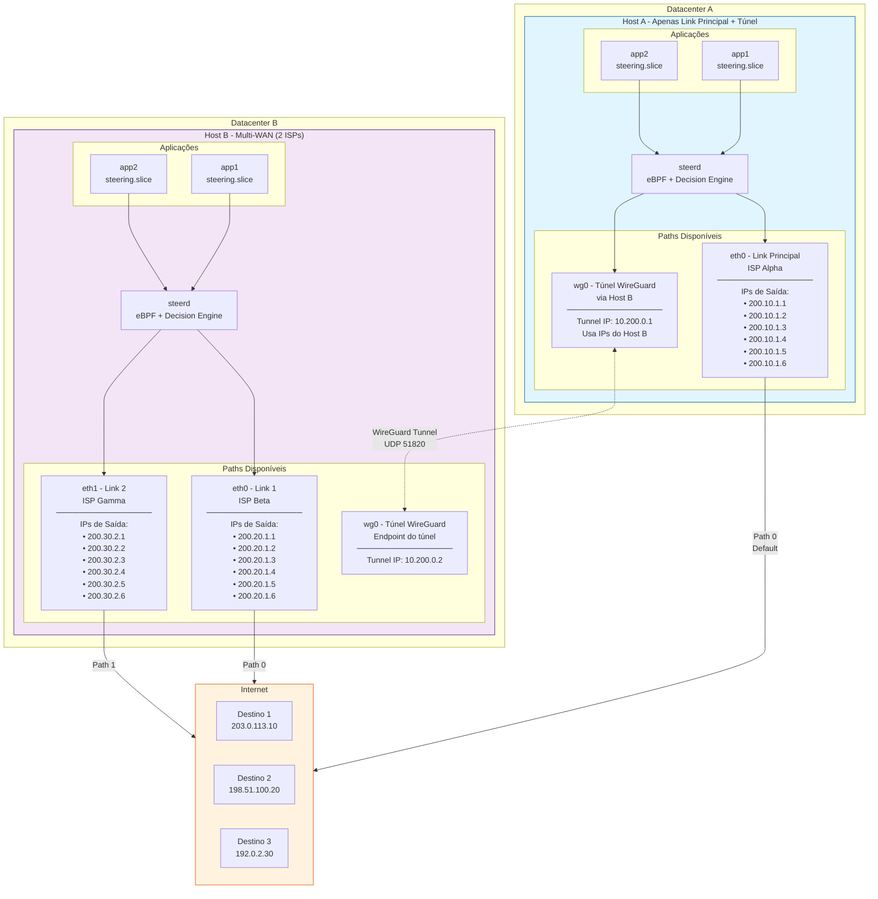
```mermaid
flowchart TB
subgraph INTERNET["Internet"]
DEST1["Destino 1<br/>203.0.113.10"]
DEST2["Destino 2<br/>198.51.100.20"]
DEST3["Destino 3<br/>192.0.2.30"]
end

subgraph DATACENTER_A["Datacenter A"]
subgraph HOST_A["Host A - Apenas Link Principal + Túnel"]
subgraph APPS_A["Aplicações"]
APP_A1["app1<br/>steering.slice"]
APP_A2["app2<br/>steering.slice"]
end

STEERD_A["steerd<br/>eBPF + Decision Engine"]

subgraph PATHS_A["Paths Disponíveis"]
direction TB
ETH0_A["eth0 - Link Principal<br/>ISP Alpha<br/>─────────────────<br/>IPs de Saída:<br/>• 200.10.1.1<br/>• 200.10.1.2<br/>• 200.10.1.3<br/>• 200.10.1.4<br/>• 200.10.1.5<br/>• 200.10.1.6"]
WG0_A["wg0 - Túnel WireGuard<br/>via Host B<br/>─────────────────<br/>Tunnel IP: 10.200.0.1<br/>Usa IPs do Host B"]
end
end
end

subgraph DATACENTER_B["Datacenter B"]
subgraph HOST_B["Host B - Multi-WAN (2 ISPs)"]
subgraph APPS_B["Aplicações"]
APP_B1["app1<br/>steering.slice"]
APP_B2["app2<br/>steering.slice"]
end

STEERD_B["steerd<br/>eBPF + Decision Engine"]

subgraph PATHS_B["Paths Disponíveis"]
direction TB
ETH0_B["eth0 - Link 1<br/>ISP Beta<br/>─────────────────<br/>IPs de Saída:<br/>• 200.20.1.1<br/>• 200.20.1.2<br/>• 200.20.1.3<br/>• 200.20.1.4<br/>• 200.20.1.5<br/>• 200.20.1.6"]
ETH1_B["eth1 - Link 2<br/>ISP Gamma<br/>─────────────────<br/>IPs de Saída:<br/>• 200.30.2.1<br/>• 200.30.2.2<br/>• 200.30.2.3<br/>• 200.30.2.4<br/>• 200.30.2.5<br/>• 200.30.2.6"]
WG0_B["wg0 - Túnel WireGuard<br/>Endpoint do túnel<br/>─────────────────<br/>Tunnel IP: 10.200.0.2"]
end
end
end

%% Conexões Host A
APP_A1 --> STEERD_A
APP_A2 --> STEERD_A
STEERD_A --> ETH0_A
STEERD_A --> WG0_A

%% Conexões Host B
APP_B1 --> STEERD_B
APP_B2 --> STEERD_B
STEERD_B --> ETH0_B
STEERD_B --> ETH1_B

%% Túnel WireGuard
WG0_A <-.->|"WireGuard Tunnel<br/>UDP 51820"| WG0_B

%% Saída para Internet
ETH0_A -->|"Path 0<br/>Default"| INTERNET
ETH0_B -->|"Path 0"| INTERNET
ETH1_B -->|"Path 1"| INTERNET

%% Estilo
style HOST_A fill:#e1f5fe,stroke:#01579b
style HOST_B fill:#f3e5f5,stroke:#4a148c
style INTERNET fill:#fff3e0,stroke:#e65100
```

### Cenário de Failover

```
┌─────────────────────────────────────────────────────────────────────────────┐
│ FLUXO DE DECISÃO │
├─────────────────────────────────────────────────────────────────────────────┤
│ │
│ HOST A (só tem eth0 + túnel): │
│ ┌─────────────────────────────────────────────────────────────────────┐ │
│ │ 1. Conexão para 203.0.113.10 via eth0 (default) │ │
│ │ 2. Detecta: 5 retransmissões + RTT > 500ms │ │
│ │ 3. Migra para wg0 → tráfego vai via Host B │ │
│ │ 4. Host B faz SNAT com seus IPs (200.20.1.x ou 200.30.2.x) │ │
│ └─────────────────────────────────────────────────────────────────────┘ │
│ │
│ HOST B (multi-WAN com 2 ISPs): │
│ ┌─────────────────────────────────────────────────────────────────────┐ │
│ │ 1. Conexão para 198.51.100.20 via eth0/ISP Beta (default) │ │
│ │ 2. Detecta: ICMP Host Unreachable │ │
│ │ 3. Migra para eth1/ISP Gamma │ │
│ │ 4. SNAT usa pool 200.30.2.1-6 (--random-fully) │ │
│ └─────────────────────────────────────────────────────────────────────┘ │
│ │
└─────────────────────────────────────────────────────────────────────────────┘
```

### Configuração dos Hosts

**Host A** (`/etc/steerd/config.yaml`):
```yaml
paths:
- id: 0
name: "direct-isp-alpha"
interface: eth0
type: direct
priority: 1
snat_pool:
- "200.10.1.1"
- "200.10.1.2"
- "200.10.1.3"
- "200.10.1.4"
- "200.10.1.5"
- "200.10.1.6"

- id: 1
name: "tunnel-via-hostb"
interface: wg0
type: tunnel
priority: 2
# SNAT feito pelo Host B
```

**Host B** (`/etc/steerd/config.yaml`):
```yaml
paths:
- id: 0
name: "direct-isp-beta"
interface: eth0
type: direct
priority: 1
snat_pool:
- "200.20.1.1"
- "200.20.1.2"
- "200.20.1.3"
- "200.20.1.4"
- "200.20.1.5"
- "200.20.1.6"

- id: 1
name: "direct-isp-gamma"
interface: eth1
type: direct
priority: 2
snat_pool:
- "200.30.2.1"
- "200.30.2.2"
- "200.30.2.3"
- "200.30.2.4"
- "200.30.2.5"
- "200.30.2.6"

- id: 2
name: "tunnel-endpoint"
interface: wg0
type: tunnel_endpoint
# Recebe tráfego do Host A e encaminha
```

### Tabela de IPs

| Host | Interface | ISP | IPs de Saída | Uso |
|------|-----------|-----|--------------|-----|
| **A** | eth0 | Alpha | 200.10.1.1-6 | Saída direta (default) |
| **A** | wg0 | - | 10.200.0.1 | Túnel para Host B |
| **B** | eth0 | Beta | 200.20.1.1-6 | Saída direta + tráfego tunelado |
| **B** | eth1 | Gamma | 200.30.2.1-6 | Failover de eth0 |
| **B** | wg0 | - | 10.200.0.2 | Endpoint do túnel |

**Total de IPs de saída:**
- Host A: 6 IPs próprios + 12 IPs via túnel (Host B) = **18 possibilidades**
- Host B: 12 IPs diretos = **12 possibilidades**

---

## 1. Arquitetura Geral

### 1.1 Visão de Alto Nível

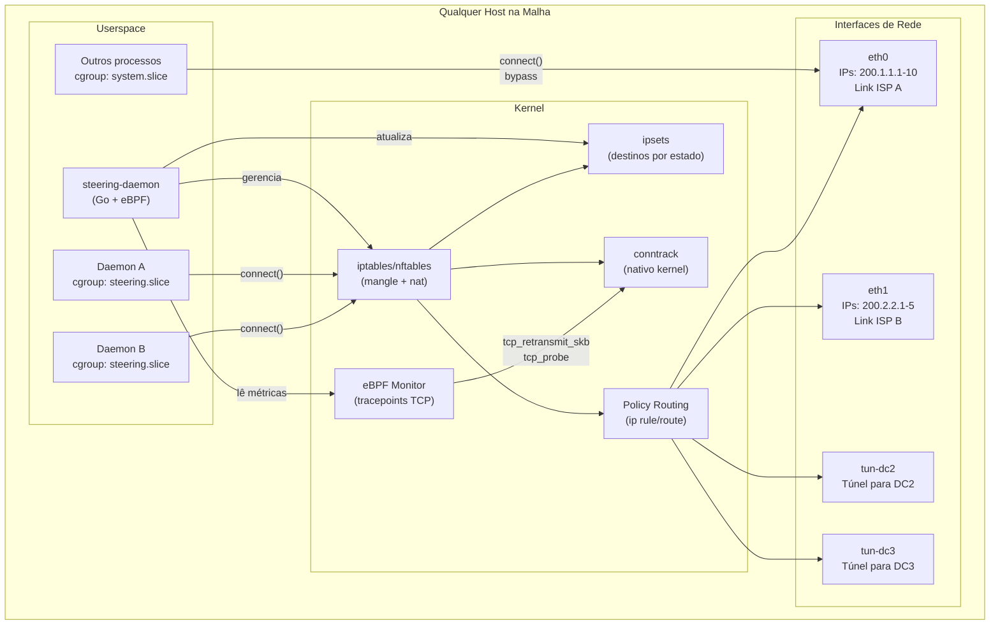
```mermaid
flowchart TB
subgraph HOST["Qualquer Host na Malha"]
subgraph USERSPACE["Userspace"]
DAEMON["steering-daemon<br/>(Go + eBPF)"]
APP1["Daemon A<br/>cgroup: steering.slice"]
APP2["Daemon B<br/>cgroup: steering.slice"]
APP3["Outros processos<br/>cgroup: system.slice"]
end

subgraph KERNEL["Kernel"]
EBPF_MON["eBPF Monitor<br/>(tracepoints TCP)"]
IPTABLES["iptables/nftables<br/>(mangle + nat)"]
IPSET["ipsets<br/>(destinos por estado)"]
CONNTRACK["conntrack<br/>(nativo kernel)"]
ROUTING["Policy Routing<br/>(ip rule/route)"]
end

subgraph INTERFACES["Interfaces de Rede"]
ETH0["eth0<br/>IPs: 200.1.1.1-10<br/>Link ISP A"]
ETH1["eth1<br/>IPs: 200.2.2.1-5<br/>Link ISP B"]
TUN1["tun-dc2<br/>Túnel para DC2"]
TUN2["tun-dc3<br/>Túnel para DC3"]
end
end

DAEMON -->|"lê métricas"| EBPF_MON
DAEMON -->|"atualiza"| IPSET
DAEMON -->|"gerencia"| IPTABLES

APP1 -->|"connect()"| IPTABLES
APP2 -->|"connect()"| IPTABLES
APP3 -->|"connect()<br/>bypass"| ETH0

IPTABLES --> IPSET
IPTABLES --> CONNTRACK
IPTABLES --> ROUTING

ROUTING --> ETH0
ROUTING --> ETH1
ROUTING --> TUN1
ROUTING --> TUN2

EBPF_MON -->|"tcp_retransmit_skb<br/>tcp_probe"| CONNTRACK
```

### 1.2 Princípios de Design

| Princípio | Descrição |
|-----------|-----------|
| **Código Único** | Mesmo binário roda em todos os servidores; comportamento definido por configuração |
| **Dual-Stack IPv4/IPv6** | Suporte nativo a ambos os protocolos; mesma lógica para ambos |
| **Híbrido eBPF + iptables** | eBPF apenas para monitoramento (read-only); iptables/ip6tables para data path |
| **Conntrack Nativo** | Usa conntrack do kernel, não reimplementa |
| **Isolamento por Cgroup** | Apenas processos em `steering.slice` são afetados |
| **Failover Automático** | Detecta degradação e redireciona sem intervenção |
| **Pool de IPs** | Randomiza IP de origem para maximizar portas efêmeras |
| **IPSet como Fonte da Verdade** | Estado persiste nos ipsets; daemon reconstrói estado ao reiniciar |
| **Monitoramento Sob Demanda** | Monitora apenas destinos com problemas; economia de memória |
| **Sliding Window** | Métricas em janela flutuante (30s) para refletir saúde atual, não histórico |
| **Retry Passivo com Backoff** | Periodicamente tenta voltar ao path default; tráfego real testa recuperação |
| **Configuração Explícita** | Interfaces e túneis configurados manualmente para previsibilidade |

### 1.3 Decisões de Design e Escopo

Esta seção documenta decisões arquiteturais importantes sobre o que está **incluído** e **excluído** do escopo do projeto.

#### 1.3.1 Configuração Manual vs Auto-Discovery

**Decisão**: **Configuração manual** de interfaces, IPs e túneis.

**Justificativa**:
- Infraestrutura crítica requer configuração explícita e previsível
- Auto-discovery pode introduzir comportamento inesperado em ambiente de produção
- Permite validação completa da configuração antes do deploy
- Simplicidade: menos código, menos surface de bugs

**Implicações**:
- Administrador deve configurar explicitamente cada path em `/etc/steerd/config.yaml`
- Mudanças em interfaces requerem atualização manual da configuração
- Não há componente `pkg/node/discovery.go` no projeto

#### 1.3.2 Tunnel Management Externo

**Decisão**: Túneis (WireGuard, IPIP, GRE) são **pré-requisitos gerenciados externamente**.

**Justificativa**:
- WireGuard/IPIP/GRE já possuem ferramentas maduras de gerenciamento (`wg-quick`, `ip tunnel`)
- Separação de responsabilidades: steerd foca em steering, não em criação de túneis
- Túneis têm lifecycle independente do steering (podem ser compartilhados com outros serviços)
- Evita reimplementar funcionalidade já disponível no sistema

**Implicações**:
- Túneis devem estar **up e funcionais** antes de iniciar steerd
- Setup de túneis é documentado em `docs/WIREGUARD.md`
- steerd apenas **usa** túneis existentes, não os cria/gerencia
- Não há componente `pkg/tunnel/manager.go` no projeto

#### 1.3.3 Config Reload

**Decisão**: Mudanças de configuração requerem **restart do daemon**.

**Justificativa**:
- Daemon de infraestrutura não muda configuração frequentemente
- Restart via systemd é rápido e seguro
- Evita complexidade de hot-reload (state inconsistencies, race conditions)
- IPSet recovery garante que estado não é perdido no restart

**Implicações**:
- Para aplicar mudanças em `/etc/steerd/config.yaml`: `systemctl restart steerd`
- Recovery de estado via ipsets garante continuidade do steering
- Não há watcher de configuração no projeto

### 1.4 Papéis de um Host

Cada host pode assumir um ou mais papéis simultaneamente:

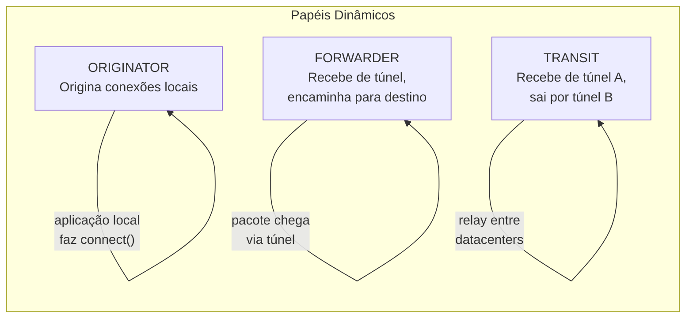
```mermaid
flowchart LR
subgraph ROLES["Papéis Dinâmicos"]
ORIG["ORIGINATOR<br/>Origina conexões locais"]
FWD["FORWARDER<br/>Recebe de túnel,<br/>encaminha para destino"]
TRANS["TRANSIT<br/>Recebe de túnel A,<br/>sai por túnel B"]
end

ORIG --> |"aplicação local<br/>faz connect()"| ORIG
FWD --> |"pacote chega<br/>via túnel"| FWD
TRANS --> |"relay entre<br/>datacenters"| TRANS
```

---

## 2. Componentes do Sistema

### 2.1 Diagrama de Componentes

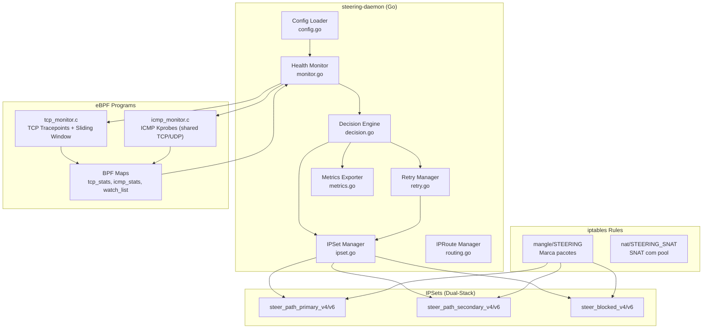
```mermaid
flowchart TB
subgraph DAEMON["steering-daemon (Go)"]
CONFIG["Config Loader<br/>config.go"]
HEALTH["Health Monitor<br/>monitor.go"]
DECISION["Decision Engine<br/>decision.go"]
IPSET_MGR["IPSet Manager<br/>ipset.go"]
IPROUTE["IPRoute Manager<br/>routing.go"]
RETRY["Retry Manager<br/>retry.go"]
METRICS["Metrics Exporter<br/>metrics.go"]
end

subgraph EBPF["eBPF Programs"]
TCP_BPF["tcp_monitor.c<br/>TCP Tracepoints + Sliding Window"]
ICMP_BPF["icmp_monitor.c<br/>ICMP Kprobes (shared TCP/UDP)"]
MAPS["BPF Maps<br/>tcp_stats, icmp_stats, watch_list"]
end

subgraph IPTABLES_RULES["iptables Rules"]
MANGLE["mangle/STEERING<br/>Marca pacotes"]
NAT["nat/STEERING_SNAT<br/>SNAT com pool"]
end

subgraph IPSETS["IPSets (Dual-Stack)"]
SET1["steer_path_primary_v4/v6"]
SET2["steer_path_secondary_v4/v6"]
SET3["steer_blocked_v4/v6"]
end

CONFIG --> HEALTH
HEALTH --> TCP_BPF
HEALTH --> ICMP_BPF
TCP_BPF --> MAPS
ICMP_BPF --> MAPS
MAPS --> HEALTH
HEALTH --> DECISION
DECISION --> IPSET_MGR
DECISION --> RETRY
IPSET_MGR --> SET1
IPSET_MGR --> SET2
IPSET_MGR --> SET3
MANGLE --> SET1
MANGLE --> SET2
MANGLE --> SET3
DECISION --> METRICS
RETRY --> IPSET_MGR
```

### 2.2 Descrição dos Componentes

#### 2.2.1 Config Loader (`internal/config/config.go`)

Responsável por carregar e validar a configuração do host.

**Responsabilidades:**
- Carregar configuração de arquivo YAML
- Validar parâmetros
- Fornecer defaults sensatos
- Aplicar mudanças requer restart do daemon (design decision 1.3.3)

**Estrutura de Configuração:**
```yaml
# /etc/steering/config.yaml
node:
id: "dc1-server-01" # Identificador único do nó

steering:
enabled: true
cgroup_slice: "steering.slice" # Apenas processos neste slice são afetados

paths:
- id: "eth0-direct"
type: "direct"
interface: "eth0"
ipv4s:
- "200.1.1.1"
- "200.1.1.2"
- "200.1.1.3"
- "200.1.1.4"
- "200.1.1.5"
ipv6s:
- "2001:db8:1::1"
- "2001:db8:1::2"
priority: 100 # Menor = preferido

- id: "eth1-direct"
type: "direct"
interface: "eth1"
ipv4s:
- "200.2.2.1"
- "200.2.2.2"
ipv6s:
- "2001:db8:2::1"
priority: 100

- id: "tunnel-dc2"
type: "tunnel"
interface: "wg-dc2"
protocol: "wireguard"
peer_ipv4: "10.99.0.2"
peer_ipv6: "fd00:99::2"
local_ipv4: "10.99.0.1"
local_ipv6: "fd00:99::1"
priority: 200 # Túnel como fallback
# Note: WireGuard tunnel must be configured externally (see docs/WIREGUARD.md)

- id: "tunnel-dc3"
type: "tunnel"
interface: "wg-dc3"
protocol: "wireguard"
peer_ipv4: "10.99.1.2"
peer_ipv6: "fd00:99:1::2"
priority: 200
# Note: WireGuard tunnel must be configured externally (see docs/WIREGUARD.md)

health:
check_interval: "1s"
thresholds:
rtt_ms: 200 # RTT acima disso = degradado
retrans_percent: 5 # Retransmissões acima disso = degradado
loss_percent: 2 # Perda acima disso = degradado
consecutive_fails: 3 # Falhas consecutivas para marcar down
recovery:
min_stable_time: "30s" # Tempo estável antes de voltar ao path
sliding_window:
num_buckets: 6 # Número de buckets na janela
bucket_duration: "5s" # Duração de cada bucket (total = 30s)

# Monitoramento sob demanda
watch_list:
max_entries: 10000 # Máximo de destinos monitorados simultaneamente
healthy_removal_time: "5m" # Remove do monitoramento após 5min saudável

# Retry passivo para tentar voltar ao path default
retry:
enabled: true
check_interval: "30s" # Frequência de verificação
retry_interval: "5m" # Intervalo base para retry
max_retry_interval: "1h" # Intervalo máximo (com backoff)
# Backoff exponencial: 5min, 10min, 20min, 40min, 1h, 1h...

logging:
level: "info" # debug, info, warn, error
format: "json"

metrics:
enabled: true
port: 9090
path: "/metrics"
```

#### 2.2.2 Health Monitor (`internal/health/monitor.go`)

Monitora saúde de conexões TCP via eBPF.

**Responsabilidades:**
- Carregar programa eBPF de monitoramento
- Coletar métricas por IP de destino
- Calcular scores de saúde
- Emitir eventos de mudança de estado

**Métricas Coletadas:**
| Métrica | Fonte eBPF | Descrição |
|---------|------------|-----------|
| `packets` | tcp_probe | Total de pacotes por destino |
| `retransmits` | tcp_retransmit_skb | Retransmissões TCP |
| `rtt_us` | tcp_probe | Round-trip time em microsegundos |
| `connect_fails` | tcp_connect (kprobe) | Falhas de conexão |
| `resets` | tcp_receive_reset | RST recebidos |

**Cálculo de Score:**
```
score = 100

if rtt_ms > threshold.rtt_ms:
score -= 30

if retrans_percent > threshold.retrans_percent:
score -= 40

if loss_percent > threshold.loss_percent:
score -= 30

if consecutive_fails > 0:
score -= (consecutive_fails * 10)

score = max(0, score)
```

#### 2.2.3 Decision Engine (`internal/decision/engine.go`)

Decide qual path usar para cada destino.

**Responsabilidades:**
- Avaliar scores de todos os paths para um destino
- Aplicar política de seleção (failover, balanceamento)
- Determinar ações (manter, migrar, bloquear)
- Coordenar transições suaves

**Algoritmo de Decisão:**
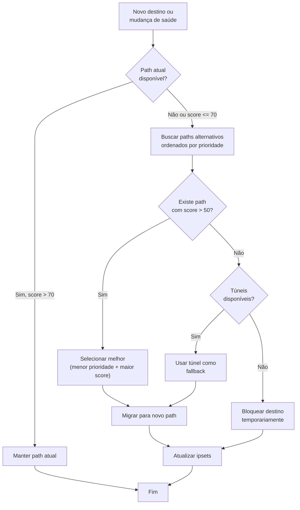
```mermaid
flowchart TD
START["Novo destino ou<br/>mudança de saúde"] --> CHECK_CURRENT

CHECK_CURRENT{"Path atual<br/>disponível?"}
CHECK_CURRENT -->|"Sim, score > 70"| KEEP["Manter path atual"]
CHECK_CURRENT -->|"Não ou score <= 70"| FIND_ALT

FIND_ALT["Buscar paths alternativos<br/>ordenados por prioridade"]
FIND_ALT --> EVAL_ALTS

EVAL_ALTS{"Existe path<br/>com score > 50?"}
EVAL_ALTS -->|"Sim"| SELECT_BEST["Selecionar melhor<br/>(menor prioridade + maior score)"]
EVAL_ALTS -->|"Não"| CHECK_TUNNEL

CHECK_TUNNEL{"Túneis<br/>disponíveis?"}
CHECK_TUNNEL -->|"Sim"| USE_TUNNEL["Usar túnel como<br/>fallback"]
CHECK_TUNNEL -->|"Não"| BLOCK["Bloquear destino<br/>temporariamente"]

SELECT_BEST --> MIGRATE["Migrar para novo path"]
USE_TUNNEL --> MIGRATE

MIGRATE --> UPDATE_IPSET["Atualizar ipsets"]
BLOCK --> UPDATE_IPSET
KEEP --> END["Fim"]
UPDATE_IPSET --> END
```

#### 2.2.4 IPSet Manager (`internal/ipset/manager.go`)

Gerencia ipsets que controlam o steering.

**Responsabilidades:**
- Criar/destruir ipsets na inicialização (dual-stack: pares v4/v6)
- Adicionar/remover IPs dos sets
- Manter consistência entre estado interno e kernel
- Recovery de estado lendo ipsets existentes

**IPSets Utilizados (Dual-Stack):**
| Nome Base | IPv4 | IPv6 | Descrição |
|-----------|------|------|-----------|
| `steer_blocked` | `steer_blocked_v4` | `steer_blocked_v6` | Destinos bloqueados temporariamente |
| `steer_path_<id>` | `steer_path_<id>_v4` | `steer_path_<id>_v6` | Destinos usando path específico |

**Operações Principais:**
- `Initialize(pathIDs)`: Cria pares v4/v6 para todos paths
- `AddToPath(pathID, addr)`: Adiciona ao set correto baseado em `addr.Is4()`
- `RemoveFromPath(pathID, addr)`: Remove do set correto
- `MoveTo(addr, fromPath, toPath)`: Move entre paths atomicamente
- `RecoverState()`: Lê ipsets existentes e reconstrói estado
- `ExtractPathID(setName)`: Extrai path ID do nome do ipset

#### 2.2.5 IPRoute Manager (`internal/routing/manager.go`)

Configura policy routing no kernel.

**Responsabilidades:**
- Criar tabelas de roteamento por path
- Configurar regras `ip rule` por fwmark
- Manter rotas atualizadas
- Cleanup na finalização

**Estrutura de Routing:**
```
# Tabelas (em /etc/iproute2/rt_tables)
100 steer_eth0
101 steer_eth1
110 steer_tunnel_dc2
111 steer_tunnel_dc3

# Regras (ip rule)
fwmark 0x1/0xff lookup steer_eth0
fwmark 0x2/0xff lookup steer_eth1
fwmark 0x10/0xff lookup steer_tunnel_dc2
fwmark 0x11/0xff lookup steer_tunnel_dc3

# Rotas por tabela
ip route add default via <gateway> dev eth0 table steer_eth0
ip route add default via <gateway> dev eth1 table steer_eth1
ip route add default via 10.99.0.2 dev tun-dc2 table steer_tunnel_dc2
```

#### 2.2.6 Retry Manager (`internal/retry/manager.go`)

Gerencia retry passivo com exponential backoff para tentar retornar ao path default.

**Responsabilidades:**
- Rastrear destinos migrados para paths alternativos
- Remover periodicamente de ipsets para testar path default
- Aplicar backoff exponencial (5m → 10m → 20m → 40m → 1h)
- Recovery de retry state ao reiniciar

**Algoritmo de Backoff:**
```
Retry 0: 5 minutos (2^0 × 5min = 5min)
Retry 1: 10 minutos (2^1 × 5min = 10min)
Retry 2: 20 minutos (2^2 × 5min = 20min)
Retry 3: 40 minutos (2^3 × 5min = 40min)
Retry 4+: 60 minutos (cap em max_retry_interval)
```

**Operações Principais:**
- `Track(dest, fromPath, toPath)`: Registra destino migrado
- `checkRetries()`: Loop periódico que remove de ipset para testar default
- `OnMigratedBack(dest, toPath)`: Chamado se destino migra de volta (incrementa backoff)
- `RecoverFromIPSets(defaultPath)`: Reconstrói tracking ao reiniciar

#### 2.2.7 Metrics Exporter (`internal/metrics/prometheus.go`)

Exporta métricas para Prometheus.

**Responsabilidades:**
- Registrar métricas de decisões, health scores, paths
- Servir endpoint HTTP `/metrics`
- Atualizar métricas em tempo real

**Métricas Exportadas:**
- `steerd_destinations_total`: Total de destinos monitorados
- `steerd_migrations_total{from, to}`: Migrações entre paths
- `steerd_dest_health_score{dest}`: Score de saúde por destino
- `steerd_path_destinations{path}`: Destinos usando cada path
- `steerd_retries_total`: Tentativas de retry
- `steerd_ebpf_events_total{type}`: Eventos eBPF recebidos

---

## 3. Fluxos de Dados

### 3.1 Fluxo de Conexão de Saída (Origem Local)

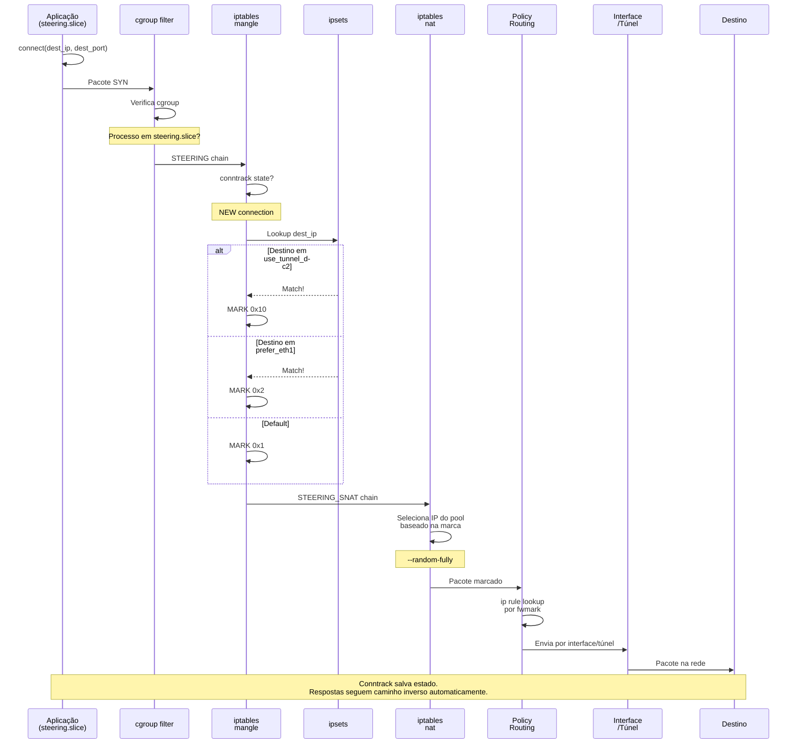
```mermaid
sequenceDiagram
participant App as Aplicação<br/>(steering.slice)
participant CG as cgroup filter
participant IPT as iptables<br/>mangle
participant IPS as ipsets
participant NAT as iptables<br/>nat
participant RT as Policy<br/>Routing
participant IF as Interface<br/>/Túnel
participant DST as Destino

App->>App: connect(dest_ip, dest_port)
App->>CG: Pacote SYN

CG->>CG: Verifica cgroup
Note over CG: Processo em steering.slice?

CG->>IPT: STEERING chain

IPT->>IPT: conntrack state?
Note over IPT: NEW connection

IPT->>IPS: Lookup dest_ip

alt Destino em use_tunnel_dc2
IPS-->>IPT: Match!
IPT->>IPT: MARK 0x10
else Destino em prefer_eth1
IPS-->>IPT: Match!
IPT->>IPT: MARK 0x2
else Default
IPT->>IPT: MARK 0x1
end

IPT->>NAT: STEERING_SNAT chain

NAT->>NAT: Seleciona IP do pool<br/>baseado na marca
Note over NAT: --random-fully

NAT->>RT: Pacote marcado

RT->>RT: ip rule lookup<br/>por fwmark

RT->>IF: Envia por interface/túnel

IF->>DST: Pacote na rede

Note over App,DST: Conntrack salva estado.<br/>Respostas seguem caminho inverso automaticamente.
```

### 3.2 Fluxo de Pacote Recebido via Túnel (Forward)

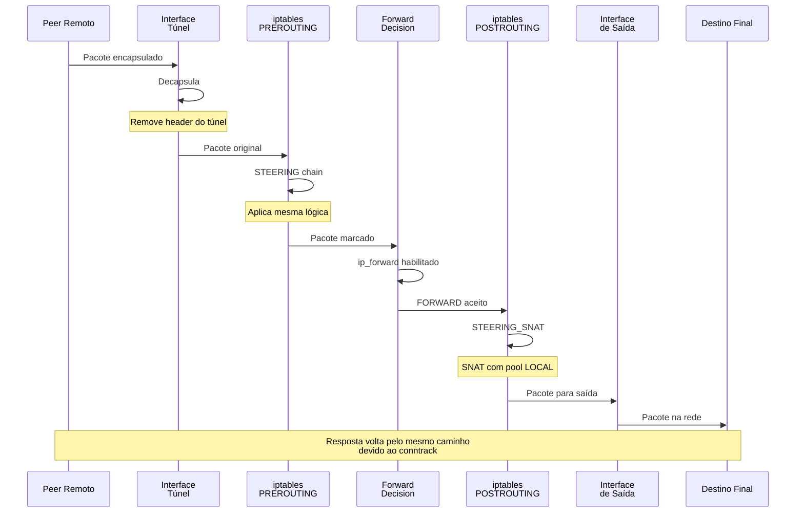
```mermaid
sequenceDiagram
participant PEER as Peer Remoto
participant TUN as Interface<br/>Túnel
participant IPT_IN as iptables<br/>PREROUTING
participant FWD as Forward<br/>Decision
participant IPT_OUT as iptables<br/>POSTROUTING
participant IF as Interface<br/>de Saída
participant DST as Destino Final

PEER->>TUN: Pacote encapsulado

TUN->>TUN: Decapsula
Note over TUN: Remove header do túnel

TUN->>IPT_IN: Pacote original

IPT_IN->>IPT_IN: STEERING chain
Note over IPT_IN: Aplica mesma lógica

IPT_IN->>FWD: Pacote marcado

FWD->>FWD: ip_forward habilitado

FWD->>IPT_OUT: FORWARD aceito

IPT_OUT->>IPT_OUT: STEERING_SNAT
Note over IPT_OUT: SNAT com pool LOCAL

IPT_OUT->>IF: Pacote para saída

IF->>DST: Pacote na rede

Note over PEER,DST: Resposta volta pelo mesmo caminho<br/>devido ao conntrack
```

### 3.3 Fluxo de Detecção e Failover

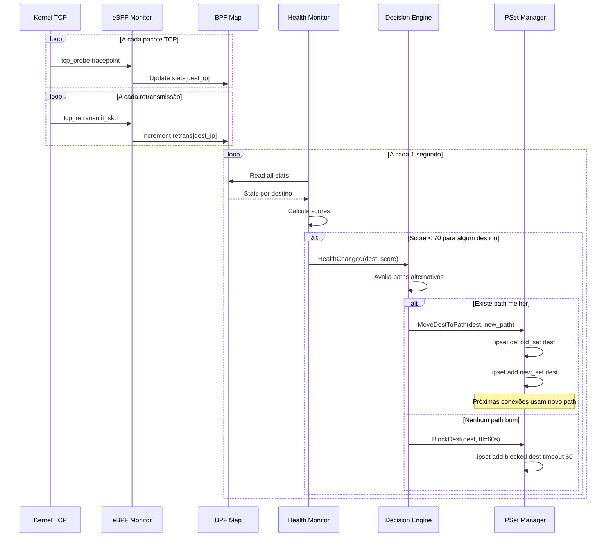
```mermaid
sequenceDiagram
participant KERN as Kernel TCP
participant EBPF as eBPF Monitor
participant MAP as BPF Map
participant MON as Health Monitor
participant DEC as Decision Engine
participant IPS as IPSet Manager

loop A cada pacote TCP
KERN->>EBPF: tcp_probe tracepoint
EBPF->>MAP: Update stats[dest_ip]
end

loop A cada retransmissão
KERN->>EBPF: tcp_retransmit_skb
EBPF->>MAP: Increment retrans[dest_ip]
end

loop A cada 1 segundo
MON->>MAP: Read all stats
MAP-->>MON: Stats por destino

MON->>MON: Calcula scores

alt Score < 70 para algum destino
MON->>DEC: HealthChanged(dest, score)

DEC->>DEC: Avalia paths alternativos

alt Existe path melhor
DEC->>IPS: MoveDestToPath(dest, new_path)
IPS->>IPS: ipset del old_set dest
IPS->>IPS: ipset add new_set dest
Note over IPS: Próximas conexões usam novo path
else Nenhum path bom
DEC->>IPS: BlockDest(dest, ttl=60s)
IPS->>IPS: ipset add blocked dest timeout 60
end
end
end
```

### 3.4 Fluxo de Resposta (Caminho Inverso)

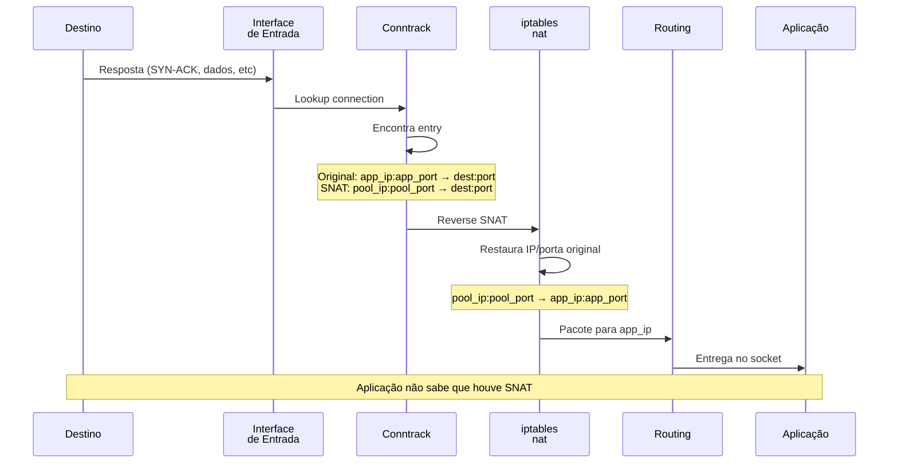
```mermaid
sequenceDiagram
participant DST as Destino
participant IF as Interface<br/>de Entrada
participant CT as Conntrack
participant NAT as iptables<br/>nat
participant RT as Routing
participant APP as Aplicação

DST->>IF: Resposta (SYN-ACK, dados, etc)

IF->>CT: Lookup connection

CT->>CT: Encontra entry
Note over CT: Original: app_ip:app_port → dest:port<br/>SNAT: pool_ip:pool_port → dest:port

CT->>NAT: Reverse SNAT

NAT->>NAT: Restaura IP/porta original
Note over NAT: pool_ip:pool_port → app_ip:app_port

NAT->>RT: Pacote para app_ip

RT->>APP: Entrega no socket

Note over DST,APP: Aplicação não sabe que houve SNAT
```

---

## 4. Estrutura do Projeto

```
steering-host-network/
├── cmd/
│ └── steerd/
│ └── main.go # Entry point do daemon
├── internal/ # Pacotes internos (não exportados)
│ ├── config/
│ │ └── config.go # Estruturas de configuração + loader
│ ├── health/
│ │ └── monitor.go # Monitora saúde via eBPF + sliding window
│ ├── decision/
│ │ └── engine.go # Decision engine + hysteresis
│ ├── ipset/
│ │ └── manager.go # Gerencia ipsets (dual-stack v4/v6)
│ ├── iptables/
│ │ └── manager.go # Gerencia iptables/ip6tables
│ ├── routing/
│ │ └── manager.go # Gerencia policy routing
│ ├── retry/
│ │ └── manager.go # Retry passivo com exponential backoff
│ ├── ebpf/
│ │ └── loader.go # Carrega programas eBPF + event handler
│ ├── metrics/
│ │ └── prometheus.go # Exporta métricas Prometheus
│ └── netlink/
│ └── (future) # Placeholder para wrappers netlink
├── bpf/
│ ├── headers/
│ │ └── types.h # Tipos compartilhados eBPF
│ └── probes/
│ ├── tcp_monitor.c # TCP tracepoints + sliding window
│ └── icmp_monitor.c # ICMP kprobes (shared TCP/UDP)
├── scripts/
│ └── setup-dev.sh # Setup ambiente desenvolvimento
├── configs/
│ └── config.yaml.example # Configuração exemplo
├── systemd/
│ ├── steerd.service # Unit do daemon
│ └── steering.slice # Slice para processos
├── build/
│ ├── Dockerfile.build # Build container
│ └── steerd.spec # RPM spec file
├── docs/
│ ├── ARCHITECTURE.md # Este documento
│ └── WIREGUARD.md # Setup manual de túneis WireGuard
├── go.mod
├── go.sum
├── Makefile
└── README.md
```

**Notas sobre a Estrutura:**
- `internal/` em vez de `pkg/`: Pacotes internos não exportados (padrão Go moderno)
- Arquivos consolidados: `monitor.go` contém stats, scorer, watchlist, window
- Discovery ausente: Configuração manual (decisão 1.3.1)
- Tunnel manager ausente: Túneis gerenciados externamente (decisão 1.3.2)
- Config watcher ausente: Reload requer restart (decisão 1.3.3)
- Netlink usado diretamente: Biblioteca `vishvananda/netlink` sem wrapper

---

## 5. Implementação Detalhada

### 5.1 Programas eBPF

Os programas eBPF estão divididos em dois arquivos:
- `bpf/probes/tcp_monitor.c`: TCP tracepoints + sliding window
- `bpf/probes/icmp_monitor.c`: ICMP kprobes (compartilhado TCP/UDP)

#### 5.1.1 TCP Monitor (`bpf/probes/tcp_monitor.c`)

```c
// SPDX-License-Identifier: GPL-2.0
// tcp_monitor.c - Monitora saúde de conexões TCP

#include "vmlinux.h"
#include <bpf/bpf_helpers.h>
#include <bpf/bpf_tracing.h>
#include <bpf/bpf_core_read.h>

// Estatísticas por IP de destino
struct dest_stats {
__u64 packets_total;
__u64 bytes_total;
__u64 retransmits;
__u64 rtt_sum_us; // Soma de RTTs em microsegundos
__u64 rtt_count; // Quantidade de amostras de RTT
__u64 rtt_min_us;
__u64 rtt_max_us;
__u64 connect_attempts;
__u64 connect_failures;
__u64 resets_received;
__u64 last_seen_ns; // Timestamp última atividade
};

// Mapa de estatísticas por destino (IPv4)
struct {
__uint(type, BPF_MAP_TYPE_LRU_HASH);
__uint(max_entries, 65536);
__type(key, __u32); // dest IPv4
__type(value, struct dest_stats);
} dest_stats_map SEC(".maps");

// Mapa de estatísticas por destino (IPv6)
struct {
__uint(type, BPF_MAP_TYPE_LRU_HASH);
__uint(max_entries, 65536);
__type(key, struct in6_addr); // dest IPv6
__type(value, struct dest_stats);
} dest_stats_map_v6 SEC(".maps");

// Helper para obter/criar entrada de stats
static __always_inline struct dest_stats *get_or_create_stats(__u32 dest_ip) {
struct dest_stats *stats = bpf_map_lookup_elem(&dest_stats_map, &dest_ip);
if (stats) {
return stats;
}

struct dest_stats new_stats = {
.rtt_min_us = ~0ULL, // Max value para min tracking
};
bpf_map_update_elem(&dest_stats_map, &dest_ip, &new_stats, BPF_ANY);
return bpf_map_lookup_elem(&dest_stats_map, &dest_ip);
}

// Tracepoint: tcp_retransmit_skb
// Chamado quando kernel retransmite um pacote TCP
SEC("tracepoint/tcp/tcp_retransmit_skb")
int trace_tcp_retransmit(struct trace_event_raw_tcp_event_sk_skb *ctx) {
__u32 dest_ip;

// Lê endereço destino do contexto
bpf_probe_read_kernel(&dest_ip, sizeof(dest_ip), &ctx->daddr);

if (dest_ip == 0) {
return 0;
}

struct dest_stats *stats = get_or_create_stats(dest_ip);
if (stats) {
__sync_fetch_and_add(&stats->retransmits, 1);
stats->last_seen_ns = bpf_ktime_get_ns();
}

return 0;
}

// Tracepoint: tcp_probe
// Chamado periodicamente com informações de RTT e cwnd
SEC("tracepoint/tcp/tcp_probe")
int trace_tcp_probe(struct trace_event_raw_tcp_probe *ctx) {
__u32 dest_ip;
__u32 srtt_us;

bpf_probe_read_kernel(&dest_ip, sizeof(dest_ip), &ctx->daddr);
bpf_probe_read_kernel(&srtt_us, sizeof(srtt_us), &ctx->srtt_us);

if (dest_ip == 0) {
return 0;
}

struct dest_stats *stats = get_or_create_stats(dest_ip);
if (stats) {
__sync_fetch_and_add(&stats->packets_total, 1);
__sync_fetch_and_add(&stats->rtt_sum_us, srtt_us);
__sync_fetch_and_add(&stats->rtt_count, 1);

// Track min/max RTT (não é atomic, mas ok para métricas)
if (srtt_us < stats->rtt_min_us) {
stats->rtt_min_us = srtt_us;
}
if (srtt_us > stats->rtt_max_us) {
stats->rtt_max_us = srtt_us;
}

stats->last_seen_ns = bpf_ktime_get_ns();
}

return 0;
}

// Tracepoint: tcp_receive_reset
// Chamado quando recebe RST
SEC("tracepoint/tcp/tcp_receive_reset")
int trace_tcp_reset(struct trace_event_raw_tcp_event_sk *ctx) {
__u32 dest_ip;

bpf_probe_read_kernel(&dest_ip, sizeof(dest_ip), &ctx->daddr);

if (dest_ip == 0) {
return 0;
}

struct dest_stats *stats = get_or_create_stats(dest_ip);
if (stats) {
__sync_fetch_and_add(&stats->resets_received, 1);
stats->last_seen_ns = bpf_ktime_get_ns();
}

return 0;
}

// Kprobe: tcp_connect
// Chamado no início de uma conexão TCP
SEC("kprobe/tcp_connect")
int trace_tcp_connect(struct pt_regs *ctx) {
struct sock *sk = (struct sock *)PT_REGS_PARM1(ctx);
__u32 dest_ip;

bpf_probe_read_kernel(&dest_ip, sizeof(dest_ip), &sk->__sk_common.skc_daddr);

if (dest_ip == 0) {
return 0;
}

struct dest_stats *stats = get_or_create_stats(dest_ip);
if (stats) {
__sync_fetch_and_add(&stats->connect_attempts, 1);
stats->last_seen_ns = bpf_ktime_get_ns();
}

return 0;
}

// Kretprobe: tcp_connect
// Chamado após tcp_connect, verifica se falhou
SEC("kretprobe/tcp_connect")
int trace_tcp_connect_ret(struct pt_regs *ctx) {
int ret = PT_REGS_RC(ctx);

// Se retornou erro, incrementa falhas
// Nota: precisaria correlacionar com o kprobe para saber o dest_ip
// Simplificação: usar mapa per-task para correlação

return 0;
}

char LICENSE[] SEC("license") = "GPL";
```

#### 5.1.2 ICMP Monitor (`bpf/probes/icmp_monitor.c`)

Ver seção 11.8 para detalhes completos do ICMP monitor compartilhado.

### 5.2 Loader eBPF (`internal/ebpf/loader.go`)

```go
package ebpf

import (
"fmt"
"log/slog"

"github.com/cilium/ebpf"
"github.com/cilium/ebpf/link"
"github.com/cilium/ebpf/rlimit"
)

//go:generate go run github.com/cilium/ebpf/cmd/bpf2go -target amd64 -cc clang tcp ../../bpf/probes/tcp_monitor.c -- -I../../bpf/headers
//go:generate go run github.com/cilium/ebpf/cmd/bpf2go -target amd64 -cc clang icmp ../../bpf/probes/icmp_monitor.c -- -I../../bpf/headers

// Loader carrega e gerencia programas eBPF
type Loader struct {
objs healthObjects
links []link.Link
log *slog.Logger
}

// NewLoader cria um novo loader
func NewLoader(log *slog.Logger) *Loader {
return &Loader{
log: log,
links: make([]link.Link, 0),
}
}

// Load carrega os programas eBPF
func (l *Loader) Load() error {
// Remove limite de memória locked para eBPF
if err := rlimit.RemoveMemlock(); err != nil {
return fmt.Errorf("removing memlock: %w", err)
}

// Carrega objetos eBPF
if err := loadHealthObjects(&l.objs, nil); err != nil {
return fmt.Errorf("loading eBPF objects: %w", err)
}

// Attach tracepoint tcp_retransmit_skb
tpRetrans, err := link.Tracepoint("tcp", "tcp_retransmit_skb", l.objs.TraceTcpRetransmit, nil)
if err != nil {
return fmt.Errorf("attaching tcp_retransmit_skb: %w", err)
}
l.links = append(l.links, tpRetrans)
l.log.Info("attached tracepoint", "name", "tcp_retransmit_skb")

// Attach tracepoint tcp_probe
tpProbe, err := link.Tracepoint("tcp", "tcp_probe", l.objs.TraceTcpProbe, nil)
if err != nil {
return fmt.Errorf("attaching tcp_probe: %w", err)
}
l.links = append(l.links, tpProbe)
l.log.Info("attached tracepoint", "name", "tcp_probe")

// Attach tracepoint tcp_receive_reset
tpReset, err := link.Tracepoint("tcp", "tcp_receive_reset", l.objs.TraceTcpReset, nil)
if err != nil {
// Não fatal, pode não existir em kernels mais antigos
l.log.Warn("failed to attach tcp_receive_reset", "error", err)
} else {
l.links = append(l.links, tpReset)
l.log.Info("attached tracepoint", "name", "tcp_receive_reset")
}

// Attach kprobe tcp_connect
kpConnect, err := link.Kprobe("tcp_connect", l.objs.TraceTcpConnect, nil)
if err != nil {
l.log.Warn("failed to attach kprobe tcp_connect", "error", err)
} else {
l.links = append(l.links, kpConnect)
l.log.Info("attached kprobe", "name", "tcp_connect")
}

return nil
}

// GetStatsMap retorna referência ao mapa de estatísticas
func (l *Loader) GetStatsMap() *ebpf.Map {
return l.objs.DestStatsMap
}

// Close libera recursos
func (l *Loader) Close() error {
for _, link := range l.links {
link.Close()
}
return l.objs.Close()
}
```

### 5.3 Health Monitor (`internal/health/monitor.go`)

```go
package health

import (
"context"
"encoding/binary"
"log/slog"
"net/netip"
"sync"
"time"

"github.com/cilium/ebpf"

"github.com/aziontech/steering-host-network/internal/config"
"github.com/aziontech/steering-host-network/internal/ebpf"
)

// DestStats espelha a struct do eBPF
type DestStats struct {
PacketsTotal uint64
BytesTotal uint64
Retransmits uint64
RTTSumUs uint64
RTTCount uint64
RTTMinUs uint64
RTTMaxUs uint64
ConnectAttempts uint64
ConnectFailures uint64
ResetsReceived uint64
LastSeenNs uint64
}

// DestHealth representa saúde calculada de um destino
type DestHealth struct {
Addr netip.Addr
Stats DestStats
PrevStats DestStats // Para calcular deltas

// Métricas calculadas
RTTAvgMs float64
RetransPercent float64
LossPercent float64
Score int

// Estado
CurrentPath string
ConsecutiveFail int
LastChange time.Time
}

// HealthChangedFunc é callback quando saúde muda significativamente
type HealthChangedFunc func(dest netip.Addr, health *DestHealth)

// Monitor monitora saúde de destinos via eBPF
type Monitor struct {
cfg *config.HealthConfig
statsMap *ebpf.Map
log *slog.Logger

mu sync.RWMutex
health map[netip.Addr]*DestHealth

onChanged HealthChangedFunc
}

// NewMonitor cria um novo monitor
func NewMonitor(cfg *config.HealthConfig, statsMap *ebpf.Map, log *slog.Logger) *Monitor {
return &Monitor{
cfg: cfg,
statsMap: statsMap,
log: log,
health: make(map[netip.Addr]*DestHealth),
}
}

// OnHealthChanged registra callback para mudanças de saúde
func (m *Monitor) OnHealthChanged(fn HealthChangedFunc) {
m.onChanged = fn
}

// Run inicia o loop de monitoramento
func (m *Monitor) Run(ctx context.Context) error {
ticker := time.NewTicker(m.cfg.CheckInterval)
defer ticker.Stop()

for {
select {
case <-ctx.Done():
return ctx.Err()
case <-ticker.C:
m.collect()
}
}
}

// collect coleta estatísticas do mapa eBPF
func (m *Monitor) collect() {
var key uint32
var stats DestStats

iter := m.statsMap.Iterate()
seen := make(map[netip.Addr]bool)

for iter.Next(&key, &stats) {
// Converte key (u32) para netip.Addr
ipBytes := make([]byte, 4)
binary.BigEndian.PutUint32(ipBytes, key)
addr := netip.AddrFrom4([4]byte(ipBytes))

seen[addr] = true
m.updateHealth(addr, stats)
}

if err := iter.Err(); err != nil {
m.log.Error("iterating stats map", "error", err)
}

// Remove entradas não vistas (expiradas do LRU)
m.mu.Lock()
for addr := range m.health {
if !seen[addr] {
delete(m.health, addr)
}
}
m.mu.Unlock()
}

// updateHealth atualiza saúde de um destino
func (m *Monitor) updateHealth(addr netip.Addr, stats DestStats) {
m.mu.Lock()
defer m.mu.Unlock()

h, exists := m.health[addr]
if !exists {
h = &DestHealth{
Addr: addr,
LastChange: time.Now(),
}
m.health[addr] = h
}

// Calcula deltas desde última coleta
deltaPackets := stats.PacketsTotal - h.PrevStats.PacketsTotal
deltaRetrans := stats.Retransmits - h.PrevStats.Retransmits
deltaRTTSum := stats.RTTSumUs - h.PrevStats.RTTSumUs
deltaRTTCount := stats.RTTCount - h.PrevStats.RTTCount

// Calcula métricas
if deltaPackets > 0 {
h.RetransPercent = float64(deltaRetrans) / float64(deltaPackets) * 100
}

if deltaRTTCount > 0 {
h.RTTAvgMs = float64(deltaRTTSum) / float64(deltaRTTCount) / 1000 // us -> ms
}

// Calcula score
prevScore := h.Score
h.Score = m.calculateScore(h)

// Atualiza estado
h.Stats = stats
h.PrevStats = stats

// Notifica se mudança significativa
if m.onChanged != nil && m.significantChange(prevScore, h.Score) {
m.onChanged(addr, h)
}
}

// calculateScore calcula score de saúde (0-100)
func (m *Monitor) calculateScore(h *DestHealth) int {
score := 100

// Penaliza por RTT alto
if h.RTTAvgMs > float64(m.cfg.Thresholds.RTTMs) {
penalty := int((h.RTTAvgMs - float64(m.cfg.Thresholds.RTTMs)) / 10)
if penalty > 30 {
penalty = 30
}
score -= penalty
}

// Penaliza por retransmissões
if h.RetransPercent > float64(m.cfg.Thresholds.RetransPercent) {
penalty := int((h.RetransPercent - float64(m.cfg.Thresholds.RetransPercent)) * 8)
if penalty > 40 {
penalty = 40
}
score -= penalty
}

// Penaliza por falhas consecutivas
score -= h.ConsecutiveFail * 10

if score < 0 {
score = 0
}

return score
}

// significantChange verifica se mudança de score é significativa
func (m *Monitor) significantChange(old, new int) bool {
// Cruzou threshold de 70 (limiar de ação)
if (old >= 70 && new < 70) || (old < 70 && new >= 70) {
return true
}
// Mudança de mais de 20 pontos
diff := old - new
if diff < 0 {
diff = -diff
}
return diff > 20
}

// GetHealth retorna saúde de um destino específico
func (m *Monitor) GetHealth(addr netip.Addr) (*DestHealth, bool) {
m.mu.RLock()
defer m.mu.RUnlock()
h, ok := m.health[addr]
return h, ok
}

// GetAllHealth retorna saúde de todos os destinos
func (m *Monitor) GetAllHealth() map[netip.Addr]*DestHealth {
m.mu.RLock()
defer m.mu.RUnlock()

result := make(map[netip.Addr]*DestHealth, len(m.health))
for k, v := range m.health {
result[k] = v
}
return result
}
```

### 5.4 Decision Engine (`internal/decision/engine.go`)

```go
package steering

import (
"log/slog"
"net/netip"
"sync"
"time"

"github.com/aziontech/steering-host-network/internal/config"
"github.com/aziontech/steering-host-network/internal/health"
"github.com/aziontech/steering-host-network/internal/decision"
)

// Decision representa uma decisão de steering
type Decision struct {
Dest netip.Addr
Action Action
FromPath string
ToPath string
Reason string
Timestamp time.Time
}

// Action é o tipo de ação a tomar
type Action int

const (
ActionNone Action = iota
ActionMigrate
ActionBlock
ActionUnblock
)

func (a Action) String() string {
switch a {
case ActionNone:
return "none"
case ActionMigrate:
return "migrate"
case ActionBlock:
return "block"
case ActionUnblock:
return "unblock"
default:
return "unknown"
}
}

// Engine toma decisões de steering
type Engine struct {
cfg *config.SteeringConfig
node *node.Node
log *slog.Logger

mu sync.RWMutex
destPath map[netip.Addr]string // Mapeamento atual dest -> path
}

// NewEngine cria um novo decision engine
func NewEngine(cfg *config.SteeringConfig, node *node.Node, log *slog.Logger) *Engine {
return &Engine{
cfg: cfg,
node: node,
log: log,
destPath: make(map[netip.Addr]string),
}
}

// Decide toma decisão baseada na saúde de um destino
func (e *Engine) Decide(dest netip.Addr, h *health.DestHealth) Decision {
e.mu.Lock()
defer e.mu.Unlock()

currentPath := e.destPath[dest]
if currentPath == "" {
currentPath = e.getDefaultPath()
}

decision := Decision{
Dest: dest,
Action: ActionNone,
FromPath: currentPath,
ToPath: currentPath,
Timestamp: time.Now(),
}

// Se score está bom, não faz nada
if h.Score >= 70 {
decision.Reason = "health ok"
return decision
}

// Score ruim, precisa agir
e.log.Info("degraded health detected",
"dest", dest,
"score", h.Score,
"rtt_ms", h.RTTAvgMs,
"retrans_pct", h.RetransPercent,
"current_path", currentPath,
)

// Tenta encontrar path alternativo
alternativePath := e.findAlternativePath(dest, currentPath, h)

if alternativePath != "" {
decision.Action = ActionMigrate
decision.ToPath = alternativePath
decision.Reason = "migrating due to degraded health"
e.destPath[dest] = alternativePath

e.log.Info("steering decision: migrate",
"dest", dest,
"from", currentPath,
"to", alternativePath,
)
} else if h.Score < 30 {
// Muito ruim e sem alternativa, bloqueia temporariamente
decision.Action = ActionBlock
decision.Reason = "blocking due to no healthy path"

e.log.Warn("steering decision: block",
"dest", dest,
"score", h.Score,
)
}

return decision
}

// findAlternativePath encontra melhor path alternativo
func (e *Engine) findAlternativePath(dest netip.Addr, currentPath string, h *health.DestHealth) string {
paths := e.node.GetPaths()

var bestPath string
var bestPriority int = 999999

for _, p := range paths {
// Pula o path atual
if p.ID == currentPath {
continue
}

// Pula paths indisponíveis
if !p.Available {
continue
}

// Prefere paths diretos sobre túneis (menor prioridade = preferido)
if p.Priority < bestPriority {
bestPath = p.ID
bestPriority = p.Priority
}
}

return bestPath
}

// getDefaultPath retorna o path padrão (menor prioridade disponível)
func (e *Engine) getDefaultPath() string {
paths := e.node.GetPaths()

var bestPath string
var bestPriority int = 999999

for _, p := range paths {
if p.Available && p.Priority < bestPriority {
bestPath = p.ID
bestPriority = p.Priority
}
}

return bestPath
}

// GetCurrentPath retorna path atual para um destino
func (e *Engine) GetCurrentPath(dest netip.Addr) string {
e.mu.RLock()
defer e.mu.RUnlock()

if path, ok := e.destPath[dest]; ok {
return path
}
return e.getDefaultPath()
}

// ResetDest remove mapeamento de um destino (volta ao default)
func (e *Engine) ResetDest(dest netip.Addr) {
e.mu.Lock()
defer e.mu.Unlock()
delete(e.destPath, dest)
}
```

### 5.5 IPSet Manager (`internal/ipset/manager.go`)

```go
package steering

import (
"fmt"
"log/slog"
"net/netip"
"os/exec"
"strings"
"sync"
"time"
)

// IPSetManager gerencia ipsets para steering
type IPSetManager struct {
log *slog.Logger
mu sync.Mutex
sets map[string]*IPSet
}

// IPSet representa um ipset
type IPSet struct {
Name string
Type string // hash:ip, hash:net, etc
Members map[netip.Addr]time.Time
}

// NewIPSetManager cria um novo manager
func NewIPSetManager(log *slog.Logger) *IPSetManager {
return &IPSetManager{
log: log,
sets: make(map[string]*IPSet),
}
}

// Initialize cria os ipsets necessários
func (m *IPSetManager) Initialize(pathIDs []string) error {
m.mu.Lock()
defer m.mu.Unlock()

// Cria set para destinos bloqueados
if err := m.createSet("steer_blocked", "hash:ip", 300); err != nil {
return fmt.Errorf("creating blocked set: %w", err)
}

// Cria set para cada path
for _, pathID := range pathIDs {
setName := m.pathSetName(pathID)
if err := m.createSet(setName, "hash:ip", 0); err != nil {
return fmt.Errorf("creating set for path %s: %w", pathID, err)
}
}

return nil
}

// createSet cria um ipset
func (m *IPSetManager) createSet(name, setType string, timeout int) error {
args := []string{"create", name, setType, "-exist"}
if timeout > 0 {
args = append(args, "timeout", fmt.Sprintf("%d", timeout))
}

cmd := exec.Command("ipset", args...)
if output, err := cmd.CombinedOutput(); err != nil {
return fmt.Errorf("ipset create: %w: %s", err, output)
}

m.sets[name] = &IPSet{
Name: name,
Type: setType,
Members: make(map[netip.Addr]time.Time),
}

m.log.Info("created ipset", "name", name, "type", setType)
return nil
}

// pathSetName retorna nome do set para um path
func (m *IPSetManager) pathSetName(pathID string) string {
// Normaliza nome (ipset não aceita alguns caracteres)
safe := strings.ReplaceAll(pathID, "-", "_")
return fmt.Sprintf("steer_path_%s", safe)
}

// AddToPath adiciona IP ao set de um path
func (m *IPSetManager) AddToPath(pathID string, addr netip.Addr) error {
m.mu.Lock()
defer m.mu.Unlock()

setName := m.pathSetName(pathID)

cmd := exec.Command("ipset", "add", setName, addr.String(), "-exist")
if output, err := cmd.CombinedOutput(); err != nil {
return fmt.Errorf("ipset add: %w: %s", err, output)
}

if set, ok := m.sets[setName]; ok {
set.Members[addr] = time.Now()
}

m.log.Debug("added to ipset", "set", setName, "addr", addr)
return nil
}

// RemoveFromPath remove IP do set de um path
func (m *IPSetManager) RemoveFromPath(pathID string, addr netip.Addr) error {
m.mu.Lock()
defer m.mu.Unlock()

setName := m.pathSetName(pathID)

cmd := exec.Command("ipset", "del", setName, addr.String(), "-exist")
if output, err := cmd.CombinedOutput(); err != nil {
return fmt.Errorf("ipset del: %w: %s", err, output)
}

if set, ok := m.sets[setName]; ok {
delete(set.Members, addr)
}

m.log.Debug("removed from ipset", "set", setName, "addr", addr)
return nil
}

// MoveTo move IP de um path para outro
func (m *IPSetManager) MoveTo(addr netip.Addr, fromPath, toPath string) error {
// Remove do path antigo
if fromPath != "" {
if err := m.RemoveFromPath(fromPath, addr); err != nil {
m.log.Warn("failed to remove from old path", "error", err)
}
}

// Adiciona ao novo path
return m.AddToPath(toPath, addr)
}

// Block adiciona IP ao set de bloqueados
func (m *IPSetManager) Block(addr netip.Addr, ttlSeconds int) error {
m.mu.Lock()
defer m.mu.Unlock()

args := []string{"add", "steer_blocked", addr.String(), "-exist"}
if ttlSeconds > 0 {
args = append(args, "timeout", fmt.Sprintf("%d", ttlSeconds))
}

cmd := exec.Command("ipset", args...)
if output, err := cmd.CombinedOutput(); err != nil {
return fmt.Errorf("ipset add blocked: %w: %s", err, output)
}

m.log.Info("blocked destination", "addr", addr, "ttl", ttlSeconds)
return nil
}

// Unblock remove IP do set de bloqueados
func (m *IPSetManager) Unblock(addr netip.Addr) error {
m.mu.Lock()
defer m.mu.Unlock()

cmd := exec.Command("ipset", "del", "steer_blocked", addr.String(), "-exist")
if output, err := cmd.CombinedOutput(); err != nil {
return fmt.Errorf("ipset del blocked: %w: %s", err, output)
}

m.log.Info("unblocked destination", "addr", addr)
return nil
}

// Cleanup remove todos os ipsets criados
func (m *IPSetManager) Cleanup() error {
m.mu.Lock()
defer m.mu.Unlock()

var lastErr error
for name := range m.sets {
cmd := exec.Command("ipset", "destroy", name)
if output, err := cmd.CombinedOutput(); err != nil {
m.log.Error("failed to destroy ipset", "name", name, "error", err, "output", string(output))
lastErr = err
} else {
m.log.Info("destroyed ipset", "name", name)
}
}

return lastErr
}
```

### 5.6 IPTables Manager (`internal/iptables/manager.go`)

```go
package steering

import (
"fmt"
"log/slog"
"os/exec"
"strings"

"github.com/aziontech/steering-host-network/internal/config"
)

// IPTablesManager gerencia regras iptables para steering
type IPTablesManager struct {
cfg *config.SteeringConfig
log *slog.Logger
}

// NewIPTablesManager cria um novo manager
func NewIPTablesManager(cfg *config.SteeringConfig, log *slog.Logger) *IPTablesManager {
return &IPTablesManager{
cfg: cfg,
log: log,
}
}

// Initialize configura regras iptables
func (m *IPTablesManager) Initialize(paths []config.PathConfig) error {
// Limpa configuração anterior
m.Cleanup()

// Cria chains customizadas
if err := m.createChains(); err != nil {
return fmt.Errorf("creating chains: %w", err)
}

// Configura regras de MANGLE (marcação)
if err := m.setupMangleRules(paths); err != nil {
return fmt.Errorf("setting up mangle rules: %w", err)
}

// Configura regras de NAT (SNAT)
if err := m.setupNatRules(paths); err != nil {
return fmt.Errorf("setting up nat rules: %w", err)
}

// Aplica regras apenas para o cgroup de steering
if err := m.applyCgroupFilter(); err != nil {
return fmt.Errorf("applying cgroup filter: %w", err)
}

m.log.Info("iptables rules initialized")
return nil
}

// createChains cria chains customizadas
func (m *IPTablesManager) createChains() error {
chains := []struct {
table string
chain string
}{
{"mangle", "STEERING"},
{"nat", "STEERING_SNAT"},
}

for _, c := range chains {
// Cria chain (ignora erro se já existe)
exec.Command("iptables", "-t", c.table, "-N", c.chain).Run()

// Limpa regras existentes
cmd := exec.Command("iptables", "-t", c.table, "-F", c.chain)
if output, err := cmd.CombinedOutput(); err != nil {
return fmt.Errorf("flushing chain %s/%s: %w: %s", c.table, c.chain, err, output)
}
}

return nil
}

// setupMangleRules configura regras de marcação
func (m *IPTablesManager) setupMangleRules(paths []config.PathConfig) error {
// Conexões estabelecidas não precisam ser remarcadas
if err := m.runIPTables("-t", "mangle", "-A", "STEERING",
"-m", "conntrack", "--ctstate", "ESTABLISHED,RELATED",
"-j", "RETURN"); err != nil {
return err
}

// Destinos bloqueados
if err := m.runIPTables("-t", "mangle", "-A", "STEERING",
"-m", "set", "--match-set", "steer_blocked", "dst",
"-j", "DROP"); err != nil {
return err
}

// Regras para cada path
for _, path := range paths {
setName := fmt.Sprintf("steer_path_%s", strings.ReplaceAll(path.ID, "-", "_"))
mark := m.pathToMark(path.ID)

if err := m.runIPTables("-t", "mangle", "-A", "STEERING",
"-m", "set", "--match-set", setName, "dst",
"-j", "MARK", "--set-mark", mark); err != nil {
return err
}
}

// Default: primeiro path (marca 0x1)
if err := m.runIPTables("-t", "mangle", "-A", "STEERING",
"-m", "mark", "--mark", "0",
"-j", "MARK", "--set-mark", "0x1"); err != nil {
return err
}

return nil
}

// setupNatRules configura regras de SNAT
func (m *IPTablesManager) setupNatRules(paths []config.PathConfig) error {
for _, path := range paths {
if len(path.IPs) == 0 {
continue
}

mark := m.pathToMark(path.ID)

// Constrói range de IPs para SNAT
var ipRange string
if len(path.IPs) == 1 {
ipRange = path.IPs[0]
} else {
ipRange = fmt.Sprintf("%s-%s", path.IPs[0], path.IPs[len(path.IPs)-1])
}

if err := m.runIPTables("-t", "nat", "-A", "STEERING_SNAT",
"-m", "mark", "--mark", mark,
"-j", "SNAT", "--to-source", ipRange, "--random-fully"); err != nil {
return err
}

m.log.Info("configured SNAT", "path", path.ID, "ips", ipRange, "mark", mark)
}

return nil
}

// applyCgroupFilter aplica regras apenas para o cgroup de steering
func (m *IPTablesManager) applyCgroupFilter() error {
cgroupPath := m.cfg.CgroupSlice

// OUTPUT - pacotes gerados localmente
if err := m.runIPTables("-t", "mangle", "-A", "OUTPUT",
"-m", "cgroup", "--path", cgroupPath,
"-j", "STEERING"); err != nil {
return err
}

// POSTROUTING - SNAT
if err := m.runIPTables("-t", "nat", "-A", "POSTROUTING",
"-m", "cgroup", "--path", cgroupPath,
"-j", "STEERING_SNAT"); err != nil {
return err
}

// PREROUTING - para pacotes de forward (túneis)
if err := m.runIPTables("-t", "mangle", "-A", "PREROUTING",
"-j", "STEERING"); err != nil {
// Não fatal, pode não ter tráfego de forward
m.log.Warn("failed to setup PREROUTING", "error", err)
}

m.log.Info("applied cgroup filter", "cgroup", cgroupPath)
return nil
}

// pathToMark converte path ID para fwmark
func (m *IPTablesManager) pathToMark(pathID string) string {
// Usa hash simples para gerar marca
// Em produção, mapear de forma mais determinística
marks := map[string]string{
"eth0-direct": "0x1",
"eth1-direct": "0x2",
"tunnel-dc2": "0x10",
"tunnel-dc3": "0x11",
}

if mark, ok := marks[pathID]; ok {
return mark
}
return "0x1"
}

// runIPTables executa comando iptables
func (m *IPTablesManager) runIPTables(args ...string) error {
cmd := exec.Command("iptables", args...)
if output, err := cmd.CombinedOutput(); err != nil {
return fmt.Errorf("iptables %v: %w: %s", args, err, output)
}
return nil
}

// Cleanup remove regras e chains
func (m *IPTablesManager) Cleanup() error {
// Remove referências às chains
exec.Command("iptables", "-t", "mangle", "-D", "OUTPUT",
"-m", "cgroup", "--path", m.cfg.CgroupSlice,
"-j", "STEERING").Run()

exec.Command("iptables", "-t", "nat", "-D", "POSTROUTING",
"-m", "cgroup", "--path", m.cfg.CgroupSlice,
"-j", "STEERING_SNAT").Run()

exec.Command("iptables", "-t", "mangle", "-D", "PREROUTING",
"-j", "STEERING").Run()

// Limpa e remove chains
for _, tc := range []struct{ t, c string }{
{"mangle", "STEERING"},
{"nat", "STEERING_SNAT"},
} {
exec.Command("iptables", "-t", tc.t, "-F", tc.c).Run()
exec.Command("iptables", "-t", tc.t, "-X", tc.c).Run()
}

m.log.Info("cleaned up iptables rules")
return nil
}
```

### 5.7 Routing Manager (`internal/routing/manager.go`)

```go
package steering

import (
"fmt"
"log/slog"
"os/exec"
"strconv"
"strings"

"github.com/aziontech/steering-host-network/internal/config"
)

// RoutingManager gerencia policy routing
type RoutingManager struct {
cfg *config.SteeringConfig
log *slog.Logger
tables map[string]int // pathID -> table number
}

// NewRoutingManager cria um novo manager
func NewRoutingManager(cfg *config.SteeringConfig, log *slog.Logger) *RoutingManager {
return &RoutingManager{
cfg: cfg,
log: log,
tables: make(map[string]int),
}
}

// Initialize configura tabelas e regras de roteamento
func (rm *RoutingManager) Initialize(paths []config.PathConfig) error {
// Atribui números de tabela para cada path
tableNum := 100
for _, path := range paths {
rm.tables[path.ID] = tableNum
tableNum++
}

// Configura cada path
for _, path := range paths {
if err := rm.setupPath(path); err != nil {
rm.log.Error("failed to setup path routing", "path", path.ID, "error", err)
// Continua com outros paths
}
}

return nil
}

// setupPath configura roteamento para um path
func (rm *RoutingManager) setupPath(path config.PathConfig) error {
tableNum := rm.tables[path.ID]
tableName := fmt.Sprintf("steer_%s", strings.ReplaceAll(path.ID, "-", "_"))

// Adiciona tabela em rt_tables (se não existir)
rm.addRouteTable(tableNum, tableName)

// Configura rota default na tabela
var gateway string
var device string

switch path.Type {
case "direct":
// Descobre gateway da interface
gw, err := rm.getDefaultGateway(path.Interface)
if err != nil {
return fmt.Errorf("getting gateway for %s: %w", path.Interface, err)
}
gateway = gw
device = path.Interface

case "tunnel":
gateway = path.PeerIP
device = rm.getTunnelDevice(path.ID)
}

// Adiciona rota default na tabela
if err := rm.addRoute(tableNum, "default", gateway, device); err != nil {
return fmt.Errorf("adding default route: %w", err)
}

// Adiciona regra ip rule para fwmark
mark := rm.pathToMark(path.ID)
if err := rm.addRule(mark, tableNum); err != nil {
return fmt.Errorf("adding ip rule: %w", err)
}

rm.log.Info("configured routing for path",
"path", path.ID,
"table", tableNum,
"gateway", gateway,
"device", device,
"mark", mark,
)

return nil
}

// addRouteTable adiciona entrada em /etc/iproute2/rt_tables
func (rm *RoutingManager) addRouteTable(num int, name string) {
// Verifica se já existe
cmd := exec.Command("grep", "-q", name, "/etc/iproute2/rt_tables")
if cmd.Run() == nil {
return // Já existe
}

// Adiciona
line := fmt.Sprintf("%d %s\n", num, name)
cmd = exec.Command("bash", "-c", fmt.Sprintf("echo '%s' >> /etc/iproute2/rt_tables", line))
cmd.Run()
}

// getDefaultGateway obtém gateway padrão de uma interface
func (rm *RoutingManager) getDefaultGateway(iface string) (string, error) {
cmd := exec.Command("ip", "route", "show", "dev", iface, "default")
output, err := cmd.Output()
if err != nil {
return "", err
}

// Parse: default via 10.0.0.1 dev eth0
parts := strings.Fields(string(output))
for i, p := range parts {
if p == "via" && i+1 < len(parts) {
return parts[i+1], nil
}
}

return "", fmt.Errorf("no default gateway found for %s", iface)
}

// getTunnelDevice retorna nome do device do túnel
func (rm *RoutingManager) getTunnelDevice(pathID string) string {
// Converte path ID para nome de device
// tunnel-dc2 -> tun-dc2
return strings.Replace(pathID, "tunnel-", "tun-", 1)
}

// addRoute adiciona rota em uma tabela
func (rm *RoutingManager) addRoute(table int, dest, gateway, device string) error {
// Remove rota existente (ignora erro)
exec.Command("ip", "route", "del", dest, "table", strconv.Itoa(table)).Run()

// Adiciona nova rota
cmd := exec.Command("ip", "route", "add", dest,
"via", gateway, "dev", device, "table", strconv.Itoa(table))

if output, err := cmd.CombinedOutput(); err != nil {
return fmt.Errorf("ip route add: %w: %s", err, output)
}

return nil
}

// addRule adiciona regra de policy routing
func (rm *RoutingManager) addRule(mark string, table int) error {
// Remove regra existente (ignora erro)
exec.Command("ip", "rule", "del", "fwmark", mark).Run()

// Adiciona nova regra
cmd := exec.Command("ip", "rule", "add",
"fwmark", mark, "table", strconv.Itoa(table), "prio", "100")

if output, err := cmd.CombinedOutput(); err != nil {
return fmt.Errorf("ip rule add: %w: %s", err, output)
}

return nil
}

// pathToMark converte path ID para fwmark (mesmo mapeamento do iptables)
func (rm *RoutingManager) pathToMark(pathID string) string {
marks := map[string]string{
"eth0-direct": "0x1",
"eth1-direct": "0x2",
"tunnel-dc2": "0x10",
"tunnel-dc3": "0x11",
}

if mark, ok := marks[pathID]; ok {
return mark
}
return "0x1"
}

// Cleanup remove regras e rotas
func (rm *RoutingManager) Cleanup() error {
for pathID, tableNum := range rm.tables {
mark := rm.pathToMark(pathID)

// Remove regra
exec.Command("ip", "rule", "del", "fwmark", mark).Run()

// Limpa tabela
exec.Command("ip", "route", "flush", "table", strconv.Itoa(tableNum)).Run()
}

rm.log.Info("cleaned up routing rules")
return nil
}
```

### 5.8 Main (`cmd/steerd/main.go`)

```go
package main

import (
"context"
"flag"
"log/slog"
"net/netip"
"os"
"os/signal"
"syscall"

"github.com/aziontech/steering-host-network/internal/config"
"github.com/aziontech/steering-host-network/internal/decision"
"github.com/aziontech/steering-host-network/internal/ebpf"
"github.com/aziontech/steering-host-network/internal/health"
"github.com/aziontech/steering-host-network/internal/ipset"
"github.com/aziontech/steering-host-network/internal/iptables"
"github.com/aziontech/steering-host-network/internal/metrics"
"github.com/aziontech/steering-host-network/internal/retry"
"github.com/aziontech/steering-host-network/internal/routing"
)

func main() {
// Flags
configPath := flag.String("config", "/etc/steerd/config.yaml", "Path to config file")
debug := flag.Bool("debug", false, "Enable debug logging")
flag.Parse()

// Logger
level := slog.LevelInfo
if *debug {
level = slog.LevelDebug
}
log := slog.New(slog.NewJSONHandler(os.Stdout, &slog.HandlerOptions{
Level: level,
}))
slog.SetDefault(log)

log.Info("starting steering daemon", "config", *configPath)

// Carrega configuração
cfg, err := config.Load(*configPath)
if err != nil {
log.Error("failed to load config", "error", err)
os.Exit(1)
}

// Context para shutdown graceful
ctx, cancel := context.WithCancel(context.Background())
defer cancel()

// Inicializa metrics
metricsCollector := metrics.NewMetrics(log)
if err := metricsCollector.Register(); err != nil {
log.Error("failed to register metrics", "error", err)
os.Exit(1)
}

// Start metrics server
metricsServer := metrics.NewServer(&cfg.Metrics, log)
if err := metricsServer.Start(); err != nil {
log.Error("failed to start metrics server", "error", err)
os.Exit(1)
}
defer metricsServer.Stop()

// Carrega eBPF
ebpfLoader := ebpf.NewLoader(log)
if err := ebpfLoader.Load(); err != nil {
log.Error("failed to load eBPF", "error", err)
os.Exit(1)
}
defer ebpfLoader.Close()

// Inicializa IPSet manager
ipsetMgr := ipset.NewManager(log)
pathIDs := make([]string, len(cfg.Paths))
for i, p := range cfg.Paths {
pathIDs[i] = p.ID
}
if err := ipsetMgr.Initialize(pathIDs); err != nil {
log.Error("failed to initialize ipsets", "error", err)
os.Exit(1)
}
defer ipsetMgr.Cleanup()

// Inicializa IPTables manager
iptablesMgr := iptables.NewManager(&cfg.Steering, ipsetMgr, log)
if err := iptablesMgr.Initialize(cfg.Paths); err != nil {
log.Error("failed to initialize iptables", "error", err)
os.Exit(1)
}
defer iptablesMgr.Cleanup()

// Inicializa Routing manager
routingMgr := routing.NewManager(&cfg.Routing, log)
if err := routingMgr.Initialize(cfg.Paths); err != nil {
log.Error("failed to initialize routing", "error", err)
os.Exit(1)
}
defer routingMgr.Cleanup()

// Decision engine
engine := decision.NewEngine(cfg, ipsetMgr, log)

// Recover state from existing ipsets
if err := engine.RecoverFromIPSets(); err != nil {
log.Warn("failed to recover state from ipsets", "error", err)
}

// Retry manager
retryMgr := retry.NewManager(&cfg.Retry, ipsetMgr, log)
retryMgr.OnRetry(func(dest netip.Addr, fromPath, toPath string) {
log.Info("retry performed", "dest", dest, "from", fromPath, "to", toPath)
metricsCollector.RecordDecision("retry")
})

// Recover retry tracking
defaultPath := cfg.GetDefaultPath()
if defaultPath != nil {
if err := retryMgr.RecoverFromIPSets(defaultPath.ID); err != nil {
log.Warn("failed to recover retry state", "error", err)
}
}

// Health monitor
monitor := health.NewMonitor(&cfg.Health, ebpfLoader, log)
monitor.OnHealthChanged(func(dest netip.Addr, h *health.DestHealth, prevScore int) {
// Make decision
dec := engine.Decide(dest, h, prevScore)

// Update metrics
metricsCollector.UpdateDestHealth(dest.String(), h.Score, h.RTTAvgMs, h.RetransPct)

// Execute decision
switch dec.Action {
case decision.ActionMigrate:
if err := ipsetMgr.MoveTo(dest, dec.FromPath, dec.ToPath); err != nil {
log.Error("failed to migrate destination", "dest", dest, "error", err)
} else {
retryMgr.Track(dest, dec.FromPath, dec.ToPath)
metricsCollector.RecordDecision("migrate")
metricsCollector.RecordMigration(dec.FromPath, dec.ToPath)
}

case decision.ActionBlock:
if err := ipsetMgr.Block(dest, 60); err != nil {
log.Error("failed to block destination", "dest", dest, "error", err)
} else {
metricsCollector.RecordDecision("block")
}

case decision.ActionUnblock:
if err := ipsetMgr.Unblock(dest); err != nil {
log.Error("failed to unblock destination", "dest", dest, "error", err)
} else {
metricsCollector.RecordDecision("unblock")
}
}
})

// Handle new problem destinations from eBPF
ebpfLoader.OnEvent(func(evt ebpf.Event) {
switch evt.Type {
case ebpf.EventNewProblemDest:
// Add to watch list
watchTCP := evt.Protocol == 6 // IPPROTO_TCP
watchUDP := evt.Protocol == 17 // IPPROTO_UDP
if err := monitor.WatchDestination(evt.Dest, watchTCP, watchUDP); err != nil {
log.Error("failed to add to watch list", "dest", evt.Dest, "error", err)
}
case ebpf.EventICMPError:
log.Debug("ICMP error", "dest", evt.Dest, "type", evt.ICMPType)
}
})

// Add initial watch list destinations
for _, entry := range cfg.WatchList.Destinations {
addr, err := netip.ParseAddr(entry.Addr)
if err != nil {
log.Warn("invalid address in watch list", "addr", entry.Addr)
continue
}
watchTCP := false
watchUDP := false
for _, proto := range entry.Protocols {
if proto == "tcp" { watchTCP = true }
if proto == "udp" { watchUDP = true }
}
if err := monitor.WatchDestination(addr, watchTCP, watchUDP); err != nil {
log.Warn("failed to add watch list entry", "addr", addr, "error", err)
}
}

// Start components
ebpfLoader.Start(ctx)

go func() {
if err := monitor.Run(ctx); err != nil && ctx.Err() == nil {
log.Error("health monitor error", "error", err)
}
}()

go func() {
if err := retryMgr.Run(ctx); err != nil && ctx.Err() == nil {
log.Error("retry manager error", "error", err)
}
}()

log.Info("steering daemon started successfully",
"node", cfg.Node.ID,
"paths", len(cfg.Paths),
"cgroup", cfg.Steering.CgroupSlice)

// Aguarda sinal de término
sigCh := make(chan os.Signal, 1)
signal.Notify(sigCh, syscall.SIGINT, syscall.SIGTERM)
<-sigCh

log.Info("shutting down...")
cancel()
}
```

---

## 6. Configuração de Ambiente

### 6.1 Systemd Slice para Steering

```ini
# /etc/systemd/system/steering.slice
[Unit]
Description=Slice for services using network steering
Before=slices.target
After=network.target

[Slice]
# Limites opcionais de recursos
#CPUQuota=80%
#MemoryMax=4G
```

### 6.2 Systemd Service para Daemon

```ini
# /etc/systemd/system/steerd.service
[Unit]
Description=Network Steering Daemon
After=network.target
Wants=network.target

[Service]
Type=simple
ExecStart=/usr/local/bin/steerd --config /etc/steering/config.yaml
ExecReload=/bin/kill -HUP $MAINPID
Restart=always
RestartSec=5

# Capabilities necessárias
AmbientCapabilities=CAP_NET_ADMIN CAP_BPF CAP_SYS_ADMIN
CapabilityBoundingSet=CAP_NET_ADMIN CAP_BPF CAP_SYS_ADMIN

# Segurança
NoNewPrivileges=yes
ProtectSystem=strict
ProtectHome=yes
ReadWritePaths=/etc/iproute2

[Install]
WantedBy=multi-user.target
```

### 6.3 Exemplo de Serviço Usando Steering

```ini
# /etc/systemd/system/meu-app.service
[Unit]
Description=Minha Aplicação
After=network.target steerd.service
Wants=steerd.service

[Service]
Type=simple
ExecStart=/usr/local/bin/meu-app

# IMPORTANTE: Coloca no slice de steering
Slice=steering.slice

User=app
Group=app

[Install]
WantedBy=multi-user.target
```

---

## 7. Scripts de Operação

### 7.1 Script de Instalação

```bash
#!/bin/bash
# scripts/install.sh

set -e

INSTALL_DIR="/usr/local/bin"
CONFIG_DIR="/etc/steering"
SYSTEMD_DIR="/etc/systemd/system"

echo "Installing steering-host-network..."

# Compila
make build

# Instala binário
sudo install -m 755 bin/steerd $INSTALL_DIR/

# Cria diretório de configuração
sudo mkdir -p $CONFIG_DIR
sudo install -m 644 configs/steerd.yaml.example $CONFIG_DIR/config.yaml

# Instala systemd units
sudo install -m 644 configs/steering.slice $SYSTEMD_DIR/
sudo install -m 644 deployments/systemd/steerd.service $SYSTEMD_DIR/

# Reload systemd
sudo systemctl daemon-reload

# Habilita slice
sudo systemctl enable steering.slice

echo "Installation complete!"
echo ""
echo "Next steps:"
echo "1. Edit $CONFIG_DIR/config.yaml"
echo "2. sudo systemctl enable --now steerd"
echo "3. Add 'Slice=steering.slice' to services that should use steering"
```

### 7.2 Script de Debug

```bash
#!/bin/bash
# scripts/debug.sh - Diagnóstico do steering

echo "=== Steering Debug Info ==="
echo ""

echo "--- IPSets ---"
for set in $(ipset list -n | grep steer_); do
echo "Set: $set"
ipset list $set | head -20
echo ""
done

echo "--- IPTables Mangle ---"
iptables -t mangle -L STEERING -v -n 2>/dev/null || echo "Chain STEERING not found"
echo ""

echo "--- IPTables NAT ---"
iptables -t nat -L STEERING_SNAT -v -n 2>/dev/null || echo "Chain STEERING_SNAT not found"
echo ""

echo "--- IP Rules ---"
ip rule show | grep -E "fwmark|steer"
echo ""

echo "--- Routing Tables ---"
for table in $(ip rule show | grep steer | awk '{print $NF}'); do
echo "Table: $table"
ip route show table $table
echo ""
done

echo "--- Conntrack Stats ---"
conntrack -C 2>/dev/null || echo "conntrack not available"
echo ""

echo "--- Cgroup steering.slice ---"
systemctl status steering.slice --no-pager 2>/dev/null || echo "steering.slice not found"
echo ""
ls -la /sys/fs/cgroup/system.slice/steering.slice/ 2>/dev/null || true
echo ""

echo "--- BPF Maps ---"
bpftool map show 2>/dev/null | grep -A2 dest_stats || echo "BPF maps not found"
echo ""

echo "--- Daemon Status ---"
systemctl status steerd --no-pager 2>/dev/null || echo "steerd not running"
```

---

## 8. Métricas e Observabilidade

### 8.1 Métricas Prometheus

O daemon exporta métricas em `/metrics`:

```
# Saúde por destino
steering_dest_health_score{dest="1.2.3.4"} 85
steering_dest_rtt_ms{dest="1.2.3.4"} 45.2
steering_dest_retrans_percent{dest="1.2.3.4"} 1.2
steering_dest_packets_total{dest="1.2.3.4"} 150432

# Decisões tomadas
steering_decisions_total{action="migrate"} 42
steering_decisions_total{action="block"} 3
steering_decisions_total{action="unblock"} 2

# Estado dos paths
steering_path_available{path="eth0-direct"} 1
steering_path_available{path="tunnel-dc2"} 1
steering_path_destinations{path="eth0-direct"} 1523
steering_path_destinations{path="tunnel-dc2"} 12

# IPSets
steering_ipset_members{set="steer_blocked"} 3
steering_ipset_members{set="steer_path_eth0_direct"} 1523
```

### 8.2 Logs Estruturados

```json
{"time":"2024-01-15T10:30:00Z","level":"INFO","msg":"health degraded","dest":"1.2.3.4","score":45,"rtt_ms":250,"retrans_pct":8.5,"current_path":"eth0-direct"}
{"time":"2024-01-15T10:30:00Z","level":"INFO","msg":"steering decision: migrate","dest":"1.2.3.4","from":"eth0-direct","to":"tunnel-dc2"}
{"time":"2024-01-15T10:30:01Z","level":"INFO","msg":"added to ipset","set":"steer_path_tunnel_dc2","addr":"1.2.3.4"}
```

---

## 9. Testes

### 9.1 Teste Manual de Steering

```bash
# 1. Inicia shell no cgroup de steering
sudo systemd-run --slice=steering.slice --scope --shell

# 2. Verifica IP de saída atual
curl -s ifconfig.me
# Deve mostrar um IP do pool

# 3. Faz múltiplas conexões para ver randomização
for i in {1..10}; do
curl -s ifconfig.me
echo ""
done
# Deve mostrar IPs diferentes do pool

# 4. Simula degradação (em outro terminal)
# Adiciona destino a um ipset de túnel
sudo ipset add steer_path_tunnel_dc2 <IP_DO_IFCONFIG_ME>

# 5. Verifica se próxima conexão usa túnel
curl -s ifconfig.me
# Deve mostrar IP do outro datacenter (via túnel)
```

### 9.2 Teste de Failover Automático

```bash
# 1. Monitora logs do daemon
journalctl -u steerd -f

# 2. Em outro terminal, gera tráfego com alta latência
# (simula rede ruim com tc)
sudo tc qdisc add dev eth0 root netem delay 300ms loss 10%

# 3. Observa nos logs a detecção e migração

# 4. Remove degradação
sudo tc qdisc del dev eth0 root

# 5. Observa recuperação
```

---

## 10. Considerações de Segurança

1. **Capabilities mínimas**: O daemon requer CAP_NET_ADMIN, CAP_BPF, CAP_SYS_ADMIN
2. **Isolamento por cgroup**: Apenas processos explicitamente configurados são afetados
3. **Sem modificação de aplicações**: Aplicações não precisam ser alteradas
4. **Conntrack nativo**: Usa implementação segura e testada do kernel
5. **Cleanup no shutdown**: Remove todas as regras ao parar o daemon

---

## 11. Gerenciamento de Estado e Persistência

### 11.1 IPSet como Fonte da Verdade

**CRÍTICO**: Os IPSets são a fonte da verdade do sistema. Quando o daemon reinicia, ele DEVE ler os ipsets existentes e reconstruir seu estado interno.

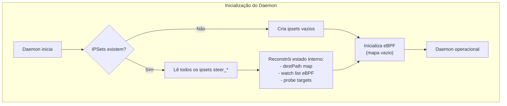
```mermaid
flowchart TD
subgraph STARTUP["Inicialização do Daemon"]
START["Daemon inicia"] --> CHECK_IPSETS{"IPSets existem?"}

CHECK_IPSETS -->|"Sim"| READ_IPSETS["Lê todos os ipsets steer_*"]
CHECK_IPSETS -->|"Não"| CREATE_IPSETS["Cria ipsets vazios"]

READ_IPSETS --> REBUILD["Reconstrói estado interno:<br/>- destPath map<br/>- watch list eBPF<br/>- probe targets"]

CREATE_IPSETS --> INIT_EBPF["Inicializa eBPF<br/>(mapa vazio)"]
REBUILD --> INIT_EBPF

INIT_EBPF --> RUNNING["Daemon operacional"]
end
```

**Fluxo de Recuperação:**

```go
// internal/decision/engine.go - RecoverFromIPSets()
func (m *Manager) RecoverFromIPSets() error {
// Lista todos os ipsets de steering
sets, err := m.ipsetMgr.ListSteeringSets()
if err != nil {
return err
}

for _, set := range sets {
pathID := m.extractPathID(set.Name) // steer_path_tunnel_dc2 -> tunnel-dc2

// Para cada membro do ipset
for _, member := range set.Members {
addr := member.Addr

// Reconstrói mapeamento interno
m.destPath[addr] = pathID

// Adiciona ao monitoramento eBPF
m.ebpfMonitor.WatchDest(addr)

// Se está em path não-default, registra para retry
if pathID != m.getDefaultPath() {
m.retryMgr.Track(addr, m.getDefaultPath(), pathID)
}

m.log.Info("recovered destination from ipset",
"dest", addr,
"path", pathID,
)
}
}

return nil
}
```

### 11.2 Monitoramento Sob Demanda (On-Demand)

**Problema**: Monitorar TODOS os destinos consome memória e CPU desnecessariamente.

**Solução**: Monitorar apenas destinos que:
1. Estão em um ipset (já tiveram problema)
2. Acabaram de apresentar sintoma inicial (primeira retransmissão)

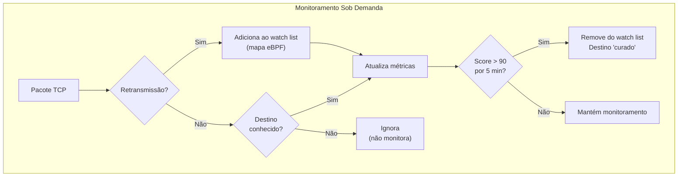
```mermaid
flowchart TD
subgraph ONDEMAND["Monitoramento Sob Demanda"]
PACKET["Pacote TCP"] --> RETRANS{"Retransmissão?"}

RETRANS -->|"Não"| KNOWN{"Destino<br/>conhecido?"}
RETRANS -->|"Sim"| ADD_WATCH["Adiciona ao watch list<br/>(mapa eBPF)"]

KNOWN -->|"Sim"| UPDATE["Atualiza métricas"]
KNOWN -->|"Não"| IGNORE["Ignora<br/>(não monitora)"]

ADD_WATCH --> UPDATE

UPDATE --> CHECK_HEALTH{"Score > 90<br/>por 5 min?"}

CHECK_HEALTH -->|"Sim"| REMOVE_WATCH["Remove do watch list<br/>Destino 'curado'"]
CHECK_HEALTH -->|"Não"| KEEP["Mantém monitoramento"]
end
```

**Mapa eBPF de Watch List:**

```c
// Mapa de destinos sendo monitorados (inserido pelo userspace)
struct {
__uint(type, BPF_MAP_TYPE_HASH); // NÃO LRU - controle explícito
__uint(max_entries, 10000);
__type(key, __u32); // dest IP
__type(value, __u8); // 1 = monitorando
} watch_list SEC(".maps");

// Tracepoints só processam se destino está no watch_list
SEC("tracepoint/tcp/tcp_retransmit_skb")
int trace_tcp_retransmit(struct trace_event_raw_tcp_event_sk_skb *ctx) {
__u32 dest_ip = ctx->daddr;

// Primeira retransmissão de um destino desconhecido?
__u8 *watching = bpf_map_lookup_elem(&watch_list, &dest_ip);

if (!watching) {
// Não está no watch list, mas teve retransmissão
// Sinaliza para userspace adicionar ao watch list
struct event evt = {
.type = EVENT_NEW_PROBLEM_DEST,
.dest_ip = dest_ip,
};
bpf_perf_event_output(ctx, &events, BPF_F_CURRENT_CPU, &evt, sizeof(evt));
return 0;
}

// Está no watch list, atualiza métricas normalmente
struct dest_stats *stats = bpf_map_lookup_elem(&dest_stats_map, &dest_ip);
if (stats) {
__sync_fetch_and_add(&stats->retransmits, 1);
// ... resto do código
}

return 0;
}
```

**Go - Gerenciamento do Watch List:**

```go
// internal/health/monitor.go - Watch list management
type WatchList struct {
ebpfMap *ebpf.Map
watchedIPs map[netip.Addr]*WatchEntry
mu sync.RWMutex
}

type WatchEntry struct {
Addr netip.Addr
AddedAt time.Time
LastProblem time.Time
HealthyStreak time.Duration // Tempo consecutivo saudável
}

// AddToWatch adiciona destino ao monitoramento
func (w *WatchList) AddToWatch(addr netip.Addr) error {
w.mu.Lock()
defer w.mu.Unlock()

if _, exists := w.watchedIPs[addr]; exists {
return nil // Já está sendo monitorado
}

// Adiciona ao mapa eBPF
key := addrToU32(addr)
value := uint8(1)
if err := w.ebpfMap.Put(key, value); err != nil {
return err
}

w.watchedIPs[addr] = &WatchEntry{
Addr: addr,
AddedAt: time.Now(),
}

return nil
}

// RemoveFromWatch remove destino do monitoramento
func (w *WatchList) RemoveFromWatch(addr netip.Addr) error {
w.mu.Lock()
defer w.mu.Unlock()

key := addrToU32(addr)
if err := w.ebpfMap.Delete(key); err != nil {
return err
}

delete(w.watchedIPs, addr)
return nil
}

// ShouldRemove verifica se destino deve sair do monitoramento
func (w *WatchList) ShouldRemove(addr netip.Addr, currentScore int) bool {
w.mu.RLock()
defer w.mu.RUnlock()

entry, ok := w.watchedIPs[addr]
if !ok {
return false
}

// Se score > 90 por mais de 5 minutos, pode remover
if currentScore > 90 {
entry.HealthyStreak += time.Since(entry.LastProblem)
if entry.HealthyStreak > 5*time.Minute {
return true
}
} else {
entry.HealthyStreak = 0
entry.LastProblem = time.Now()
}

return false
}
```

### 11.3 Janela Flutuante (Sliding Window) para Métricas

**Problema**: Contadores acumulativos não refletem saúde atual, apenas histórico.

**Solução**: Usar buckets de tempo para manter janela flutuante dos últimos N segundos.

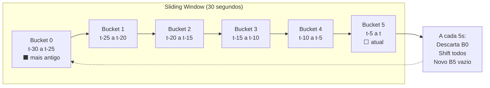
```mermaid
flowchart LR
subgraph WINDOW["Sliding Window (30 segundos)"]
B0["Bucket 0<br/>t-30 a t-25<br/>⬛ mais antigo"]
B1["Bucket 1<br/>t-25 a t-20"]
B2["Bucket 2<br/>t-20 a t-15"]
B3["Bucket 3<br/>t-15 a t-10"]
B4["Bucket 4<br/>t-10 a t-5"]
B5["Bucket 5<br/>t-5 a t<br/>⬜ atual"]

B0 --> B1 --> B2 --> B3 --> B4 --> B5
end

ROTATE["A cada 5s:<br/>Descarta B0<br/>Shift todos<br/>Novo B5 vazio"]

B5 --> ROTATE
ROTATE -.-> B0
```

**Estrutura eBPF com Buckets:**

```c
// bpf/headers/types.h + bpf/probes/tcp_monitor.c

#define NUM_BUCKETS 6
#define BUCKET_DURATION_NS (5ULL * 1000000000ULL) // 5 segundos em nanosegundos

// Stats por bucket (janela de 5 segundos)
struct bucket_stats {
__u64 packets;
__u64 bytes;
__u64 retransmits;
__u64 rtt_sum_us;
__u64 rtt_count;
};

// Stats completas com sliding window
struct tcp_dest_stats {
struct bucket_stats buckets[NUM_BUCKETS];
__u8 current_bucket; // Índice do bucket atual (0-5)
__u8 _pad1[3];
__u64 bucket_start_ns; // Timestamp início do bucket atual
__u64 last_seen_ns;
__u64 connect_attempts;
__u64 connect_failures;
__u64 resets_received;
__u64 rtt_min_us;
__u64 rtt_max_us;
};

// Mapas separados para IPv4 e IPv6
struct {
__uint(type, BPF_MAP_TYPE_LRU_HASH);
__uint(max_entries, MAX_DEST_ENTRIES); // 65536
__type(key, __u32);
__type(value, struct tcp_dest_stats);
} tcp_stats_v4 SEC(".maps");

struct {
__uint(type, BPF_MAP_TYPE_LRU_HASH);
__uint(max_entries, MAX_DEST_ENTRIES);
__type(key, struct in6_addr);
__type(value, struct tcp_dest_stats);
} tcp_stats_v6 SEC(".maps");

// Helper para obter bucket atual e rotacionar se necessário
static __always_inline struct bucket_stats *get_current_bucket(
struct tcp_dest_stats *stats, __u64 now_ns) {

// Calcula quantos buckets passaram desde última rotação
__u64 elapsed = now_ns - stats->bucket_start_ns;
__u32 buckets_passed = elapsed / BUCKET_DURATION_NS;

if (buckets_passed > 0) {
// Precisa rotacionar
if (buckets_passed >= NUM_BUCKETS) {
// Muito tempo passou, zera tudo
__builtin_memset(stats->buckets, 0, sizeof(stats->buckets));
stats->current_bucket = 0;
} else {
// Rotaciona N buckets
for (__u32 i = 0; i < buckets_passed && i < NUM_BUCKETS; i++) {
stats->current_bucket = (stats->current_bucket + 1) % NUM_BUCKETS;
// Zera o bucket que vai ser reutilizado
__builtin_memset(&stats->buckets[stats->current_bucket], 0,
sizeof(struct bucket_stats));
}
}
stats->bucket_start_ns = now_ns;
}

return &stats->buckets[stats->current_bucket];
}

SEC("tracepoint/tcp/tcp_retransmit_skb")
int trace_tcp_retransmit(struct trace_event_raw_tcp_event_sk_skb *ctx) {
__u32 dest_ip = ctx->daddr;

// Verifica watch list
__u8 *watching = bpf_map_lookup_elem(&watch_list, &dest_ip);
if (!watching) {
// Sinaliza novo problema (código anterior)
return 0;
}

struct tcp_dest_stats *stats = bpf_map_lookup_elem(&dest_stats_map, &dest_ip);
if (!stats) {
return 0;
}

__u64 now = bpf_ktime_get_ns();
struct bucket_stats *bucket = get_current_bucket(stats, now);

__sync_fetch_and_add(&bucket->retransmits, 1);

return 0;
}
```

**Go - Leitura da Sliding Window:**

```go
// internal/health/monitor.go - Sliding window processing

const (
NumBuckets = 6
BucketDuration = 5 * time.Second
WindowDuration = NumBuckets * BucketDuration // 30 segundos
)

type BucketStats struct {
Packets uint64
Retransmits uint64
RTTSumUs uint64
RTTCount uint64
}

type WindowedStats struct {
Buckets [NumBuckets]BucketStats
CurrentBucket uint8
BucketStartNs uint64
LastRotation uint64
}

// GetWindowMetrics calcula métricas agregadas da janela
func (w *WindowedStats) GetWindowMetrics() (packets, retransmits, avgRTTUs uint64) {
for i := 0; i < NumBuckets; i++ {
packets += w.Buckets[i].Packets
retransmits += w.Buckets[i].Retransmits
}

var totalRTT, totalRTTCount uint64
for i := 0; i < NumBuckets; i++ {
totalRTT += w.Buckets[i].RTTSumUs
totalRTTCount += w.Buckets[i].RTTCount
}

if totalRTTCount > 0 {
avgRTTUs = totalRTT / totalRTTCount
}

return
}

// CalculateScore calcula score baseado na janela flutuante
func (m *Monitor) CalculateScore(stats *WindowedStats) int {
packets, retransmits, avgRTTUs := stats.GetWindowMetrics()

score := 100

// Calcula % de retransmissão na janela
if packets > 0 {
retransPct := float64(retransmits) / float64(packets) * 100
if retransPct > m.cfg.Thresholds.RetransPercent {
penalty := int((retransPct - m.cfg.Thresholds.RetransPercent) * 8)
if penalty > 40 {
penalty = 40
}
score -= penalty
}
}

// RTT médio da janela
avgRTTMs := float64(avgRTTUs) / 1000
if avgRTTMs > float64(m.cfg.Thresholds.RTTMs) {
penalty := int((avgRTTMs - float64(m.cfg.Thresholds.RTTMs)) / 10)
if penalty > 30 {
penalty = 30
}
score -= penalty
}

if score < 0 {
score = 0
}

return score
}
```

### 11.4 Retry Passivo para Recuperação

**Problema**: Quando tráfego migra para túnel, não há como saber se path original voltou a funcionar.

**Por que NÃO usar probe ativo:**
- ICMP pode estar bloqueado
- TCP probe precisa saber a porta correta do destino
- Código complexo (SO_BINDTODEVICE, goroutines, etc)
- Probe sintético pode passar, mas tráfego real falhar

**Solução**: Retry passivo - após X minutos no túnel, volta automaticamente para o path default e deixa o tráfego real testar.

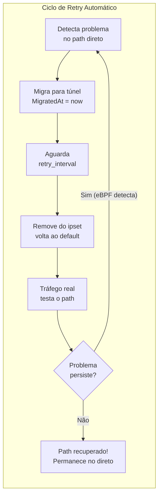
```mermaid
flowchart LR
subgraph CICLO["Ciclo de Retry Automático"]
PROBLEMA["Detecta problema<br/>no path direto"] --> MIGRA["Migra para túnel<br/>MigratedAt = now"]
MIGRA --> TIMER["Aguarda<br/>retry_interval"]
TIMER --> VOLTA["Remove do ipset<br/>volta ao default"]
VOLTA --> TRAFEGO["Tráfego real<br/>testa o path"]
TRAFEGO --> CHECK{"Problema<br/>persiste?"}
CHECK -->|"Sim (eBPF detecta)"| PROBLEMA
CHECK -->|"Não"| OK["Path recuperado!<br/>Permanece no direto"]
end
```

**Segurança do Retry**: Conexões existentes NÃO são afetadas!

```
Conexão A (já estabelecida via túnel):
→ conntrack mantém: src:port → dst:port via túnel
→ Continua funcionando pelo túnel até fechar naturalmente

Conexão B (nova, após retry):
→ Não tem match no ipset do túnel
→ Usa path default (direto)
→ Se falhar, eBPF detecta retransmissões e migra novamente
```

**Implementação Simplificada:**

```go
// internal/retry/manager.go

// SteeringEntry representa um destino com steering ativo
type SteeringEntry struct {
Dest netip.Addr
CurrentPath string // Path atual (túnel ou direto)
DefaultPath string // Path default para este destino
MigratedAt time.Time // Quando migrou para CurrentPath
RetryCount int // Quantas vezes já tentou retry
}

// RetryManager gerencia retries automáticos
type RetryManager struct {
cfg *config.RetryConfig
entries map[netip.Addr]*SteeringEntry
ipset *IPSetManager
log *slog.Logger
mu sync.RWMutex
}

func NewRetryManager(cfg *config.RetryConfig, ipset *IPSetManager, log *slog.Logger) *RetryManager {
return &RetryManager{
cfg: cfg,
entries: make(map[netip.Addr]*SteeringEntry),
ipset: ipset,
log: log,
}
}

// Track registra que um destino foi migrado
func (r *RetryManager) Track(dest netip.Addr, fromPath, toPath string) {
r.mu.Lock()
defer r.mu.Unlock()

r.entries[dest] = &SteeringEntry{
Dest: dest,
CurrentPath: toPath,
DefaultPath: fromPath,
MigratedAt: time.Now(),
RetryCount: 0,
}
}

// Untrack remove destino do tracking (quando fica saudável)
func (r *RetryManager) Untrack(dest netip.Addr) {
r.mu.Lock()
defer r.mu.Unlock()
delete(r.entries, dest)
}

// Run inicia loop de retry
func (r *RetryManager) Run(ctx context.Context) error {
ticker := time.NewTicker(r.cfg.CheckInterval) // ex: 30s
defer ticker.Stop()

for {
select {
case <-ctx.Done():
return ctx.Err()
case <-ticker.C:
r.checkRetries()
}
}
}

func (r *RetryManager) checkRetries() {
r.mu.Lock()
defer r.mu.Unlock()

now := time.Now()

for dest, entry := range r.entries {
// Só faz retry se NÃO está no path default
if entry.CurrentPath == entry.DefaultPath {
continue
}

// Calcula intervalo com backoff exponencial
interval := r.calculateInterval(entry.RetryCount)

// Passou tempo suficiente desde a migração?
if now.Sub(entry.MigratedAt) < interval {
continue
}

r.log.Info("retry: attempting to return to default path",
"dest", dest,
"current_path", entry.CurrentPath,
"default_path", entry.DefaultPath,
"retry_count", entry.RetryCount,
"interval_was", interval,
)

// Remove do ipset do túnel → volta ao default automaticamente
if err := r.ipset.RemoveFromPath(entry.CurrentPath, dest); err != nil {
r.log.Error("retry: failed to remove from ipset",
"dest", dest,
"error", err,
)
continue
}

// Atualiza estado - agora está no default, aguardando ver se funciona
entry.CurrentPath = entry.DefaultPath
entry.MigratedAt = now
entry.RetryCount++

// NOTA: Mantém no watch list do eBPF!
// Se problema persistir, será detectado e migrará novamente
}
}

// calculateInterval calcula intervalo com backoff exponencial
func (r *RetryManager) calculateInterval(retryCount int) time.Duration {
base := r.cfg.RetryInterval // ex: 5min

// Backoff: 5min, 10min, 20min, 40min... até max
multiplier := 1 << retryCount // 2^retryCount
interval := base * time.Duration(multiplier)

if interval > r.cfg.MaxRetryInterval { // ex: 1 hora
interval = r.cfg.MaxRetryInterval
}

return interval
}

// OnMigratedBack é chamado quando destino migra de volta para túnel
// (problema persistiu após retry)
func (r *RetryManager) OnMigratedBack(dest netip.Addr, toPath string) {
r.mu.Lock()
defer r.mu.Unlock()

if entry, ok := r.entries[dest]; ok {
entry.CurrentPath = toPath
entry.MigratedAt = time.Now()
// RetryCount já foi incrementado, mantém para backoff
}
}

// Reset zera o retry count quando destino fica saudável por tempo suficiente
func (r *RetryManager) Reset(dest netip.Addr) {
r.mu.Lock()
defer r.mu.Unlock()

if entry, ok := r.entries[dest]; ok {
entry.RetryCount = 0
}
}
```

**Timeline de Exemplo com Backoff:**

```
t=0:00 Destino 1.2.3.4 tem problema, migra para túnel
RetryCount=0, próximo retry em 5min

t=5:00 Retry #1: volta para path direto
Problema persiste, eBPF detecta, migra para túnel
RetryCount=1, próximo retry em 10min

t=15:00 Retry #2: volta para path direto
Problema persiste, migra para túnel
RetryCount=2, próximo retry em 20min

t=35:00 Retry #3: volta para path direto
PATH RECUPEROU! Sem retransmissões
Após 5min saudável, remove do watch list
RetryCount reset para 0
```

### 11.5 Fluxo Completo com Todas as Melhorias

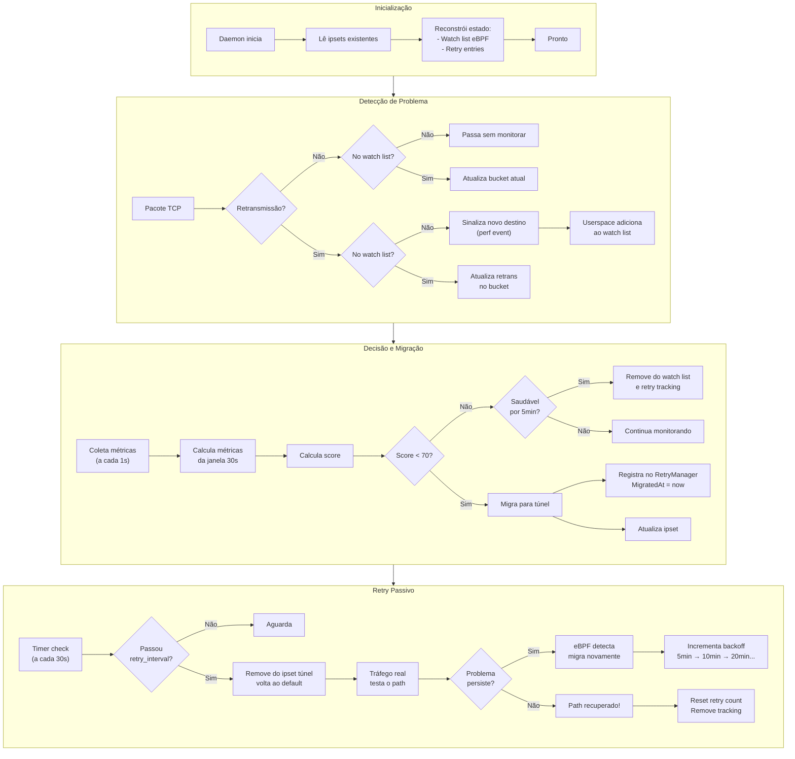
```mermaid
flowchart TB
subgraph INIT["Inicialização"]
START["Daemon inicia"] --> READ_IPSETS["Lê ipsets existentes"]
READ_IPSETS --> REBUILD_STATE["Reconstrói estado:<br/>- Watch list eBPF<br/>- Retry entries"]
REBUILD_STATE --> READY["Pronto"]
end

subgraph DETECTION["Detecção de Problema"]
PACKET["Pacote TCP"] --> RETRANS{"Retransmissão?"}
RETRANS -->|"Não"| IN_WATCH{"No watch list?"}
RETRANS -->|"Sim"| IN_WATCH2{"No watch list?"}

IN_WATCH -->|"Não"| PASS["Passa sem monitorar"]
IN_WATCH -->|"Sim"| UPDATE_BUCKET["Atualiza bucket atual"]

IN_WATCH2 -->|"Não"| SIGNAL_NEW["Sinaliza novo destino<br/>(perf event)"]
IN_WATCH2 -->|"Sim"| UPDATE_RETRANS["Atualiza retrans<br/>no bucket"]

SIGNAL_NEW --> ADD_WATCH["Userspace adiciona<br/>ao watch list"]
end

subgraph DECISION["Decisão e Migração"]
COLLECT["Coleta métricas<br/>(a cada 1s)"] --> CALC_WINDOW["Calcula métricas<br/>da janela 30s"]
CALC_WINDOW --> CALC_SCORE["Calcula score"]
CALC_SCORE --> CHECK_SCORE{"Score < 70?"}

CHECK_SCORE -->|"Não"| CHECK_HEAL{"Saudável<br/>por 5min?"}
CHECK_SCORE -->|"Sim"| MIGRATE["Migra para túnel"]

CHECK_HEAL -->|"Sim"| REMOVE_WATCH["Remove do watch list<br/>e retry tracking"]
CHECK_HEAL -->|"Não"| CONTINUE["Continua monitorando"]

MIGRATE --> TRACK_RETRY["Registra no RetryManager<br/>MigratedAt = now"]
MIGRATE --> UPDATE_IPSET["Atualiza ipset"]
end

subgraph RECOVERY["Retry Passivo"]
TIMER["Timer check<br/>(a cada 30s)"] --> CHECK_TIME{"Passou<br/>retry_interval?"}

CHECK_TIME -->|"Não"| WAIT["Aguarda"]
CHECK_TIME -->|"Sim"| REMOVE_IPSET["Remove do ipset túnel<br/>volta ao default"]

REMOVE_IPSET --> REAL_TRAFFIC["Tráfego real<br/>testa o path"]
REAL_TRAFFIC --> PROBLEM_BACK{"Problema<br/>persiste?"}

PROBLEM_BACK -->|"Sim"| MIGRATE_AGAIN["eBPF detecta<br/>migra novamente"]
PROBLEM_BACK -->|"Não"| RECOVERED["Path recuperado!"]

MIGRATE_AGAIN --> BACKOFF["Incrementa backoff<br/>5min → 10min → 20min..."]
RECOVERED --> RESET_RETRY["Reset retry count<br/>Remove tracking"]
end

INIT --> DETECTION
DETECTION --> DECISION
DECISION --> RECOVERY
```

### 11.6 Suporte Dual-Stack (IPv4 + IPv6)

O sistema suporta tanto IPv4 quanto IPv6 de forma transparente usando uma arquitetura unificada.

#### Estratégia de Implementação

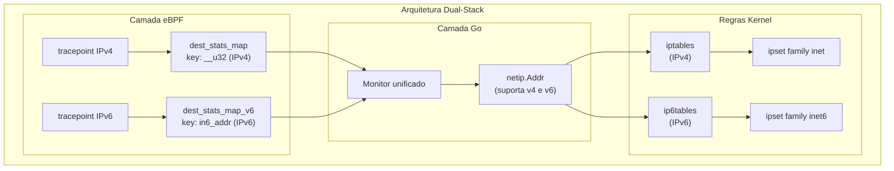
```mermaid
flowchart TB
subgraph DUALSTACK["Arquitetura Dual-Stack"]
subgraph EBPF_LAYER["Camada eBPF"]
MAP4["dest_stats_map<br/>key: __u32 (IPv4)"]
MAP6["dest_stats_map_v6<br/>key: in6_addr (IPv6)"]
TP4["tracepoint IPv4"]
TP6["tracepoint IPv6"]
end

subgraph USERSPACE["Camada Go"]
ADDR["netip.Addr<br/>(suporta v4 e v6)"]
MONITOR["Monitor unificado"]
end

subgraph KERNEL_RULES["Regras Kernel"]
IPT4["iptables<br/>(IPv4)"]
IPT6["ip6tables<br/>(IPv6)"]
IPSET4["ipset family inet"]
IPSET6["ipset family inet6"]
end
end

TP4 --> MAP4
TP6 --> MAP6
MAP4 --> MONITOR
MAP6 --> MONITOR
MONITOR --> ADDR
ADDR --> IPT4
ADDR --> IPT6
IPT4 --> IPSET4
IPT6 --> IPSET6
```

#### Estruturas eBPF Dual-Stack

```c
// bpf/maps.h - Mapas para IPv4 e IPv6

#include <linux/in6.h>

// Chave unificada que suporta ambos os protocolos
struct ip_key {
__u8 family; // AF_INET ou AF_INET6
union {
__u32 v4; // IPv4 address
struct in6_addr v6; // IPv6 address
} addr;
} __attribute__((packed));

// Ou usar mapas separados (mais eficiente para lookup)

// Mapa IPv4
struct {
__uint(type, BPF_MAP_TYPE_HASH);
__uint(max_entries, 10000);
__type(key, __u32);
__type(value, struct tcp_dest_stats);
} dest_stats_map SEC(".maps");

// Mapa IPv6
struct {
__uint(type, BPF_MAP_TYPE_HASH);
__uint(max_entries, 10000);
__type(key, struct in6_addr);
__type(value, struct tcp_dest_stats);
} dest_stats_map_v6 SEC(".maps");

// Watch list IPv4
struct {
__uint(type, BPF_MAP_TYPE_HASH);
__uint(max_entries, 10000);
__type(key, __u32);
__type(value, __u8);
} watch_list SEC(".maps");

// Watch list IPv6
struct {
__uint(type, BPF_MAP_TYPE_HASH);
__uint(max_entries, 10000);
__type(key, struct in6_addr);
__type(value, __u8);
} watch_list_v6 SEC(".maps");
```

#### Tracepoints IPv6

```c
// bpf/probes/tcp_monitor.c - Tracepoints dual-stack (IPv4 + IPv6)

// Helper para verificar se é IPv6
static __always_inline bool is_ipv6(struct sock *sk) {
return sk->__sk_common.skc_family == AF_INET6;
}

// Tracepoint tcp_retransmit_skb - funciona para ambos
SEC("tracepoint/tcp/tcp_retransmit_skb")
int trace_tcp_retransmit(struct trace_event_raw_tcp_event_sk_skb *ctx) {
__u16 family = ctx->family;

if (family == AF_INET) {
__u32 dest_ip = ctx->daddr;
// ... lógica IPv4 (código existente)
__u8 *watching = bpf_map_lookup_elem(&watch_list, &dest_ip);
if (!watching) {
// Sinaliza novo destino
struct event evt = {
.type = EVENT_NEW_PROBLEM_DEST,
.family = AF_INET,
};
evt.addr.v4 = dest_ip;
bpf_perf_event_output(ctx, &events, BPF_F_CURRENT_CPU, &evt, sizeof(evt));
return 0;
}
// Atualiza stats
struct tcp_dest_stats *stats = bpf_map_lookup_elem(&dest_stats_map, &dest_ip);
if (stats) {
__u64 now = bpf_ktime_get_ns();
struct bucket_stats *bucket = get_current_bucket(stats, now);
__sync_fetch_and_add(&bucket->retransmits, 1);
}
} else if (family == AF_INET6) {
struct in6_addr dest_ip6;
bpf_probe_read_kernel(&dest_ip6, sizeof(dest_ip6), ctx->daddr_v6);

__u8 *watching = bpf_map_lookup_elem(&watch_list_v6, &dest_ip6);
if (!watching) {
// Sinaliza novo destino IPv6
struct event evt = {
.type = EVENT_NEW_PROBLEM_DEST,
.family = AF_INET6,
};
__builtin_memcpy(&evt.addr.v6, &dest_ip6, sizeof(dest_ip6));
bpf_perf_event_output(ctx, &events, BPF_F_CURRENT_CPU, &evt, sizeof(evt));
return 0;
}
// Atualiza stats IPv6
struct tcp_dest_stats *stats = bpf_map_lookup_elem(&dest_stats_map_v6, &dest_ip6);
if (stats) {
__u64 now = bpf_ktime_get_ns();
struct bucket_stats *bucket = get_current_bucket(stats, now);
__sync_fetch_and_add(&bucket->retransmits, 1);
}
}

return 0;
}
```

#### Estrutura de Eventos Dual-Stack

```c
// bpf/events.h

struct event {
__u8 type;
__u8 family; // AF_INET ou AF_INET6
__u8 _pad[2];
union {
__u32 v4;
struct in6_addr v6;
} addr;
} __attribute__((packed));

#define EVENT_NEW_PROBLEM_DEST 1
#define EVENT_HEALTH_CHANGED 2
```

#### Go - Abstração Unificada

```go
// Go usa natip.Addr nativo (stdlib)

// Addr representa um endereço IPv4 ou IPv6
// Usa netip.Addr (stdlib) que já suporta ambos nativamente
import "net/netip"

type Addr = netip.Addr

// Helper para converter para chave do mapa eBPF
func AddrToEBPFKey(addr netip.Addr) ([]byte, bool) {
if addr.Is4() {
// IPv4: retorna 4 bytes
b := addr.As4()
return b[:], true
} else if addr.Is6() {
// IPv6: retorna 16 bytes
b := addr.As16()
return b[:], false
}
return nil, false
}

// IsIPv4 verifica se é IPv4
func IsIPv4(addr netip.Addr) bool {
return addr.Is4()
}

// IsIPv6 verifica se é IPv6
func IsIPv6(addr netip.Addr) bool {
return addr.Is6()
}
```

#### Go - Monitor Dual-Stack

```go
// internal/health/monitor.go - Versão dual-stack

type Monitor struct {
cfg *config.HealthConfig
statsMapV4 *ebpf.Map // dest_stats_map (IPv4)
statsMapV6 *ebpf.Map // dest_stats_map_v6 (IPv6)
watchListV4 *ebpf.Map // watch_list (IPv4)
watchListV6 *ebpf.Map // watch_list_v6 (IPv6)
log *slog.Logger

mu sync.RWMutex
health map[netip.Addr]*DestHealth
}

// WatchDest adiciona destino ao monitoramento
func (m *Monitor) WatchDest(addr netip.Addr) error {
value := uint8(1)

if addr.Is4() {
key := addr.As4()
return m.watchListV4.Put(key[:], value)
} else {
key := addr.As16()
return m.watchListV6.Put(key[:], value)
}
}

// UnwatchDest remove destino do monitoramento
func (m *Monitor) UnwatchDest(addr netip.Addr) error {
if addr.Is4() {
key := addr.As4()
return m.watchListV4.Delete(key[:])
} else {
key := addr.As16()
return m.watchListV6.Delete(key[:])
}
}

// collect coleta estatísticas de ambos os mapas
func (m *Monitor) collect() {
// Coleta IPv4
m.collectFromMap(m.statsMapV4, true)

// Coleta IPv6
m.collectFromMap(m.statsMapV6, false)
}

func (m *Monitor) collectFromMap(statsMap *ebpf.Map, isV4 bool) {
var key []byte
var stats WindowedStats

if isV4 {
key = make([]byte, 4)
} else {
key = make([]byte, 16)
}

iter := statsMap.Iterate()
for iter.Next(&key, &stats) {
var addr netip.Addr
if isV4 {
addr = netip.AddrFrom4([4]byte(key))
} else {
addr = netip.AddrFrom16([16]byte(key))
}

m.updateHealth(addr, &stats)
}
}
```

#### IPSet Dual-Stack

```go
// internal/ipset/manager.go - Versão dual-stack

// IPSetManager gerencia ipsets para IPv4 e IPv6
type IPSetManager struct {
log *slog.Logger
mu sync.Mutex
sets map[string]*IPSetPair // Cada "set" é um par v4+v6
}

// IPSetPair contém um ipset para cada família
type IPSetPair struct {
NameV4 string // ex: steer_path_eth0_v4
NameV6 string // ex: steer_path_eth0_v6
}

// Initialize cria os ipsets para ambas as famílias
func (m *IPSetManager) Initialize(pathIDs []string) error {
m.mu.Lock()
defer m.mu.Unlock()

// Cria sets para destinos bloqueados
if err := m.createSetPair("steer_blocked", 300); err != nil {
return fmt.Errorf("creating blocked sets: %w", err)
}

// Cria sets para cada path
for _, pathID := range pathIDs {
baseName := m.pathSetBaseName(pathID)
if err := m.createSetPair(baseName, 0); err != nil {
return fmt.Errorf("creating sets for path %s: %w", pathID, err)
}
}

return nil
}

// createSetPair cria um par de ipsets (v4 + v6)
func (m *IPSetManager) createSetPair(baseName string, timeout int) error {
nameV4 := baseName + "_v4"
nameV6 := baseName + "_v6"

// Cria ipset IPv4
args := []string{"create", nameV4, "hash:ip", "family", "inet", "-exist"}
if timeout > 0 {
args = append(args, "timeout", fmt.Sprintf("%d", timeout))
}
if err := exec.Command("ipset", args...).Run(); err != nil {
return fmt.Errorf("creating %s: %w", nameV4, err)
}

// Cria ipset IPv6
args = []string{"create", nameV6, "hash:ip", "family", "inet6", "-exist"}
if timeout > 0 {
args = append(args, "timeout", fmt.Sprintf("%d", timeout))
}
if err := exec.Command("ipset", args...).Run(); err != nil {
return fmt.Errorf("creating %s: %w", nameV6, err)
}

m.sets[baseName] = &IPSetPair{
NameV4: nameV4,
NameV6: nameV6,
}

m.log.Info("created ipset pair", "base", baseName)
return nil
}

// AddToPath adiciona IP ao set correto baseado na família
func (m *IPSetManager) AddToPath(pathID string, addr netip.Addr) error {
baseName := m.pathSetBaseName(pathID)
pair, ok := m.sets[baseName]
if !ok {
return fmt.Errorf("unknown path: %s", pathID)
}

var setName string
if addr.Is4() {
setName = pair.NameV4
} else {
setName = pair.NameV6
}

cmd := exec.Command("ipset", "add", setName, addr.String(), "-exist")
if output, err := cmd.CombinedOutput(); err != nil {
return fmt.Errorf("ipset add: %w: %s", err, output)
}

return nil
}

// RemoveFromPath remove IP do set correto
func (m *IPSetManager) RemoveFromPath(pathID string, addr netip.Addr) error {
baseName := m.pathSetBaseName(pathID)
pair, ok := m.sets[baseName]
if !ok {
return fmt.Errorf("unknown path: %s", pathID)
}

var setName string
if addr.Is4() {
setName = pair.NameV4
} else {
setName = pair.NameV6
}

cmd := exec.Command("ipset", "del", setName, addr.String(), "-exist")
if output, err := cmd.CombinedOutput(); err != nil {
return fmt.Errorf("ipset del: %w: %s", err, output)
}

return nil
}
```

#### IPTables/IP6Tables Manager

```go
// internal/iptables/manager.go - Versão dual-stack

type IPTablesManager struct {
cfg *config.SteeringConfig
log *slog.Logger
}

// Initialize configura regras para IPv4 e IPv6
func (m *IPTablesManager) Initialize(paths []config.PathConfig) error {
// Configura IPv4
if err := m.initializeFamily("iptables", "inet", paths); err != nil {
return fmt.Errorf("initializing iptables (IPv4): %w", err)
}

// Configura IPv6
if err := m.initializeFamily("ip6tables", "inet6", paths); err != nil {
return fmt.Errorf("initializing ip6tables (IPv6): %w", err)
}

return nil
}

func (m *IPTablesManager) initializeFamily(cmd, family string, paths []config.PathConfig) error {
// Limpa configuração anterior
m.cleanupFamily(cmd)

// Cria chains customizadas
if err := m.createChains(cmd); err != nil {
return err
}

// Configura regras de MANGLE
if err := m.setupMangleRules(cmd, family, paths); err != nil {
return err
}

// Configura regras de NAT
if err := m.setupNatRules(cmd, family, paths); err != nil {
return err
}

// Aplica filtro de cgroup
if err := m.applyCgroupFilter(cmd); err != nil {
return err
}

m.log.Info("initialized firewall rules", "family", family)
return nil
}

func (m *IPTablesManager) createChains(cmd string) error {
for _, chain := range []struct{ table, name string }{
{"mangle", "STEERING"},
{"nat", "STEERING_SNAT"},
} {
// Cria chain
exec.Command(cmd, "-t", chain.table, "-N", chain.name).Run()
// Limpa
exec.Command(cmd, "-t", chain.table, "-F", chain.name).Run()
}
return nil
}

func (m *IPTablesManager) setupMangleRules(cmd, family string, paths []config.PathConfig) error {
suffix := "_v4"
if family == "inet6" {
suffix = "_v6"
}

// Conexões estabelecidas
m.runCmd(cmd, "-t", "mangle", "-A", "STEERING",
"-m", "conntrack", "--ctstate", "ESTABLISHED,RELATED",
"-j", "RETURN")

// Destinos bloqueados
m.runCmd(cmd, "-t", "mangle", "-A", "STEERING",
"-m", "set", "--match-set", "steer_blocked"+suffix, "dst",
"-j", "DROP")

// Regras para cada path
for _, path := range paths {
setName := fmt.Sprintf("steer_path_%s%s",
strings.ReplaceAll(path.ID, "-", "_"), suffix)
mark := m.pathToMark(path.ID)

m.runCmd(cmd, "-t", "mangle", "-A", "STEERING",
"-m", "set", "--match-set", setName, "dst",
"-j", "MARK", "--set-mark", mark)
}

// Default
m.runCmd(cmd, "-t", "mangle", "-A", "STEERING",
"-m", "mark", "--mark", "0",
"-j", "MARK", "--set-mark", "0x1")

return nil
}

func (m *IPTablesManager) setupNatRules(cmd, family string, paths []config.PathConfig) error {
for _, path := range paths {
// Seleciona IPs da família correta
var ips []string
if family == "inet" {
ips = path.IPv4s
} else {
ips = path.IPv6s
}

if len(ips) == 0 {
continue
}

mark := m.pathToMark(path.ID)

// Constrói range de IPs
var ipRange string
if len(ips) == 1 {
ipRange = ips[0]
} else {
ipRange = fmt.Sprintf("%s-%s", ips[0], ips[len(ips)-1])
}

m.runCmd(cmd, "-t", "nat", "-A", "STEERING_SNAT",
"-m", "mark", "--mark", mark,
"-j", "SNAT", "--to-source", ipRange, "--random-fully")
}

return nil
}

func (m *IPTablesManager) applyCgroupFilter(cmd string) error {
cgroupPath := m.cfg.CgroupSlice

// OUTPUT
m.runCmd(cmd, "-t", "mangle", "-A", "OUTPUT",
"-m", "cgroup", "--path", cgroupPath,
"-j", "STEERING")

// POSTROUTING
m.runCmd(cmd, "-t", "nat", "-A", "POSTROUTING",
"-m", "cgroup", "--path", cgroupPath,
"-j", "STEERING_SNAT")

// PREROUTING (para forward)
m.runCmd(cmd, "-t", "mangle", "-A", "PREROUTING",
"-j", "STEERING")

return nil
}

func (m *IPTablesManager) runCmd(cmd string, args ...string) error {
c := exec.Command(cmd, args...)
if output, err := c.CombinedOutput(); err != nil {
return fmt.Errorf("%s %v: %w: %s", cmd, args, err, output)
}
return nil
}

// Cleanup limpa regras de ambas as famílias
func (m *IPTablesManager) Cleanup() error {
m.cleanupFamily("iptables")
m.cleanupFamily("ip6tables")
return nil
}

func (m *IPTablesManager) cleanupFamily(cmd string) {
cgroup := m.cfg.CgroupSlice

// Remove referências
exec.Command(cmd, "-t", "mangle", "-D", "OUTPUT",
"-m", "cgroup", "--path", cgroup, "-j", "STEERING").Run()
exec.Command(cmd, "-t", "nat", "-D", "POSTROUTING",
"-m", "cgroup", "--path", cgroup, "-j", "STEERING_SNAT").Run()
exec.Command(cmd, "-t", "mangle", "-D", "PREROUTING",
"-j", "STEERING").Run()

// Limpa e remove chains
for _, tc := range []struct{ t, c string }{
{"mangle", "STEERING"},
{"nat", "STEERING_SNAT"},
} {
exec.Command(cmd, "-t", tc.t, "-F", tc.c).Run()
exec.Command(cmd, "-t", tc.t, "-X", tc.c).Run()
}
}
```

#### Configuração YAML Dual-Stack

```yaml
paths:
- id: "eth0-direct"
type: "direct"
interface: "eth0"
ipv4s: # Pool IPv4
- "200.1.1.1"
- "200.1.1.2"
- "200.1.1.3"
ipv6s: # Pool IPv6
- "2001:db8:1::1"
- "2001:db8:1::2"
- "2001:db8:1::3"
priority: 100

- id: "tunnel-dc2"
type: "tunnel"
protocol: "wireguard"
interface: "wg-dc2"
peer_endpoint: "203.0.113.10:51820"
local_ipv4: "10.99.0.1"
peer_ipv4: "10.99.0.2"
local_ipv6: "fd00:99::1" # IPv6 no túnel
peer_ipv6: "fd00:99::2"
priority: 200
```

#### Comandos de Debug Dual-Stack

```bash
#!/bin/bash
# scripts/debug.sh - Versão dual-stack

echo "=== IPv4 IPSets ==="
for set in $(ipset list -n | grep "_v4$"); do
echo "Set: $set"
ipset list $set | head -20
done

echo ""
echo "=== IPv6 IPSets ==="
for set in $(ipset list -n | grep "_v6$"); do
echo "Set: $set"
ipset list $set | head -20
done

echo ""
echo "=== IPv4 iptables ==="
iptables -t mangle -L STEERING -v -n 2>/dev/null
iptables -t nat -L STEERING_SNAT -v -n 2>/dev/null

echo ""
echo "=== IPv6 ip6tables ==="
ip6tables -t mangle -L STEERING -v -n 2>/dev/null
ip6tables -t nat -L STEERING_SNAT -v -n 2>/dev/null

echo ""
echo "=== IPv4 Routes ==="
ip -4 rule show | grep -E "fwmark|steer"
echo ""
echo "=== IPv6 Routes ==="
ip -6 rule show | grep -E "fwmark|steer"
```

### 11.7 Suporte UDP

O monitoramento UDP utiliza o **ICMP Monitor compartilhado** (seção 11.8) para detecção de falhas. Como UDP é stateless, não há métricas específicas do protocolo (RTT, retransmissões) - apenas ICMP errors.

#### 11.7.1 Comparação TCP vs UDP

| Capacidade | TCP | UDP |
|------------|-----|-----|
| ICMP errors (compartilhado) | ✅ | ✅ |
| Retransmissões | ✅ | ❌ (não existe) |
| RTT | ✅ | ❌ (não existe) |
| RST | ✅ | ❌ (não existe) |
| Perda silenciosa | ✅ (via retrans) | ❌ |

#### 11.7.2 Arquitetura UDP

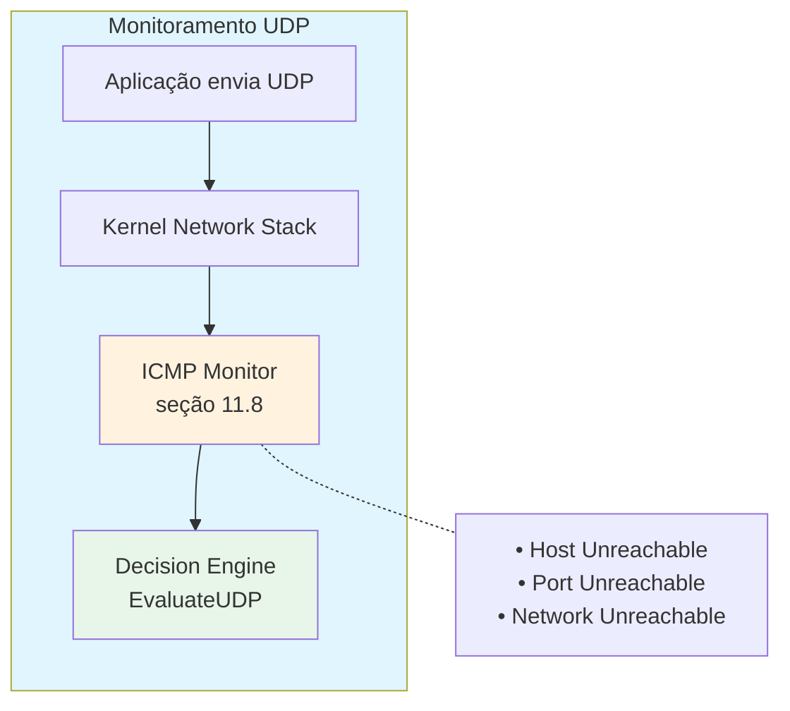
```mermaid
flowchart TD
subgraph UDP["Monitoramento UDP"]
A[Aplicação envia UDP] --> B[Kernel Network Stack]
B --> C[ICMP Monitor<br/>seção 11.8]
C --> D[Decision Engine<br/>EvaluateUDP]
end

C -.- E["• Host Unreachable<br/>• Port Unreachable<br/>• Network Unreachable"]

style UDP fill:#e1f5fe
style C fill:#fff3e0
style D fill:#e8f5e9
```

#### 11.7.3 Decision Engine para UDP

```go
// internal/decision/engine.go

// EvaluateUDP avalia saúde UDP de um destino
// Usa exclusivamente o ICMP Monitor compartilhado
func (e *Engine) EvaluateUDP(addr netip.Addr) Decision {
// UDP só tem ICMP errors como sinal de problemas
if e.icmpMonitor.IsUnreachable(addr, e.cfg.ICMPHardErrorThreshold) {
icmpStats, _ := e.icmpMonitor.GetStats(addr)
return Decision{
Action: ActionFailover,
Reason: fmt.Sprintf("icmp_%s",
icmpCodeToString(icmpStats.LastType, icmpStats.LastCode)),
}
}

return Decision{Action: ActionNone}
}
```

#### 11.7.4 Configuração UDP

```yaml
# config.yaml

monitoring:
# ICMP compartilhado - ver seção 11.8
icmp:
enabled: true
hard_error_threshold: 3

# UDP usa apenas ICMP compartilhado
udp:
enabled: true
# Nenhuma configuração adicional necessária
# Failover é baseado nos thresholds do ICMP Monitor

# Watch list com protocolos
watch_list:
destinations:
- addr: "8.8.8.8"
protocols: [udp] # DNS
- addr: "1.1.1.1"
protocols: [tcp, udp] # Ambos
```

#### 11.7.5 Regras IPTables para UDP

```bash
#!/bin/bash
# Steering UDP segue mesmo padrão do TCP
# Usa mesmos ipsets (compartilhados por protocolo)

# Mangle: marcar pacotes UDP para destinos em failover
iptables -t mangle -A OUTPUT \
-m cgroup --path steering.slice \
-p udp \
-m set --match-set tunnel1_v4 dst \
-j MARK --set-mark 100

ip6tables -t mangle -A OUTPUT \
-m cgroup --path steering.slice \
-p udp \
-m set --match-set tunnel1_v6 dst \
-j MARK --set-mark 100

# NAT: SNAT para pacotes marcados
iptables -t nat -A POSTROUTING \
-m cgroup --path steering.slice \
-p udp \
-m mark --mark 100 \
-j SNAT --to-source 10.99.1.10-10.99.1.20 --random-fully

ip6tables -t nat -A POSTROUTING \
-m cgroup --path steering.slice \
-p udp \
-m mark --mark 100 \
-j SNAT --to-source fd00:99::10-fd00:99::20 --random-fully
```

#### 11.7.6 Casos de Uso UDP

**DNS (UDP/53)**
```
Query DNS para 8.8.8.8
│
├── Resposta OK: sem ação
│
└── ICMP Host Unreachable (3x consecutivos)
│
└── Failover: ipset add tunnel1_v4 8.8.8.8
│
└── Próximas queries vão pelo tunnel
```

**Logs/Syslog (UDP/514)**
```
Envio de logs para collector
│
├── Sem resposta (fire-and-forget): sem ação
│
└── ICMP Port Unreachable (collector offline)
│
└── Failover para tunnel após threshold
```

**QUIC (UDP/443) - Limitado**
```
Aplicação QUIC
│
├── Retransmissões QUIC: invisíveis ao kernel
│
└── ICMP errors: capturados pelo ICMP Monitor
│
└── Failover funciona apenas para "hard failures"
```

### 11.8 ICMP Monitor Compartilhado (TCP + UDP)

O monitoramento de erros ICMP é **compartilhado** entre TCP e UDP, pois ICMP opera na camada de rede (L3), independente do protocolo de transporte.

#### 11.8.1 Arquitetura Unificada

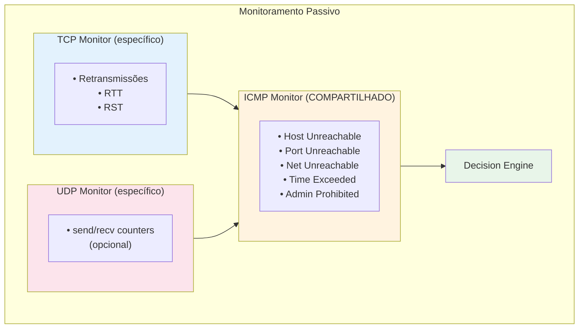
```mermaid
flowchart TD
subgraph Passive["Monitoramento Passivo"]
subgraph TCP["TCP Monitor (específico)"]
T1["• Retransmissões<br/>• RTT<br/>• RST"]
end

subgraph UDP["UDP Monitor (específico)"]
U1["• send/recv counters<br/>(opcional)"]
end

TCP --> ICMP
UDP --> ICMP

subgraph ICMP["ICMP Monitor (COMPARTILHADO)"]
I1["• Host Unreachable<br/>• Port Unreachable<br/>• Net Unreachable<br/>• Time Exceeded<br/>• Admin Prohibited"]
end

ICMP --> DE[Decision Engine]
end

style TCP fill:#e3f2fd
style UDP fill:#fce4ec
style ICMP fill:#fff3e0
style DE fill:#e8f5e9
```

#### 11.8.2 Tipos ICMP Monitorados

```c
// bpf/headers/icmp_types.h

#ifndef __ICMP_TYPES_H__
#define __ICMP_TYPES_H__

// =====================================================
// ICMPv4 (RFC 792)
// =====================================================

#define ICMP_DEST_UNREACH 3 // Destination Unreachable
#define ICMP_TIME_EXCEEDED 11 // Time Exceeded

// Códigos para ICMP_DEST_UNREACH (tipo 3)
#define ICMP_NET_UNREACH 0 // Network Unreachable
#define ICMP_HOST_UNREACH 1 // Host Unreachable
#define ICMP_PROT_UNREACH 2 // Protocol Unreachable
#define ICMP_PORT_UNREACH 3 // Port Unreachable
#define ICMP_FRAG_NEEDED 4 // Fragmentation Needed
#define ICMP_SR_FAILED 5 // Source Route Failed
#define ICMP_NET_UNKNOWN 6 // Destination Network Unknown
#define ICMP_HOST_UNKNOWN 7 // Destination Host Unknown
#define ICMP_HOST_ISOLATED 8 // Source Host Isolated
#define ICMP_NET_ANO 9 // Network Administratively Prohibited
#define ICMP_HOST_ANO 10 // Host Administratively Prohibited
#define ICMP_NET_UNR_TOS 11 // Network Unreachable for TOS
#define ICMP_HOST_UNR_TOS 12 // Host Unreachable for TOS
#define ICMP_PKT_FILTERED 13 // Communication Administratively Prohibited

// Códigos para ICMP_TIME_EXCEEDED (tipo 11)
#define ICMP_EXC_TTL 0 // TTL Exceeded in Transit
#define ICMP_EXC_FRAGTIME 1 // Fragment Reassembly Time Exceeded

// =====================================================
// ICMPv6 (RFC 4443)
// =====================================================

#define ICMPV6_DEST_UNREACH 1 // Destination Unreachable
#define ICMPV6_PKT_TOOBIG 2 // Packet Too Big
#define ICMPV6_TIME_EXCEEDED 3 // Time Exceeded
#define ICMPV6_PARAM_PROB 4 // Parameter Problem

// Códigos para ICMPv6_DEST_UNREACH (tipo 1)
#define ICMPV6_NOROUTE 0 // No Route to Destination
#define ICMPV6_ADM_PROHIBITED 1 // Administratively Prohibited
#define ICMPV6_NOT_NEIGHBOUR 2 // Beyond Scope of Source Address
#define ICMPV6_ADDR_UNREACH 3 // Address Unreachable
#define ICMPV6_PORT_UNREACH 4 // Port Unreachable
#define ICMPV6_POLICY_FAIL 5 // Source Address Failed Policy
#define ICMPV6_REJECT_ROUTE 6 // Reject Route to Destination

// Códigos para ICMPv6_TIME_EXCEEDED (tipo 3)
#define ICMPV6_EXC_HOPLIMIT 0 // Hop Limit Exceeded
#define ICMPV6_EXC_FRAGTIME 1 // Fragment Reassembly Time Exceeded

#endif /* __ICMP_TYPES_H__ */
```

#### 11.8.3 Estruturas ICMP Compartilhadas

```c
// bpf/headers/icmp_monitor_types.h

#ifndef __ICMP_MONITOR_TYPES_H__
#define __ICMP_MONITOR_TYPES_H__

#include "vmlinux.h"
#include "icmp_types.h"

// Severidade do erro ICMP
enum icmp_severity {
ICMP_SEV_INFO = 0, // Informativo (ex: TTL exceeded em traceroute)
ICMP_SEV_TRANSIENT = 1, // Pode ser temporário
ICMP_SEV_HARD = 2, // Falha definitiva (host/port unreachable)
};

// Estatísticas ICMP por destino (compartilhado TCP/UDP)
struct icmp_dest_stats {
__u64 total_errors; // Total de erros ICMP recebidos
__u64 last_error_ns; // Timestamp do último erro
__u32 errors_in_window; // Erros na janela atual (sliding window)
__u8 last_type; // Último tipo ICMP
__u8 last_code; // Último código ICMP
__u8 last_severity; // Severidade do último erro
__u8 consecutive_hard; // Erros "hard" consecutivos
__u8 is_unreachable; // Flag: destino considerado unreachable
__u8 _pad[3];
};

// Watch list entry para ICMP (compartilhado)
struct icmp_watch_entry {
__u64 added_ns; // Quando foi adicionado à watch list
__u8 watch_tcp; // Monitorar para TCP
__u8 watch_udp; // Monitorar para UDP
__u8 active; // Se está ativo
__u8 _pad[5];
};

#endif /* __ICMP_MONITOR_TYPES_H__ */
```

#### 11.8.4 Maps eBPF para ICMP

```c
// bpf/maps/icmp_maps.h

#ifndef __ICMP_MAPS_H__
#define __ICMP_MAPS_H__

#include "icmp_monitor_types.h"

// Estatísticas ICMP IPv4 por destino
struct {
__uint(type, BPF_MAP_TYPE_HASH);
__uint(max_entries, 20000); // Compartilhado TCP+UDP
__type(key, __u32); // IPv4 address
__type(value, struct icmp_dest_stats);
} icmp_stats_v4_map SEC(".maps");

// Estatísticas ICMP IPv6 por destino
struct {
__uint(type, BPF_MAP_TYPE_HASH);
__uint(max_entries, 20000);
__type(key, struct in6_addr); // IPv6 address
__type(value, struct icmp_dest_stats);
} icmp_stats_v6_map SEC(".maps");

// Watch list ICMP IPv4 (compartilhado)
struct {
__uint(type, BPF_MAP_TYPE_HASH);
__uint(max_entries, 20000);
__type(key, __u32);
__type(value, struct icmp_watch_entry);
} icmp_watch_v4_map SEC(".maps");

// Watch list ICMP IPv6 (compartilhado)
struct {
__uint(type, BPF_MAP_TYPE_HASH);
__uint(max_entries, 20000);
__type(key, struct in6_addr);
__type(value, struct icmp_watch_entry);
} icmp_watch_v6_map SEC(".maps");

// Ring buffer para notificar userspace de eventos ICMP críticos
struct {
__uint(type, BPF_MAP_TYPE_RINGBUF);
__uint(max_entries, 256 * 1024); // 256KB
} icmp_events SEC(".maps");

// Estrutura do evento ICMP para ring buffer
struct icmp_event {
__u64 timestamp_ns;
__u8 ip_version; // 4 ou 6
__u8 icmp_type;
__u8 icmp_code;
__u8 severity;
__u8 protocol; // IPPROTO_TCP ou IPPROTO_UDP
__u8 _pad[3];
union {
__u32 v4_addr;
struct in6_addr v6_addr;
} dest;
};

#endif /* __ICMP_MAPS_H__ */
```

#### 11.8.5 ICMP Monitor eBPF (Passivo)

```c
// bpf/probes/icmp_monitor.c

#include "vmlinux.h"
#include <bpf/bpf_helpers.h>
#include <bpf/bpf_tracing.h>
#include <bpf/bpf_core_read.h>
#include "icmp_maps.h"

// Determina severidade do erro ICMP
static __always_inline enum icmp_severity get_icmp_severity(__u8 type, __u8 code)
{
if (type == ICMP_DEST_UNREACH) {
switch (code) {
case ICMP_NET_UNREACH:
case ICMP_HOST_UNREACH:
case ICMP_PORT_UNREACH:
case ICMP_NET_ANO:
case ICMP_HOST_ANO:
case ICMP_PKT_FILTERED:
return ICMP_SEV_HARD;
case ICMP_FRAG_NEEDED:
return ICMP_SEV_TRANSIENT; // PMTUD, não é erro real
default:
return ICMP_SEV_TRANSIENT;
}
}
if (type == ICMP_TIME_EXCEEDED) {
return ICMP_SEV_INFO; // Geralmente traceroute
}
return ICMP_SEV_INFO;
}

// Mesma lógica para ICMPv6
static __always_inline enum icmp_severity get_icmpv6_severity(__u8 type, __u8 code)
{
if (type == ICMPV6_DEST_UNREACH) {
switch (code) {
case ICMPV6_NOROUTE:
case ICMPV6_ADM_PROHIBITED:
case ICMPV6_ADDR_UNREACH:
case ICMPV6_PORT_UNREACH:
case ICMPV6_REJECT_ROUTE:
return ICMP_SEV_HARD;
default:
return ICMP_SEV_TRANSIENT;
}
}
if (type == ICMPV6_PKT_TOOBIG) {
return ICMP_SEV_TRANSIENT; // PMTUD
}
if (type == ICMPV6_TIME_EXCEEDED) {
return ICMP_SEV_INFO;
}
return ICMP_SEV_INFO;
}

// ============================================================
// Tracepoint para ICMPv4
// ============================================================

SEC("tracepoint/icmp/icmp_receive")
int trace_icmp_receive(struct trace_event_raw_icmp_receive *ctx)
{
__u8 type = ctx->type;
__u8 code = ctx->code;

// Filtrar apenas erros relevantes
if (type != ICMP_DEST_UNREACH && type != ICMP_TIME_EXCEEDED)
return 0;

// O ICMP error contém o header IP original embedded
// O saddr do ICMP é quem gerou o erro (roteador ou destino)
// Precisamos extrair o destino original do embedded header

// Simplificação: usamos saddr como proxy do destino problemático
// Em produção, parsear o embedded IP header para precisão
__u32 problem_dest = ctx->saddr;

// Verificar watch list
struct icmp_watch_entry *watch = bpf_map_lookup_elem(&icmp_watch_v4_map, &problem_dest);
if (!watch || !watch->active)
return 0;

// Determinar severidade
enum icmp_severity sev = get_icmp_severity(type, code);

// Atualizar estatísticas
struct icmp_dest_stats *stats = bpf_map_lookup_elem(&icmp_stats_v4_map, &problem_dest);
if (!stats) {
// Criar entrada se não existe
struct icmp_dest_stats new_stats = {0};
bpf_map_update_elem(&icmp_stats_v4_map, &problem_dest, &new_stats, BPF_NOEXIST);
stats = bpf_map_lookup_elem(&icmp_stats_v4_map, &problem_dest);
if (!stats)
return 0;
}

__u64 now = bpf_ktime_get_ns();

__sync_fetch_and_add(&stats->total_errors, 1);
stats->last_error_ns = now;
stats->last_type = type;
stats->last_code = code;
stats->last_severity = sev;

// Contar erros hard consecutivos
if (sev == ICMP_SEV_HARD) {
if (stats->consecutive_hard < 255)
stats->consecutive_hard++;
}

// Enviar evento para userspace via ring buffer (apenas erros hard)
if (sev == ICMP_SEV_HARD) {
struct icmp_event *evt;
evt = bpf_ringbuf_reserve(&icmp_events, sizeof(*evt), 0);
if (evt) {
evt->timestamp_ns = now;
evt->ip_version = 4;
evt->icmp_type = type;
evt->icmp_code = code;
evt->severity = sev;
evt->protocol = 0; // Desconhecido sem parsear embedded header
evt->dest.v4_addr = problem_dest;
bpf_ringbuf_submit(evt, 0);
}
}

return 0;
}

// ============================================================
// Tracepoint para ICMPv6
// ============================================================

SEC("tracepoint/icmp/icmpv6_receive")
int trace_icmpv6_receive(struct trace_event_raw_icmpv6_receive *ctx)
{
__u8 type = ctx->type;
__u8 code = ctx->code;

// Filtrar apenas erros relevantes
if (type != ICMPV6_DEST_UNREACH &&
type != ICMPV6_PKT_TOOBIG &&
type != ICMPV6_TIME_EXCEEDED)
return 0;

struct in6_addr problem_dest;
BPF_CORE_READ_INTO(&problem_dest, ctx, saddr);

// Verificar watch list
struct icmp_watch_entry *watch = bpf_map_lookup_elem(&icmp_watch_v6_map, &problem_dest);
if (!watch || !watch->active)
return 0;

// Determinar severidade
enum icmp_severity sev = get_icmpv6_severity(type, code);

// Atualizar estatísticas
struct icmp_dest_stats *stats = bpf_map_lookup_elem(&icmp_stats_v6_map, &problem_dest);
if (!stats) {
struct icmp_dest_stats new_stats = {0};
bpf_map_update_elem(&icmp_stats_v6_map, &problem_dest, &new_stats, BPF_NOEXIST);
stats = bpf_map_lookup_elem(&icmp_stats_v6_map, &problem_dest);
if (!stats)
return 0;
}

__u64 now = bpf_ktime_get_ns();

__sync_fetch_and_add(&stats->total_errors, 1);
stats->last_error_ns = now;
stats->last_type = type;
stats->last_code = code;
stats->last_severity = sev;

if (sev == ICMP_SEV_HARD) {
if (stats->consecutive_hard < 255)
stats->consecutive_hard++;
}

// Enviar evento para userspace
if (sev == ICMP_SEV_HARD) {
struct icmp_event *evt;
evt = bpf_ringbuf_reserve(&icmp_events, sizeof(*evt), 0);
if (evt) {
evt->timestamp_ns = now;
evt->ip_version = 6;
evt->icmp_type = type;
evt->icmp_code = code;
evt->severity = sev;
evt->protocol = 0;
evt->dest.v6_addr = problem_dest;
bpf_ringbuf_submit(evt, 0);
}
}

return 0;
}

char LICENSE[] SEC("license") = "GPL";
```

#### 11.8.6 ICMP Monitor em Go (Compartilhado)

```go
// internal/ebpf/icmp_monitor.go

package ebpf

import (
"bytes"
"context"
"encoding/binary"
"errors"
"fmt"
"log/slog"
"net/netip"
"sync"

"github.com/cilium/ebpf"
"github.com/cilium/ebpf/ringbuf"
)

// ICMPSeverity representa a severidade do erro ICMP
type ICMPSeverity uint8

const (
ICMPSevInfo ICMPSeverity = 0
ICMPSevTransient ICMPSeverity = 1
ICMPSevHard ICMPSeverity = 2
)

// ICMPDestStats estatísticas ICMP para um destino
type ICMPDestStats struct {
TotalErrors uint64
LastErrorNs uint64
ErrorsInWindow uint32
LastType uint8
LastCode uint8
LastSeverity uint8
ConsecutiveHard uint8
IsUnreachable uint8
}

// ICMPEvent evento recebido via ring buffer
type ICMPEvent struct {
TimestampNs uint64
IPVersion uint8
ICMPType uint8
ICMPCode uint8
Severity uint8
Protocol uint8
Dest netip.Addr
}

// ICMPEventHandler callback para processar eventos ICMP
type ICMPEventHandler func(event ICMPEvent)

// ICMPMonitor monitora erros ICMP (compartilhado TCP/UDP)
type ICMPMonitor struct {
statsV4Map *ebpf.Map
statsV6Map *ebpf.Map
watchV4Map *ebpf.Map
watchV6Map *ebpf.Map
ringbuf *ringbuf.Reader
handler ICMPEventHandler
log *slog.Logger
mu sync.RWMutex
cancel context.CancelFunc
}

// NewICMPMonitor cria nova instância do monitor ICMP
func NewICMPMonitor(objs *bpfObjects, handler ICMPEventHandler, log *slog.Logger) (*ICMPMonitor, error) {
rd, err := ringbuf.NewReader(objs.IcmpEvents)
if err != nil {
return nil, fmt.Errorf("failed to create ringbuf reader: %w", err)
}

return &ICMPMonitor{
statsV4Map: objs.IcmpStatsV4Map,
statsV6Map: objs.IcmpStatsV6Map,
watchV4Map: objs.IcmpWatchV4Map,
watchV6Map: objs.IcmpWatchV6Map,
ringbuf: rd,
handler: handler,
log: log,
}, nil
}

// Start inicia o processamento de eventos ICMP
func (m *ICMPMonitor) Start(ctx context.Context) {
ctx, m.cancel = context.WithCancel(ctx)

go func() {
for {
select {
case <-ctx.Done():
return
default:
record, err := m.ringbuf.Read()
if err != nil {
if errors.Is(err, ringbuf.ErrClosed) {
return
}
m.log.Error("failed to read from ringbuf", "error", err)
continue
}

event, err := m.parseEvent(record.RawSample)
if err != nil {
m.log.Error("failed to parse ICMP event", "error", err)
continue
}

if m.handler != nil {
m.handler(event)
}
}
}
}()
}

// Stop para o processamento
func (m *ICMPMonitor) Stop() {
if m.cancel != nil {
m.cancel()
}
m.ringbuf.Close()
}

// parseEvent converte bytes do ring buffer em ICMPEvent
func (m *ICMPMonitor) parseEvent(data []byte) (ICMPEvent, error) {
if len(data) < 24 {
return ICMPEvent{}, fmt.Errorf("event too short: %d bytes", len(data))
}

r := bytes.NewReader(data)
var evt ICMPEvent

binary.Read(r, binary.LittleEndian, &evt.TimestampNs)
binary.Read(r, binary.LittleEndian, &evt.IPVersion)
binary.Read(r, binary.LittleEndian, &evt.ICMPType)
binary.Read(r, binary.LittleEndian, &evt.ICMPCode)
binary.Read(r, binary.LittleEndian, &evt.Severity)
binary.Read(r, binary.LittleEndian, &evt.Protocol)

r.Seek(8, 0) // Skip padding, go to dest union

if evt.IPVersion == 4 {
var v4 uint32
binary.Read(r, binary.BigEndian, &v4)
evt.Dest = netip.AddrFrom4([4]byte{
byte(v4 >> 24), byte(v4 >> 16), byte(v4 >> 8), byte(v4),
})
} else {
var v6 [16]byte
r.Read(v6[:])
evt.Dest = netip.AddrFrom16(v6)
}

return evt, nil
}

// WatchDestination adiciona destino à watch list ICMP
func (m *ICMPMonitor) WatchDestination(addr netip.Addr, watchTCP, watchUDP bool) error {
m.mu.Lock()
defer m.mu.Unlock()

entry := struct {
AddedNs uint64
WatchTCP uint8
WatchUDP uint8
Active uint8
Pad [5]uint8
}{
AddedNs: uint64(bpf_ktime_get_ns()),
WatchTCP: boolToU8(watchTCP),
WatchUDP: boolToU8(watchUDP),
Active: 1,
}

stats := ICMPDestStats{}

if addr.Is4() {
key := addrToU32(addr)
if err := m.watchV4Map.Put(key, entry); err != nil {
return fmt.Errorf("failed to add to ICMP watch v4: %w", err)
}
if err := m.statsV4Map.Put(key, stats); err != nil {
return fmt.Errorf("failed to init ICMP stats v4: %w", err)
}
} else {
key := addr.As16()
if err := m.watchV6Map.Put(key, entry); err != nil {
return fmt.Errorf("failed to add to ICMP watch v6: %w", err)
}
if err := m.statsV6Map.Put(key, stats); err != nil {
return fmt.Errorf("failed to init ICMP stats v6: %w", err)
}
}

m.log.Info("added to ICMP watch list",
"addr", addr,
"tcp", watchTCP,
"udp", watchUDP,
)
return nil
}

// UnwatchDestination remove destino da watch list
func (m *ICMPMonitor) UnwatchDestination(addr netip.Addr) error {
m.mu.Lock()
defer m.mu.Unlock()

if addr.Is4() {
key := addrToU32(addr)
m.watchV4Map.Delete(key)
m.statsV4Map.Delete(key)
} else {
key := addr.As16()
m.watchV6Map.Delete(key)
m.statsV6Map.Delete(key)
}

m.log.Debug("removed from ICMP watch list", "addr", addr)
return nil
}

// GetStats retorna estatísticas ICMP para um destino
func (m *ICMPMonitor) GetStats(addr netip.Addr) (*ICMPDestStats, error) {
m.mu.RLock()
defer m.mu.RUnlock()

var stats ICMPDestStats
var err error

if addr.Is4() {
key := addrToU32(addr)
err = m.statsV4Map.Lookup(key, &stats)
} else {
key := addr.As16()
err = m.statsV6Map.Lookup(key, &stats)
}

if err != nil {
return nil, err
}
return &stats, nil
}

// ResetConsecutiveErrors zera contador de erros consecutivos
func (m *ICMPMonitor) ResetConsecutiveErrors(addr netip.Addr) error {
m.mu.Lock()
defer m.mu.Unlock()

stats, err := m.GetStats(addr)
if err != nil {
return err
}

stats.ConsecutiveHard = 0
stats.IsUnreachable = 0

if addr.Is4() {
key := addrToU32(addr)
return m.statsV4Map.Put(key, stats)
} else {
key := addr.As16()
return m.statsV6Map.Put(key, stats)
}
}

// IsUnreachable verifica se destino está marcado como unreachable
func (m *ICMPMonitor) IsUnreachable(addr netip.Addr, threshold uint8) bool {
stats, err := m.GetStats(addr)
if err != nil {
return false
}
return stats.ConsecutiveHard >= threshold
}

// Helpers
func boolToU8(b bool) uint8 {
if b {
return 1
}
return 0
}

func addrToU32(addr netip.Addr) uint32 {
b := addr.As4()
return binary.BigEndian.Uint32(b[:])
}

// Placeholder - em produção usar bpf helper
func bpf_ktime_get_ns() uint64 {
return uint64(time.Now().UnixNano())
}
```

#### 11.8.7 Integração com Decision Engine

```go
// internal/decision/engine.go (atualizado)

package decision

import (
"log/slog"
"net/netip"
"time"

"steering/internal/ebpf"
"steering/internal/ipset"
)

// Config configuração do decision engine
type Config struct {
// ICMP (compartilhado TCP/UDP)
ICMPHardErrorThreshold uint8 `yaml:"icmp_hard_error_threshold"`

// TCP específico
TCPRetransmitThreshold float64 `yaml:"tcp_retransmit_threshold"`
TCPRTTThreshold time.Duration `yaml:"tcp_rtt_threshold"`

// Janela de avaliação
EvaluationWindow time.Duration `yaml:"evaluation_window"`
}

func DefaultConfig() *Config {
return &Config{
ICMPHardErrorThreshold: 3,
TCPRetransmitThreshold: 0.1, // 10% retransmissões
TCPRTTThreshold: 500 * time.Millisecond,
EvaluationWindow: 30 * time.Second,
}
}

// Engine gerencia decisões de steering
type Engine struct {
cfg *Config
icmpMonitor *ebpf.ICMPMonitor // Compartilhado
tcpMonitor *ebpf.TCPMonitor // Específico TCP
ipset *ipset.Manager
log *slog.Logger
}

// NewEngine cria novo decision engine
func NewEngine(cfg *Config, icmp *ebpf.ICMPMonitor, tcp *ebpf.TCPMonitor,
ipset *ipset.Manager, log *slog.Logger) *Engine {
return &Engine{
cfg: cfg,
icmpMonitor: icmp,
tcpMonitor: tcp,
ipset: ipset,
log: log,
}
}

// EvaluateTCP avalia saúde TCP de um destino
func (e *Engine) EvaluateTCP(addr netip.Addr) Decision {
// 1. Verificar ICMP errors (compartilhado)
if e.icmpMonitor.IsUnreachable(addr, e.cfg.ICMPHardErrorThreshold) {
return Decision{
Action: ActionFailover,
Reason: "icmp_unreachable",
}
}

// 2. Verificar métricas TCP específicas
tcpStats, err := e.tcpMonitor.GetStats(addr)
if err != nil {
return Decision{Action: ActionNone}
}

// Verificar taxa de retransmissão
if tcpStats.RetransmitRate > e.cfg.TCPRetransmitThreshold {
return Decision{
Action: ActionFailover,
Reason: "high_retransmit_rate",
}
}

// Verificar RTT
if tcpStats.AvgRTT > e.cfg.TCPRTTThreshold {
return Decision{
Action: ActionFailover,
Reason: "high_rtt",
}
}

return Decision{Action: ActionNone}
}

// EvaluateUDP avalia saúde UDP de um destino
func (e *Engine) EvaluateUDP(addr netip.Addr) Decision {
// Para UDP, só temos ICMP errors (compartilhado)
if e.icmpMonitor.IsUnreachable(addr, e.cfg.ICMPHardErrorThreshold) {
icmpStats, _ := e.icmpMonitor.GetStats(addr)
return Decision{
Action: ActionFailover,
Reason: fmt.Sprintf("icmp_%s", icmpCodeToString(icmpStats.LastType, icmpStats.LastCode)),
}
}

return Decision{Action: ActionNone}
}

// OnICMPEvent callback para eventos ICMP do ring buffer
func (e *Engine) OnICMPEvent(event ebpf.ICMPEvent) {
e.log.Info("ICMP error received",
"dest", event.Dest,
"type", event.ICMPType,
"code", event.ICMPCode,
"severity", event.Severity,
)

// Para erros hard, avaliar imediatamente
if event.Severity == uint8(ebpf.ICMPSevHard) {
// Decidir baseado no protocolo monitorado
// Como não sabemos o protocolo do embedded header,
// avaliamos para ambos se estiverem na watch list

if e.icmpMonitor.IsUnreachable(event.Dest, e.cfg.ICMPHardErrorThreshold) {
e.log.Warn("destination unreachable via ICMP",
"dest", event.Dest,
"consecutive_errors", e.cfg.ICMPHardErrorThreshold,
)
// Trigger failover
e.triggerFailover(event.Dest, "icmp_hard_error")
}
}
}
```

#### 11.8.8 Fluxo Unificado

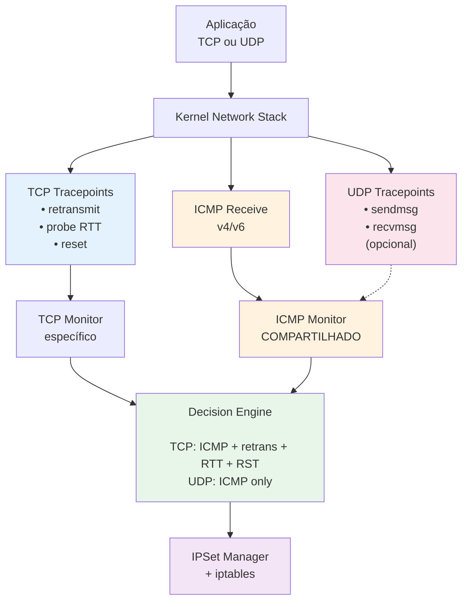
```mermaid
flowchart TD
App[Aplicação<br/>TCP ou UDP] --> Kernel[Kernel Network Stack]

Kernel --> TCP_TP["TCP Tracepoints<br/>• retransmit<br/>• probe RTT<br/>• reset"]
Kernel --> ICMP_TP["ICMP Receive<br/>v4/v6"]
Kernel --> UDP_TP["UDP Tracepoints<br/>• sendmsg<br/>• recvmsg<br/>(opcional)"]

TCP_TP --> TCP_Mon[TCP Monitor<br/>específico]
ICMP_TP --> ICMP_Mon[ICMP Monitor<br/>COMPARTILHADO]
UDP_TP -.-> ICMP_Mon

TCP_Mon --> DE
ICMP_Mon --> DE

DE[Decision Engine<br/><br/>TCP: ICMP + retrans + RTT + RST<br/>UDP: ICMP only]

DE --> IPSet[IPSet Manager<br/>+ iptables]

style TCP_TP fill:#e3f2fd
style UDP_TP fill:#fce4ec
style ICMP_TP fill:#fff3e0
style ICMP_Mon fill:#fff3e0
style DE fill:#e8f5e9
style IPSet fill:#f3e5f5
```

#### 11.8.9 Configuração YAML Atualizada

```yaml
# config.yaml

monitoring:
# ICMP Monitor compartilhado (TCP + UDP)
icmp:
enabled: true
# Erros hard consecutivos para considerar unreachable
hard_error_threshold: 3
# Tipos de ICMP que são considerados "hard error"
hard_error_types:
v4: [3] # ICMP_DEST_UNREACH
v6: [1] # ICMPV6_DEST_UNREACH
# Códigos específicos que disparam failover
hard_error_codes:
v4: [0, 1, 3, 9, 10, 13] # net, host, port, admin prohibited
v6: [0, 1, 3, 4, 6] # noroute, admin, addr, port, reject

# TCP específico (usa ICMP + métricas próprias)
tcp:
enabled: true
retransmit_threshold: 0.10 # 10%
rtt_threshold: 500ms
window_duration: 30s
bucket_count: 6
bucket_duration: 5s

# UDP (usa apenas ICMP compartilhado)
udp:
enabled: true
# Sem configuração adicional - depende apenas do ICMP monitor

# Watch list inicial (opcional)
watch_list:
# IPs para monitorar desde o início
destinations:
- addr: "8.8.8.8"
protocols: [tcp, udp]
- addr: "1.1.1.1"
protocols: [udp] # Só UDP (ex: DNS)
- addr: "2001:4860:4860::8888"
protocols: [tcp, udp]
```

---

## 12. Limitações Conhecidas

1. **UDP limitado a hard failures**: Monitoramento UDP detecta apenas ICMP errors (host/port unreachable); não detecta perda silenciosa de pacotes ou degradação de latência
2. **QUIC sem visibilidade interna**: Para QUIC, apenas falhas completas são detectadas; retransmissões e RTT são gerenciados em userspace (invisível ao kernel)
3. **Kernel 5.x+**: Requer kernel moderno para eBPF e cgroup v2
4. **IPSets não sobrevivem reboot**: IPSets são perdidos em reboot do host; usar `ipset save/restore` ou systemd unit para persistir
5. **Retry pode causar breves degradações**: Durante retry, algumas conexões novas podem sofrer se path ainda estiver ruim (mitigado pelo backoff exponencial)
6. **Dual-stack requer configuração completa**: Para suporte IPv4/IPv6, ambas as famílias devem estar configuradas (interfaces, pools SNAT, rotas)

---

## 13. Considerações de Produção

Esta seção aborda aspectos práticos para deploy em ambiente de produção, baseados em análise de riscos e experiências operacionais.

### 13.1 Estabilidade do eBPF entre Kernels

#### Preferência por Tracepoints

Tracepoints são mais estáveis entre versões de kernel do que kprobes:

| Tipo | Estabilidade | Exemplo |
|------|--------------|---------|
| **Tracepoint** | Alta (API estável) | `tcp/tcp_retransmit_skb`, `sock/inet_sock_set_state` |
| **Kprobe** | Baixa (função interna) | `kprobe/tcp_connect` |

**Recomendações:**

```c
// Preferir tracepoints sempre que possível
SEC("tracepoint/tcp/tcp_retransmit_skb") // ✅ Estável
int trace_tcp_retransmit(struct trace_event_raw_tcp_event_sk_skb *ctx)

// Kprobes apenas quando não há tracepoint equivalente
SEC("kprobe/tcp_connect") // ⚠️ Menos estável
int kprobe_tcp_connect(struct pt_regs *ctx)
```

#### Fallback Graceful

O loader deve detectar falhas de attach e degradar funcionalidade:

```go
type FeatureFlags struct {
HasRetransTracepoint bool
HasRSTTracepoint bool
HasICMPTracepoint bool
}

func (l *Loader) AttachWithFallback() (*FeatureFlags, error) {
flags := &FeatureFlags{}

// Tenta tracepoint primeiro
if err := l.attachTracepoint("tcp/tcp_retransmit_skb"); err != nil {
log.Warn("tcp_retransmit tracepoint unavailable, trying kprobe")
if err := l.attachKprobe("tcp_retransmit_skb"); err != nil {
log.Warn("tcp_retransmit monitoring disabled")
flags.HasRetransTracepoint = false
}
} else {
flags.HasRetransTracepoint = true
}

// Similar para outros hooks...
return flags, nil
}
```

### 13.2 Cardinalidade e Memória do eBPF

#### Problema: Muitos Destinos

Em ambientes que falam com muitos destinos (CDN, scraping, APIs diversas), o `dest_stats_map` pode:
- Estourar `max_entries` → erro `ENOSPC`
- Consumir memória significativa do kernel

#### Solução 1: LRU Hash Map

```c
// Ao invés de HASH regular, usar LRU
struct {
__uint(type, BPF_MAP_TYPE_LRU_HASH); // LRU automático
__uint(max_entries, 65536);
__type(key, struct dest_key);
__type(value, struct dest_stats);
} dest_stats_map SEC(".maps");
```

Características do LRU:
- Entradas menos usadas são automaticamente removidas
- Não requer GC em userspace
- Trade-off: pode perder métricas de destinos esporádicos

#### Solução 2: GC em Userspace

Se precisar de controle fino sobre o que manter:

```go
type GarbageCollector struct {
statsMap *ebpf.Map
maxAge time.Duration
maxEntries int
interval time.Duration
}

func (gc *GarbageCollector) Run(ctx context.Context) {
ticker := time.NewTicker(gc.interval)
defer ticker.Stop()

for {
select {
case <-ctx.Done():
return
case <-ticker.C:
gc.collectOldEntries()
}
}
}

func (gc *GarbageCollector) collectOldEntries() {
now := time.Now().UnixNano()
cutoff := now - gc.maxAge.Nanoseconds()

var key DestKey
var stats DestStats
var toDelete []DestKey

iter := gc.statsMap.Iterate()
for iter.Next(&key, &stats) {
if stats.LastUpdateNs < uint64(cutoff) {
toDelete = append(toDelete, key)
}
}

for _, k := range toDelete {
gc.statsMap.Delete(&k)
}

log.Info("GC completed",
"deleted", len(toDelete),
"remaining", gc.statsMap.Info().MaxEntries)
}
```

#### Configuração Recomendada

```yaml
ebpf:
dest_stats_map:
type: lru_hash # ou hash com GC
max_entries: 65536 # Ajustar conforme ambiente

gc:
enabled: true # Se usar hash regular
interval: 5m
max_age: 30m # Remover entradas sem atividade
```

### 13.3 Coexistência com iptables Existentes

#### Ordem das Regras

Em hosts com kube-proxy, firewalls corporativos ou scripts legados, a ordem das regras é crítica:

```
┌─────────────────────────────────────────────────────────────┐
│ mangle/OUTPUT │
├─────────────────────────────────────────────────────────────┤
│ 1. [kube-proxy rules] ← Podem já ter marcado pacotes │
│ 2. [corporate firewall] ← Podem dropar antes de STEERING │
│ 3. [STEERING chain] ← Nossa chain │
└─────────────────────────────────────────────────────────────┘
```

**Recomendações:**

```bash
# Usar -I (insert) ao invés de -A (append) para garantir posição
iptables -t mangle -I OUTPUT 1 -m cgroup --path steering.slice -j STEERING

# Ou usar número específico após identificar posição ideal
iptables -t mangle -I OUTPUT 3 -m cgroup --path steering.slice -j STEERING
```

#### Documentar Posição Recomendada

```yaml
# Em ambientes com kube-proxy (Kubernetes)
iptables_integration:
mangle_output_position: "after KUBE-PROXY-MARK"
nat_postrouting_position: "before KUBE-POSTROUTING"

# Em ambientes com firewall corporativo
iptables_integration:
mangle_output_position: "after CORP-FIREWALL-MARK"
insert_mode: "by_number"
insert_position: 5
```

#### Verificação de Conflitos

```go
func (im *IPTablesManager) CheckConflicts() []Warning {
var warnings []Warning

// Verificar se outras chains usam MARK
rules, _ := im.ipt.List("mangle", "OUTPUT")
for _, rule := range rules {
if strings.Contains(rule, "MARK") &&
!strings.Contains(rule, "STEERING") {
warnings = append(warnings, Warning{
Level: "WARN",
Message: "Another chain uses MARK in mangle/OUTPUT",
Rule: rule,
})
}
}

return warnings
}
```

### 13.4 Range Reservado de Tabelas de Roteamento

#### Problema

Manipular `/etc/iproute2/rt_tables` pode causar:
- Race conditions com outras ferramentas
- Conflitos com NetworkManager, systemd-networkd
- Poluição com tabelas antigas

#### Solução: Range Fixo Reservado

```yaml
routing:
table_range:
start: 20000
end: 20099
# Tabelas: 20000=steer_path0, 20001=steer_path1, etc.
```

```go
const (
TableRangeStart = 20000
TableRangeEnd = 20099
)

func (rm *RoutingManager) AllocateTable(pathID int) (int, error) {
tableNum := TableRangeStart + pathID

if tableNum > TableRangeEnd {
return 0, fmt.Errorf("table range exhausted: pathID %d exceeds range", pathID)
}

// Não precisa modificar rt_tables se usar número diretamente
// ip route add ... table 20000
return tableNum, nil
}
```

#### Evitar Modificar rt_tables

```go
// Preferir usar número direto (não precisa de nome em rt_tables)
func (rm *RoutingManager) AddRoute(dst, gw string, tableNum int) error {
// Usar número diretamente - não precisa de /etc/iproute2/rt_tables
cmd := exec.Command("ip", "route", "add", dst, "via", gw, "table", strconv.Itoa(tableNum))
return cmd.Run()
}
```

### 13.5 Tunning de Conntrack

Em cenários de alto volume com SNAT, o conntrack pode ser gargalo:

#### Parâmetros Críticos

```bash
# Verificar uso atual
cat /proc/sys/net/netfilter/nf_conntrack_count
cat /proc/sys/net/netfilter/nf_conntrack_max

# Ajustar limites (exemplo para servidor de alto tráfego)
sysctl -w net.netfilter.nf_conntrack_max=1048576
sysctl -w net.netfilter.nf_conntrack_buckets=262144
```

#### Monitoramento

```yaml
# Métricas a monitorar
conntrack_metrics:
- name: nf_conntrack_count
path: /proc/sys/net/netfilter/nf_conntrack_count
alert_threshold: 0.8 # 80% do max

- name: nf_conntrack_drop
path: /proc/net/stat/nf_conntrack
field: drop
alert_on: increase
```

```go
type ConntrackMonitor struct {
maxEntries int
alertPct float64
}

func (cm *ConntrackMonitor) Check() *Alert {
count := cm.readConntrackCount()
pct := float64(count) / float64(cm.maxEntries)

if pct > cm.alertPct {
return &Alert{
Level: "WARNING",
Message: fmt.Sprintf("Conntrack at %.1f%% capacity", pct*100),
Action: "Consider increasing nf_conntrack_max",
}
}
return nil
}
```

### 13.6 Integração com Systemd

#### Template de Unit para steering.slice

```ini
# /etc/systemd/system/steering.slice
[Unit]
Description=Slice for services using steering
Before=slices.target

[Slice]
CPUAccounting=true
MemoryAccounting=true
```

#### Template de Service com Steering

```ini
# /etc/systemd/system/myapp.service
[Unit]
Description=My Application with Steering
After=network.target steerd.service
Requires=steerd.service

[Service]
# CRÍTICO: Colocar no slice correto
Slice=steering.slice

ExecStart=/usr/bin/myapp
Restart=always

[Install]
WantedBy=multi-user.target
```

#### Checklist de Habilitação

```markdown
## Habilitando Steering para um Serviço

1. [ ] Verificar se steerd está rodando: `systemctl status steerd`
2. [ ] Verificar se steering.slice existe: `systemctl status steering.slice`
3. [ ] Adicionar `Slice=steering.slice` ao unit do serviço
4. [ ] Recarregar systemd: `systemctl daemon-reload`
5. [ ] Reiniciar o serviço: `systemctl restart myapp`
6. [ ] Verificar cgroup: `cat /proc/$(pidof myapp)/cgroup | grep steering`
7. [ ] Testar steering: verificar logs do steerd para conexões do serviço
```

#### Verificação Programática

```go
func (sm *ServiceManager) VerifyServiceInSlice(serviceName string) error {
// Obter PID do serviço
cmd := exec.Command("systemctl", "show", serviceName, "--property=MainPID")
out, err := cmd.Output()
if err != nil {
return err
}

pid := strings.TrimPrefix(strings.TrimSpace(string(out)), "MainPID=")

// Verificar cgroup
cgroupPath := fmt.Sprintf("/proc/%s/cgroup", pid)
content, err := os.ReadFile(cgroupPath)
if err != nil {
return err
}

if !strings.Contains(string(content), "steering.slice") {
return fmt.Errorf("service %s is not in steering.slice", serviceName)
}

return nil
}
```

### 13.7 Histerese e Anti-Flapping

#### Problema

Thresholds agressivos + janela curta = alternância frequente entre paths (flapping).

#### Solução: Histerese Assimétrica

```go
type HysteresisConfig struct {
// Para DEGRADAR (migrar para outro path)
DegradeThreshold float64 // Score abaixo do qual considerar ruim
DegradeWindow time.Duration // Por quanto tempo deve estar ruim
DegradeMinFailures int // Mínimo de falhas consecutivas

// Para RECUPERAR (voltar ao path original)
RecoverThreshold float64 // Score acima do qual considerar bom
RecoverWindow time.Duration // Por quanto tempo deve estar bom
RecoverMinSuccess int // Mínimo de sucessos consecutivos
}

// Configuração recomendada
var DefaultHysteresis = HysteresisConfig{
DegradeThreshold: 0.5, // Score < 50%
DegradeWindow: 30 * time.Second,
DegradeMinFailures: 3,

RecoverThreshold: 0.8, // Score > 80% (mais alto que degrade)
RecoverWindow: 60 * time.Second, // Mais tempo para recuperar
RecoverMinSuccess: 5,
}
```

#### Visualização

```
Score
│
1.0├─────────────────────────────────────
│ ┌── Recover threshold (0.8)
0.8├────────────────────┼────────────────
│ │
│ ┌───────────────┘
│ │ Zona de histerese
│ │ (não muda de path)
│ └───────────────┐
0.5├────────────────────┼────────────────
│ └── Degrade threshold (0.5)
│
0.0├─────────────────────────────────────
└──────────────────────────────────── Tempo
```

### 13.8 Limitação: Métrica por Destino sem Dimensão de Path

#### Descrição

O modelo atual monitora métricas por destino (`dest_ip`), não por par `(dest_ip, path_id)`.

Isso significa:
- Enquanto destino usa **path 0**, métricas refletem path 0
- Ao migrar para **path 1**, métricas passam a refletir path 1
- Não é possível comparar paths **antes** de migrar

#### Implicação

O modelo é **reativo**, não **preditivo**:

```
┌─────────────────────────────────────────────────────────────┐
│ Modelo Atual (Reativo) │
│ │
│ 1. Destino em path 0 │
│ 2. Path 0 degrada → métricas ruins │
│ 3. Migra para path 1 │
│ 4. Se path 1 também ruim → métricas ruins → migra para path 2│
│ │
│ Não sabe a priori: "path 1 está melhor que path 0?" │
└─────────────────────────────────────────────────────────────┘
```

#### Quando Isso é Suficiente

- ✅ Falhas de path são relativamente raras
- ✅ Paths alternativos geralmente funcionam
- ✅ Custo de "testar" um path ruim é aceitável

#### Evolução Futura (Fora do Escopo Atual)

Para modelo preditivo, seria necessário:
- Chave `(dest_ip, path_id)` no eBPF
- Inferir path atual via `sk_mark` ou interface de saída
- Ou probes ativos por path (contradiz requisito de passivo-only)

---

## 14. Roadmap Futuro

- [x] Suporte a IPv6 (dual-stack implementado na seção 11.6)
- [x] Monitoramento UDP genérico (seção 11.7) - detecta hard failures via ICMP
- [x] Considerações de produção (seção 13)
- [ ] Monitoramento QUIC avançado (integração com métricas userspace)
- [ ] Interface web para visualização
- [ ] API REST para integração
- [ ] Modo cluster (sincronização entre nós)
- [ ] Persistência de estado em disco
- [ ] Métricas históricas (integração com InfluxDB/Prometheus)
- [ ] Métricas por (destino, path) para decisões preditivas

---

## 15. Referências

- [Linux Policy Routing](https://man7.org/linux/man-pages/man8/ip-rule.8.html)
- [IPSet Documentation](https://ipset.netfilter.org/)
- [eBPF Documentation](https://ebpf.io/what-is-ebpf/)
- [cilium/ebpf Library](https://github.com/cilium/ebpf)
- [Conntrack-tools](https://conntrack-tools.netfilter.org/)
- [Cgroup v2](https://www.kernel.org/doc/html/latest/admin-guide/cgroup-v2.html)

---

## Apêndice A: Avaliação de Alternativas Existentes

Esta seção avalia ferramentas existentes (open source e comerciais) que poderiam ser usadas como alternativa a esta implementação.

### A.1 Comparação de Requisitos

| Requisito | Nossa Solução | Ferramentas Existentes |
|-----------|---------------|----------------------|
| Monitoramento eBPF passivo | ✅ | Cilium, Pixie, Hubble |
| Steering por cgroup (daemons específicos) | ✅ | ❌ (maioria usa proxy) |
| IPSet + iptables para data path | ✅ | mwan3, OPNsense |
| Funciona no host (não gateway) | ✅ | ❌ (maioria é gateway/proxy) |
| Suporte a túneis customizados | ✅ | SD-WAN solutions |
| Afeta apenas daemons específicos | ✅ | ❌ (afeta todo tráfego) |
| Dual-stack IPv4/IPv6 | ✅ | Parcial na maioria |

### A.2 Soluções Open Source

#### A.2.1 SD-WAN Open Source

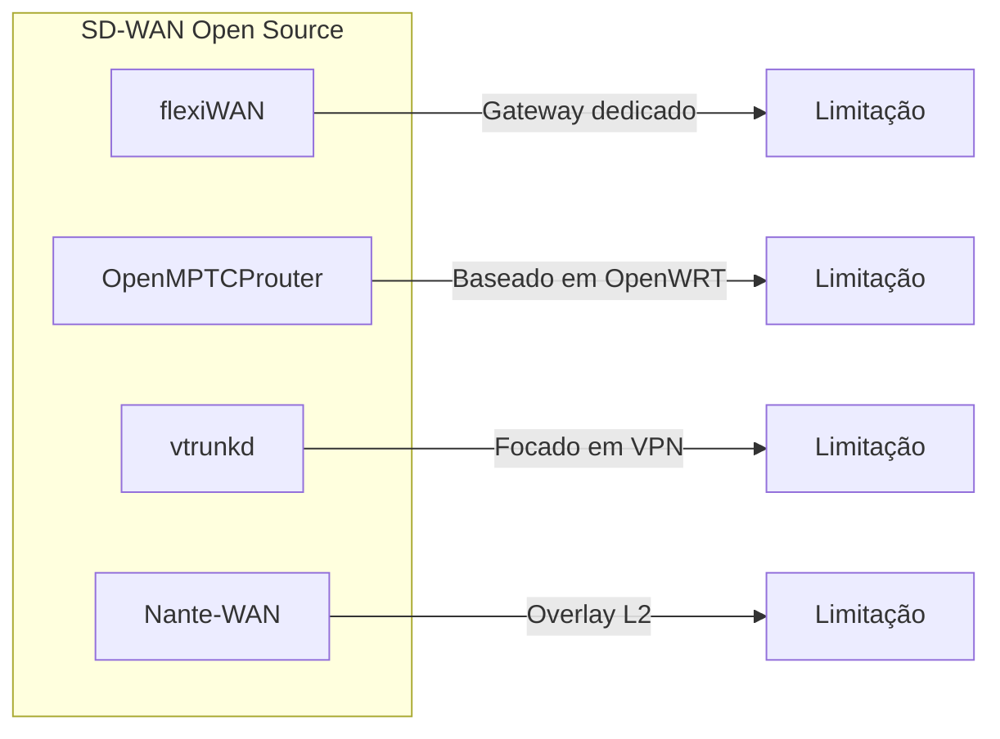
```mermaid
flowchart LR
subgraph SDWAN["SD-WAN Open Source"]
FW[flexiWAN]
OM[OpenMPTCProuter]
VT[vtrunkd]
NW[Nante-WAN]
end

FW --> |"Gateway dedicado"| LIM1[Limitação]
OM --> |"Baseado em OpenWRT"| LIM2[Limitação]
VT --> |"Focado em VPN"| LIM3[Limitação]
NW --> |"Overlay L2"| LIM4[Limitação]
```

| Ferramenta | Descrição | Prós | Contras |
|------------|-----------|------|---------|
| [flexiWAN](https://flexiwan.com/) | SD-WAN completo com AI routing, self-healing | Open source, features enterprise | Precisa de gateway dedicado |
| [OpenMPTCProuter](https://github.com/Ysurac/openmptcprouter) | Agregação multi-link via MPTCP | MPTCP nativo, failover | Baseado em OpenWRT, precisa de VPS |
| [vtrunkd](https://github.com/VrayoSystems/vtrunkd) | Bonding de links, até 30 conexões | Multi-plataforma, leve | Focado em VPN/agregação apenas |
| [Nante-WAN](https://github.com/upa/nante-wan) | DMVPN + VXLAN + EVPN | Overlay L2 completo | Complexidade, focado em overlay |

#### A.2.2 Ferramentas eBPF

| Ferramenta | Descrição | Prós | Contras |
|------------|-----------|------|---------|
| [Cilium](https://github.com/cilium/cilium) | Load balancing + observability via eBPF | eBPF maduro, health checking | Focado em Kubernetes |
| [Cloudflare Tubular](https://blog.cloudflare.com/tubular-fixing-the-socket-api-with-ebpf/) | Socket steering via sk_lookup | Produção comprovada | Focado em bind/listen (ingress) |
| [Katran](https://github.com/facebookincubator/katran) | L4 Load Balancer XDP (Facebook) | Alta performance XDP | Apenas para entrada (ingress) |
| [Pixie](https://github.com/pixie-io/pixie) | Observability com eBPF | Métricas automáticas | Apenas observação, sem steering |

#### A.2.3 Multi-WAN / Failover

| Ferramenta | Descrição | Prós | Contras |
|------------|-----------|------|---------|
| [OPNsense](https://opnsense.org/) | Firewall com Multi-WAN + failover | Completo, GUI, estável | É um firewall/gateway |
| mwan3 (OpenWRT) | Multi-WAN com policy routing | Leve, configurável | Para roteadores OpenWRT |
| PFSense | Firewall open source | Maduro, documentado | É um firewall/gateway |
| VyOS | Router OS open source | Flexível, CLI poderoso | Curva de aprendizado |

### A.3 Soluções Comerciais

| Solução | Tipo | O que faz | Preço Estimado |
|---------|------|-----------|----------------|
| Cisco SD-WAN (Viptela) | SD-WAN | Enterprise completo, analytics | $$$$ (licensing + hardware) |
| VMware VeloCloud | SD-WAN | SD-WAN com orchestration | $$$$ (por edge) |
| Fortinet SD-WAN | SD-WAN | Integrado com FortiGate | $$$ (por appliance) |
| Cloudflare Argo | Smart Routing | Routing otimizado global | $ (por GB transferido) |
| AWS Global Accelerator | Cloud | Anycast + failover | $$ (por hora + dados) |
| Zscaler | SASE | Zero Trust + SD-WAN | $$$$ (por usuário/ano) |
| Cato Networks | SASE | SASE completo | $$$ (por site/usuário) |
| Aryaka | SD-WAN as a Service | WAN otimizada global | $$$$ (managed service) |

### A.4 Análise Detalhada das Alternativas Mais Próximas

#### A.4.1 flexiWAN

```yaml
Avaliação: ⭐⭐⭐⭐ (4/5)

Pontos Fortes:
- SD-WAN open source mais completo
- AI-based routing decisions
- Self-healing network
- Suporte comercial disponível
- Comunidade ativa

Limitações para nosso caso:
- Requer gateway/appliance dedicado
- Não funciona no nível do host
- Afeta todo o tráfego (não por cgroup)
- Overhead de management plane

Quando usar:
- Quando você tem (ou pode ter) gateways dedicados
- Quando precisa de GUI e management centralizado
- Quando quer suporte comercial
```

#### A.4.2 Cilium

```yaml
Avaliação: ⭐⭐⭐⭐ (4/5)

Pontos Fortes:
- eBPF maduro e bem testado
- Health checking de backends
- Load balancing distribuído
- Excelente observability (Hubble)
- Código bem documentado

Limitações para nosso caso:
- Focado em Kubernetes/containers
- Não faz steering de saída por destino
- Service mesh model (não host-level)
- Complexidade para uso standalone

Quando usar:
- Ambiente Kubernetes
- Precisa de service mesh features
- Quer reutilizar código eBPF bem testado
```

#### A.4.3 OpenMPTCProuter

```yaml
Avaliação: ⭐⭐⭐ (3/5)

Pontos Fortes:
- MPTCP nativo (agregação real)
- Failover automático
- Suporte a múltiplos ISPs
- Comunidade ativa

Limitações para nosso caso:
- Requer servidor VPS como aggregator
- Baseado em OpenWRT (para roteadores)
- Não funciona diretamente no host
- MPTCP precisa de suporte end-to-end

Quando usar:
- Home office com múltiplos ISPs
- Quando agregação real é necessária
- Quando pode usar roteador dedicado
```

### A.5 Gap Analysis

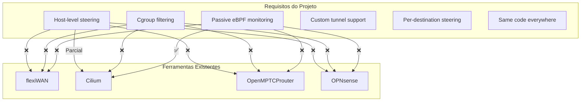
```mermaid
flowchart TD
subgraph REQ["Requisitos do Projeto"]
R1[Host-level steering]
R2[Cgroup filtering]
R3[Passive eBPF monitoring]
R4[Custom tunnel support]
R5[Per-destination steering]
R6[Same code everywhere]
end

subgraph TOOLS["Ferramentas Existentes"]
T1[flexiWAN]
T2[Cilium]
T3[OpenMPTCProuter]
T4[OPNsense]
end

R1 -->|"❌"| T1
R1 -->|"❌"| T3
R1 -->|"❌"| T4
R1 -->|"Parcial"| T2

R2 -->|"❌"| T1
R2 -->|"❌"| T2
R2 -->|"❌"| T3
R2 -->|"❌"| T4

R3 -->|"❌"| T1
R3 -->|"✅"| T2
R3 -->|"❌"| T3
R3 -->|"❌"| T4
```

| Requisito | flexiWAN | Cilium | OpenMPTCProuter | OPNsense |
|-----------|----------|--------|-----------------|----------|
| Host-level (não gateway) | ❌ | Parcial | ❌ | ❌ |
| Filtering por cgroup | ❌ | ❌ | ❌ | ❌ |
| Monitoramento eBPF passivo | ❌ | ✅ | ❌ | ❌ |
| Túneis customizados (FOU, etc) | ✅ | Parcial | ✅ | ✅ |
| Steering por destino | ✅ | ❌ | ❌ | ✅ |
| Mesmo código em todos hosts | ❌ | ✅ | ❌ | ❌ |
| Dual-stack IPv4/IPv6 | ✅ | ✅ | Parcial | ✅ |
| TCP + UDP | ✅ | ✅ | ✅ | ✅ |

### A.6 Conclusão da Avaliação

#### Cenários onde usar alternativas existentes:

| Cenário | Recomendação | Justificativa |
|---------|--------------|---------------|
| Gateway dedicado disponível | **flexiWAN** ou **OPNsense** | Soluções maduras, GUI |
| Ambiente Kubernetes | **Cilium** | Nativo, eBPF, integrado |
| Agregação de múltiplos ISPs | **OpenMPTCProuter** | MPTCP real |
| Enterprise com budget | **Cisco/VMware SD-WAN** | Suporte, SLA |

#### Cenário onde implementar solução própria:

```
✅ Precisa funcionar no HOST (não gateway)
✅ Precisa filtrar por CGROUP (apenas alguns daemons)
✅ Precisa de monitoramento PASSIVO (sem probes)
✅ Precisa de steering por DESTINO específico
✅ Precisa do MESMO CÓDIGO em todos os servidores
✅ Precisa de túneis CUSTOMIZADOS (FOU, GRE, WireGuard)
```

**Nenhuma ferramenta existente atende a todos esses requisitos simultaneamente.**

### A.7 Componentes Reutilizáveis

Embora não exista uma solução completa, podemos reutilizar componentes de projetos existentes:

| Componente | Fonte | O que reutilizar |
|------------|-------|------------------|
| Código eBPF para TCP metrics | Cilium/Hubble | Tracepoints, estruturas |
| Lógica de health checking | Cilium | Algoritmos de decisão |
| IPSet management | ipset-go libraries | Bindings Go |
| Policy routing | mwan3 | Lógica de regras |
| Configuration patterns | flexiWAN | YAML structure |

### A.8 Referências das Alternativas

- [flexiWAN - Open Source SD-WAN](https://flexiwan.com/)
- [OpenMPTCProuter](https://github.com/Ysurac/openmptcprouter)
- [Cilium - eBPF Networking](https://github.com/cilium/cilium)
- [Cloudflare Tubular](https://blog.cloudflare.com/tubular-fixing-the-socket-api-with-ebpf/)
- [Katran - Facebook L4 LB](https://github.com/facebookincubator/katran)
- [vtrunkd - Link Bonding](https://github.com/VrayoSystems/vtrunkd)
- [OPNsense Firewall](https://opnsense.org/)
- [Nante-WAN](https://github.com/upa/nante-wan)
- [Hubble - Cilium Observability](https://github.com/cilium/hubble)
- [Pixie - eBPF Observability](https://github.com/pixie-io/pixie)
